# Manual general de mantenimiento

## Tabla de Contenidos

1. [Introducción](#introducción)
2. [Recomendaciones generales](#recomendaciones-generales)
3. [Procesos de mantenimiento](#procesos-de-mantenimiento)
4. [Estudio de casos](#estudios-de-caso)
5. [Fuentes](#fuentes)
6. [Contacto](#contacto)

## Introducción

Este manual tiene como finalidad recopilar información valiosa para las labores de mantenimiento de diversos productos de software.
con el fin de democratizar el conocimiento, estará abierto para recibir aportes de la comunidad, por favor lea la guia de aportes aquí(#a la guia de aportes)

## Recomendaciones Generales

independientemente del tipo de mantenimiento a realizar, hay varios factores a tener en cuenta para el desarrollo de las labores de mantenimiento.
considere siempre las herramientas que tenga a la mano, aquí algunas:

- Herramientas de depuración: Estas herramientas ayudan a identificar la causa de los errores en el software.
la mayoría de los IDEs tienen integradas herramientas para las labores de depuración, es muy importante conocer estas herramientas y tomar su maximo provecho.
- Herramientas de pruebas: Estas herramientas ayudan a garantizar que el software funciona correctamente.
es critico mantener el software al tanto en el plan de pruebas, siempre realice pruebas a su software además de las pruebas unitarias y de integración; las cuales deberian estar siempre presentes en cualquier funcionalidad o labor de mantenimiento de software, considere:
  - pruebas de estrés y rendimiento
  - pruebas de seguridad
  - pruebas de usabilidad y aceptación
  - pruebas funcionales
  - pruebas de humo
  - pruebas de extremo a extremo

#### nota: recuerde que las pruebas ayudan a incrementar la calidad y fiabilidad del software

- Herramientas de monitoreo: Estas herramientas ayudan a rastrear el rendimiento del software y a identificar posibles problemas.
- Herramientas de gestión de configuración: Estas herramientas ayudan a realizar un seguimiento de los cambios en el software.
independientemente si las labores de mantenimiento son realizadas por una o varias personas, es importante mantener un control de versiones optimo y organizado, esto con el fin de evitar errores de versionamiento y despliegue, ademas de permitir una transisión entre vesiones muy comoda y segura.

no solamente las herramientas de control de versiones deben ser consideradas, es importante notar que las herramientas de integración continua son vitales para el software moderno y por ende vitales para las labores de mantenimiento de este.

- Herramientas de documentación: Estas herramientas ayudan a crear y mantener la documentación del software.
es imperativo mantener un software bien documentado

## 1. Considere patrones de diseño y arquitectura

Al inicio del proyecto de software, se realizó una serie de sesiones de diseño; donde considerando los diversos requerimientos del producto que se iba a construir, se tomaron decisiones de diseño y arquitectura, es posible que a medida que el producto haya madurado, se  hayan tomado nueevas decisiones y modificado el diseño original. De cualquier manera, busque los diseños, arquitecturas de referencia, diagramas, entre otros documentos de diseño que puedan ser utiles y estudielos conciensudamente.

Es fundamental que el ingeniero de software comprenda a fondo los patrones de diseño y arquitectura utilizados en la construcción de la aplicación que se está manteniendo. Esto le permitirá:

- Comprender la estructura y organización del código: Al conocer los patrones de diseño, podrá entender cómo se han organizado los componentes del software y cómo interactúan entre sí. Esto facilita la identificación de las áreas que necesitan ser modificadas o actualizadas.
- Tomar decisiones informadas sobre las modificaciones: La comprensión de la arquitectura del software permite tomar decisiones informadas sobre cómo realizar las modificaciones sin afectar negativamente el funcionamiento general de la aplicación.
- Evitar introducir nuevos errores: Al seguir los patrones de diseño adecuados, reduce el riesgo de introducir nuevos errores en el código durante el proceso de mantenimiento.
- Mantener la coherencia del código: Al utilizar patrones de diseño consistentes, se mantiene la coherencia del código y se facilita su comprensión y mantenimiento a largo plazo.
notas sobre arquitectura(#arquitectura de software) y diseño(#patrones de diseño)

## 2. Evalue el impacto

Seguramente el software que está manteniendo pertenezca a una empresa u organización; es muy importante que de manera colectiva y/o individual según el caso, se evalúe cuidadosamente el impacto que las modificaiones tendrán en la aplicación. Esto implica considerar:

- Funcionalidad: ¿Las modificaciones afectarán la funcionalidad existente de la aplicación?
- Rendimiento: ¿Las modificaciones afectarán el rendimiento de la aplicación?
- Seguridad: ¿Las modificaciones introducirán nuevas vulnerabilidades de seguridad?
- Usabilidad: ¿Las modificaciones afectarán la usabilidad de la aplicación para los usuarios?
- Compatibilidad: ¿Las modificaciones afectarán la compatibilidad de la aplicación con otros sistemas o plataformas?

## 3. Considere el plan de pruebas

Una vez realizadas las modificaciones, es crucial realizar pruebas exhaustivas y diversas para garantizar que la aplicación funciona correctamente y que no se han introducido nuevos errores. Las pruebas deben cubrir como minimo:

- Casos de uso: Todos los casos de uso de la aplicación deben probarse para garantizar que funcionan correctamente.
- Regresión: Se deben realizar pruebas de regresión para garantizar que las modificaciones no han afectado negativamente la funcionalidad existente.
- Rendimiento: Se deben realizar pruebas de rendimiento para garantizar que la aplicación sigue funcionando con el rendimiento esperado.
- Seguridad: Se deben realizar pruebas de seguridad para garantizar que las modificaciones no han introducido nuevas vulnerabilidades.

Es importante mencionar que la mayoría de los proyectos de software tienen un plan de pruebas, que suele ser definido en las etapas iniciales del ciclo de vida(planificación y diseño) y posteriormente ejecutado en la etapa de pruebas; generalmente los planes de pruebas quedan documentados al igual que la arquitectura y el diseño, por lo tanto, es importante buscar tener acceso a estos documentos, para cumplir con las pruebas que sugiera el diseño del proyecto de software. De igual manera, si el plan de pruebas por alguna razón ya no es pertinente a los nuevos desarrollos en el mantenimiento del producto, entonces es imperativo el definir un nuevo plan de pruebas, donde se contemplen, segun las necesidades, estandares y demás lineamientos pertinentes a la naturaleza del proyecto de software, las pruebas que se realizarán en el ciclo de mantenimiento.

## 4. documente y comunique

la documentación es sumamente valiosa, para poder transmitir el conocimiento dentro de las organizaciones a cargo del mantenimiento y desarrollo de los productos de software
Es fundamental mantener una comunicación fluida y transparente con todas las partes interesadas durante el proceso de mantenimiento de software. Esto incluye:

Usuarios: Informar a los usuarios sobre las próximas modificaciones y el tiempo de inactividad potencial.
Equipo de desarrollo: Colaborar con el equipo de desarrollo original para comprender mejor el código y la arquitectura de la aplicación.
Gerentes: Mantener a los gerentes informados sobre el progreso del mantenimiento y cualquier problema potencial.

además es importante mantener la documentación del software actualizada para reflejar los cambios realizados durante el mantenimiento. Esto incluye:

Documentación del código: Actualizar la documentación del código para reflejar las modificaciones realizadas.
Documentación de usuario: Actualizar la documentación del usuario para reflejar los cambios en la funcionalidad o la interfaz de usuario.
Documentación de la arquitectura: Actualizar la documentación de la arquitectura para reflejar los cambios en la arquitectura del software.

es muy importante mantener documentos relacionados con las labores de mantenimiento del software, el conocimiento y las experiencias obtenidas al realizar mantenimiento a aplicaciones de software, son enriquecedores y proveen al ingeniero de una perspicacia y habilidad que solamente se obtienen al realizar labores de mantenimiento; el problema radica en que esta caja de herramientas se queda en la cabeza del ingeniero y solo le será util a este, en lugar de a su equipo, su organización o el resto del mundo.
es por esto que siempre las labores de mantenimiento deben ser documentadas, no solo a nivel tecnico, lo cual también es de suma importancia, sino que en la medida de lo posible, compartidas, en blogs, foros, o iniciativas abiertas, como este manual.

### <mark>  NOTA: siempre tenga en cuenta los lineamientos de privacidad de su organización, tenga cuidado de la información que publica en internet y siempre consulte con el area a cargo de la seguridad de la información antes de realizar la publicación de sus articulos, notas, etc.</mark>

# Procesos de mantenimiento

Todos los sistemas se degradan con el tiempo, en el ambito del software, esto se conoce con diversos nombres, como decadencia, degradación o desgaste del sistema o del software. así mismo los sistemas de software incrementan su complejidad en el tiempo, algunos autores llaman a esta función entropía del software. la entropia contribuye al desgaste del software, dado que en un sistema con alta entropía, se hace mas dificil predecir el comportamiento de las variables, entradas y salidas; en otras palabras, los sistemas de software mas complejos se desgastan mas rápido, son mas propensos a errores y consecuentemente, son mas dificiles y costosos de mantener.  

## tipos de mantenimiento

la IEEE propone en el estandar 1219, que el mantenimiento de software puede ser de cuatro tipos:
  
- correctivo
- preventivo
- perfectivo
- adaptativo

generalmente son separados segun su tipo y su proposito
| | corrección | mejora |
| ---|---|--- |
|| | |
|**proactivo**| preventivo | perfectivo|
|**reactivo**| correctivo | adaptativo|
  
este estandar es ampliamente aceptado dentro de la industria del software y provee una base para diversos [modelos](#modelos-de-mantenimiento) que pueden adaptarse a diversas situaciones y gran variedad de proyectos.

un ejemplo es el concepto de mantenimiento planeado y no planeado; de esta forma, las labores de mantenimiento se agrupan según su urgencia y prioridad

**Mantenimiento planeado (planeable)**: se refiere a todas las labores de mantenimiento que pueden ser previstas y priorizadas según las necesidades de la organización a cargo del software. Dependerá de cada organización como se aborda la gestión del ciclo de vida de mantenimiento.
en esta instancia, se abordan los siguientes tipos de mantenimiento:

- correctivo no urgente: en este caso, si bien los resultados o condiciones del sistema pueden diferir de lo especificado en el requerimiento, no interfieren de manera directa en su funcionamiento, existe algún tipo de plan te contingencia para el escenario o bien no tiene un impacto significativo en la experiencia del usuario, algunos ejemplos son:
  - el sistema no muestra los componentes visuales en la paleta de colores requerida
  - el modulo de facturación, no toma en cuenta los decimales; con lo cual los empleados de la caja deben realizar un ajuste en caso de ser necesario.
  - hay un modulo que se encuentra obsoleto, sin embargo aún hay un cliente que lo utiliza una vez al año
- preventivo: incluye todas las actividades de [refactoring](#refactoring), la idea es hacer que el software mantenga o incremente su calidad para mitigar los efectos del desgaste del software, así mismo intentar reducir la entropía del software que es introducida a medida que se mantienen las funcionalidades existentes y se agregan nuevas funcionalidades.
- perfectivo: incluye labores que buscan mejorar las funcionalidades del software, adionalmente puede implicar agregar nuevas funcionalidades, por ejemplo:
  - un cliente va a expandir sus operaciones a otro país, por lo que el software de facturación debe soportar la moneda de este país.
  - un modulo que genera reportes, ahora debe generar también gráficos de barras con la información de ventas en función del tiempo.
- adaptativo: incluye todas las actividades de [reingeniería](#reingeniería), la idea es modificar el software para poder asimilar los cambios del entorno que se ejecuta, algunos ejemplos son:
  - migración de proveedores de hosting
  - actualizaciones del sistema operativo del servidor o el cliente
  - librerias deprecadas

**Mantenimiento no planeado**: son todas las actividades de mantenimiento que no pueden ser previstas, pueden ocurrir por diversas causas y no necesariamente implican que el software tenga baja calidad o un diseño defectuoso; sin embargo, el diseño del software, juega un papel vital en evitar que este tipo de incidentes ocurran. las tareas de mantenimiento no planeado, tienen  prioridad maxima, ya que constituyen mantenimiento correctivo urgente, puede incluir las siguientes afectaciones:

- que afecta a una gran cantidad o todos los usuarios
- causan inoperabilidad en el sistema
- no existe un plan de contingencia
  
en este ambito son vitales las herramientas de monitoreo, permitiendo a los ingenieros observar datos y reportes del comportamiento del software de forma integral.

 existen diversas herramientas que permiten analizar y monitorear el software, tanto para detectar bloques de codigo propensos a errores, o que tengan un diseño deficiente como para mantener registros de las transacciones del sistema, el comportamiento de diversos módulos, entre otros indicadores.

- [Google Cloud Operations](https://cloud.google.com/products/operations?hl=en)
- [IBM Instana](https://www.ibm.com/products/instana)
- [Amazon CloudWatch](https://aws.amazon.com/cloudwatch/)
- [New relic](https://newrelic.com/)
- [Grafana](https://grafana.com/)
- [Prometeus](https://prometheus.io/)
- [Datadog](https://www.datadoghq.com/)
- [Splunk](https://www.splunk.com/)

---

para que el mantenimiento agregue la mayor antidad de valor posible, es necesario entender el sistema, de la forma mas integral posible; para poder designarle un alcance y prioridad optimo a las labores de mantenimiento.
esto dependerá de cada caso, sin embargo algunas consideraciones generales son:

### 1. Objetivos

¿Qué se pretende lograr con el mantenimiento ? ¿Reducir errores, mejorar el rendimiento, aumentar la seguridad o una combinación de estos?
¿Qué tan crítico es el software para la organización? ¿Un fallo podría tener un impacto significativo en las operaciones o los ingresos?
¿Cuáles son las expectativas de las partes interesadas, como usuarios, gerentes y equipo de desarrollo?

### 2. Características del software

¿Qué tipo de software es? ¿Aplicación web, aplicación móvil, sistema embebido o un tipo diferente?
¿Qué tecnologías se utilizan en el desarrollo del software? ¿Lenguajes de programación, frameworks, bases de datos, etc.?
¿Cuál es la complejidad del software? ¿Cuántas líneas de código tiene, cuántos módulos y componentes?
¿Cuál es el historial de mantenimiento del software? ¿Ha habido problemas recurrentes o errores conocidos?

### 3. Recursos disponibles

¿Cuánto tiempo y personal se puede dedicar al mantenimiento?
¿Qué presupuesto se ha asignado para las actividades de mantenimiento ?
¿Se dispone de las herramientas y tecnologías necesarias para realizar el mantenimiento ?
¿Se cuenta con la experiencia y el conocimiento técnico necesarios en el equipo?

### 4. Riesgos potenciales

¿Cuáles son los principales riesgos asociados al software? ¿Vulnerabilidades de seguridad, errores conocidos, problemas de rendimiento?
¿Qué impacto podrían tener estos riesgos en la organización si no se abordan?
¿Cuáles son los costos potenciales de no realizar el mantenimiento?

### 5. Priorización de actividades

¿Qué actividades de mantenimiento son más importantes y urgentes?
¿En qué orden se deben realizar las actividades de mantenimiento ?
¿Es posible agrupar las actividades de mantenimiento por tipo o tecnología?

### 6. Comunicación y coordinación

¿Cómo se comunicará el alcance del mantenimiento  a las partes interesadas?
¿Cómo se coordinará el mantenimiento con otras actividades, como desarrollo de nuevas funcionalidades o soporte técnico?
¿Cómo se gestionarán los cambios en el alcance del mantenimiento  durante el proceso?

### 7. Evaluación y revisión

¿Cómo se evaluará el éxito del mantenimiento ?
¿Con qué frecuencia se revisará el alcance del mantenimiento ?
¿Cómo se adaptará el alcance del mantenimiento a los cambios en el software, las tecnologías y las necesidades de la organización?

---

### Refactoring

El refactoring es un proceso de mejora continua del código fuente sin modificar su comportamiento externo. Se centra en organizar y simplificar el código sin agregar nuevas funcionalidades ni cambiar la lógica del software.

los objetivos del refactoring son:

- Mejorar la legibilidad: El código debe ser fácil de entender y leer para otros desarrolladores.
- Aumentar la mantenibilidad: El código debe ser fácil de modificar y adaptar a nuevos requisitos.
- Reducir la complejidad: El código debe ser lo más simple y directo posible.
- Evitar errores: Un código bien estructurado y organizado es menos propenso a errores.

Existen numerosas técnicas de refactoring, algunas de las más comunes incluyen:

- Renombrar variables y métodos: Se utilizan nombres más descriptivos y significativos para mejorar la comprensión del código.
- Extraer métodos: Se extraen fragmentos de código repetitivos en métodos independientes para mejorar la modularidad.
- Generalizar código: Se modifica el código para que sea más flexible y reutilizable en diferentes contextos.
- Simplificar expresiones: Se simplifican expresiones complejas para mejorar la legibilidad y reducir el riesgo de errores.

Al momento de realizar un refactor tenga en cuenta la siguiente lista de checkeo:

- [X] el código debe estar más limpio, despue del refactor.
- [X] no se deben agregar nuevas funcionalidades durante el refactor
- [X] el codigo debe cumplir con todas las pruebas existentes, despues del refactor.

---

**código limpio**
: el concepto de codigo limpio se refiere a codigo que cumple con un estandar de calidad establecido dentro de los equipos de desarrollo, la idea es mantener la calidad del producto de software y evitar la deuda técnica, además de incrementar la mantenibilidad del software.
algunos de los principios del codigo limpio son:

- obviedad: el código debe ser legible y obvio para otros ingenieros y programadores, independiete si estos tienen contexto sobre este o no.
- unico: las funcionalidades, algoritmos y demás implementaciones deben construirse una única vez, de lo contrario se incrementa la carga cognitiva y la entropía del sistema, reduciendo la mantenibilidad y haciendo lentos los avances.
- cantidad minima de partes moviles: el código debe ser lo mas simple posible, en terminos generales, menos codigo significa menos errores, menos mantenimiento, complejidad, entropía y menos carga cognitiva
- facil de probar y cumple el plan de pruebas: aunque puede variar dependiendo del equipo a cargo, generalmente se busca que el código cumpla con un porcentaje de cobertura, así como superar un umbral de porcentaje de exito en las pruebas; estas pruebas a su vez, deben ser faciles de implementar.

**Code smells**
: también llamado código apestoso, se refiere basicamente al codigo que tiene una mala calidad. esto no implica que el código no funcione correctamente o que no cumpla con los requerimientos del sistema, sino mas bien a que el código no está completamente limpio y que potencialmente puede generar inconvenientes en el largo plazo.

los principales code smell son:

- Bloater: un bloque del codigo que ha crecido demasiado, tanto que resulta complejo de entender y manejar, algunos ejemplos son:
  - métodos demasiado largos: la mayoría de los métodos, deben tener menos de diez lineas.
  - clases muy complejas: las clases deben ser sencillas y concretas, una clase con demasiados métodos.
  - mal uso de primitivos: los tipos primitivos no deben usarse para representar objetos de dominio.
  - listas de parametros demasiado largas: los metodos, no deben tener mas de tres o cuatro parametros.  
  - agrupación de datos: si dos o más bloques de codigo tienen las mismas variables, entonces estos datos deben estar en su propia clase.
- abuso de la orientación a objetos: una aplicación incorrecta o incompleta de los principios de la orientación a objetos, algunos ejemplos son:
  - condicionales complejos
  - atributos condicionales o temporales
  - herencia incompleta o condicionada
  - clases iguales con interfaces diferentes
- inconveniente de cambios: al realizar una modificación a un bloque de codigo, es necesario también realizar modificaciones en una gran cantidad de bloques diferentes, algunos ejemplos son:
  - cambios divergentes: una vez realizado un cambio, es necesario hacer ajustes en otros bloques que no están relacionados con la funcionalidad modificada
  - operaciones dispersas: un cambio cualquiera, implica realizar una gran cantidad de pequeños ajustes en otros bloques del codigo
  - herencias paralelas: cuando se crea una subclase, es necesario crear otras subclases para otras clases no relacionadas.
- desechables: es cualquier cosa que puede ser eliminada del código sin afectar su funcionamiento, algunos ejemplos son:
  - comentarios
  - codigo duplicado
  - clases innecesarias
  - codigo muerto
- acopladores: cuando el codigo favorece el acoplamiento o genera una delegación excesiva, algunos ejemplos son:
  - envidia de funcionalidad: los metodos no deben acceder datos de otros objetos
  - poca intimidad: las clases no deben acceder a los atributos de otras clases
  - cadenas de mensajes: el código no debería seguir una estructura  `a()-> b() -> c() -> d()`

existen diversas herramientas para detectar code smells:

- [sonarqube](https://www.sonarsource.com/products/sonarqube/)
- [jDeodorant](https://github.com/tsantalis/JDeodorant)
- [infusion](https://www.intooitus.com/products/infusion/)
- [Codebeat](https://codebeat.co/)
- [Jetbrains Upsource](https://www.jetbrains.com/upsource/)
- [PMD](https://pmd.github.io/)
- [Codeclimate](https://codeclimate.com/)

<mark> nota: cuando se detectan code smells es muy importante atacarlos lo antes posible.  

---

<mark>nota: cuando se cambia el comportamiento del código fuente, ya no se está realizando refactoring, se está realizando reingeniería</mark>
---

### reingeniería

La reingeniería es un proceso de transformación profunda del software para mejorar su arquitectura, diseño y código. Se centra en modificar la estructura fundamental del software para hacerlo más moderno, adaptable y mantenible; en ultima instancia, la reingeniería puede desencadenar una migración completa del software hacia una arquitectura, motor de base de datos, lenguaje de programación o patrones de diseño más adecuados a los nuevos requerimientos. Dependiendo de la madurez, tamaño y complejidad del software(comprendiendo aquí también, a las personas detrás de este software, así como sus procesos empresariales y logisticos.) los procesos de reingeniería pueden ser más o menos comunes, complejos y profundos;

los objetivos de la reingeniería son:

- Modernizar el software: Adaptar el software a las tecnologías y frameworks modernos.
- Mejorar la arquitectura: Simplificar la arquitectura del software para hacerlo más modular y flexible.
- Reestructurar el código: Reorganizar el código para hacerlo más legible, mantenible y reutilizable.
- Eliminar código obsoleto: Eliminar código innecesario o no utilizado que dificulta la comprensión y el mantenimiento del software.

en cuanto a las técnicas, podemos destacar:  

- Análisis estático: Analizar el código fuente para identificar problemas de diseño, errores y código obsoleto.
- Reestructuración de la arquitectura: Modificar la arquitectura del software para mejorar su modularidad, separación de preocupaciones y patrones de diseño.
- Reescritura del código: Reescribir el código desde cero utilizando tecnologías y frameworks modernos.

---

### Migración

---
En ocasiones, los productos de software requieren una reestructuración completa en su ambiente de ejecución,por ejemplo, mover el software de una nube publica a una privada o viceversa, este proceso es conocido como migración, algunos ejemplos son:

- Migración de arquitectura
- Migración de sistema operativo
- Migración a la nube
- Migración a SAP

existen diversos patrones para ejecutar migraciones, conocidos como Rs:

- Reubicar/ realojar (rehost): esta estrategia suele ser más rapida en comparación por lo que reduce costos, la idea es mover la aplicación de un servidor fisico local( on premise ) a una maquina virtual alojada en la nube sin realizar cambios mayores al software.
- Reingeiería: implica realizar cambios a la aplicación para adaptarse a nuevas funcionalidades, mejorar su rendimiento y escalar de manera mas eficiente, un caso común es separa una aplicación monolitica en un grupo de servicios o microservicios.
- cambio de plataforma( replatform ): es una combinación de la reingeniería y la reubicación, la idea es hacer cambios menores a la aplicación para que esta se adapte mejor a las nuevas condiciones, por ejemplo, convertir la aplicación en contenedores o modificarla para que soporte bases de datos en la nube.
- retirar/ reemplazar: en ocasiones tiene sentido simplemente retirar la aplicación, las razones pueden variar e incluyen poco valor, capacidades duplicadas o limitadas o altos costos de operación.

por la manera en como se contruyen las aplicaciones de software, estas están diseñadas para ser ejecutadas en sistemas operativos especificos, con arquitecturas de red, datos y nube particulares. Por lo tanto determinar una estrategia de migración implica conocer y entender cada componente de la aplicación de forma individual; algunos de los factores a considerar cuando se evaluan componentes del sistema candidatos a migración son:

- complejidad
- importancia
- implicaciones de cumplimiento
- disponibilidad
- aplicación de pruebas

Realizar una migración conlleva una serie de riesgos, los cuales deben ser considerados antes de tomar la decisión de migrar un sistema:

- retos tecnicos: la aplicación puede tener dependencias criticas, o una gran cantidad de las dependencias, que agregan complejidad a la migración
- costos inesperados: si la planeación no se realiza correctamente, la organización puede incurrir en costos que no se encontraban en el presupuesto planeado, como pueden ser costos de licencias o entrenamientos relacionados con las nuevas herramientas o plataformas.
- inoperabilidad: es posible que al realizar cambios en la aplicación, esta falle o presente errores que causen tiempos de inoperabilidad inesperados.
- diferencias culturales o de administración: dado que cada organización es diferente, cada una utiliza los productos de software de maneras diferentes, esto puede causar fricción y relentizar los procesos de migración.

---

### requerimientos

---
Así como el software tiene un ciclo de vida, el mantenimiento tiene internamente su propio ciclo de vida, este es similar al ciclo de vida del software, dependiendo de las metodologías de cada equipo puede variar, sin embargo, cuenta basicamente con las fases de planeación, diseño, implementación, pruebas y despliegue. Así, homologamente al ciclo de vida del desarrollo de software, en el mantenimiento se deben recolectar y analizar los requerimientos de las actualizaciones del software.

- La IEEE presentó en 1980 el estandar *IEEE830* que propone especificaciones de requerimientos de software deben cumplir y estos pueden ser funcionales o no funcionales.
Los principales objetivos que se identifican en la especificación de requisitos del software son los siguientes:

  - Ayudar a los clientes a describir claramente lo que quieren de un programa de software.
  
  - Ayudar a los desarrolladores a entender lo que quiere el cliente, incluso si ellos mismos no saben exactamente lo que quieren.
  - Servir de base para el desarrollo de normas ERS (especificación de requisitos de software) específicas para cada organización. Esto ayudará a los desarrolladores a entender exactamente lo que quiere el cliente.
  
- ### requerimientos funcionales

  Los requerimientos funcionales se refieren a que debe hacer el software, es de suma importancia que estos requerimientos así como su contexto y alcance, se definan con alto nivel de detalle y claridad; de lo contrario, se corre el riesgo de que el equipo de desarrollo realice interpretaciones subjetivas, que pueden generar reprocesos, introducir regresiones, reducir la calidad y la mantenibilidad del software.

  en general, los requerimientos funcionales describen los requerimientos que puede tener el usuario y el sistema, los tipos mas comunes de requerimientos funcionales son:
  - Regulaciones comerciales
  - Requisitos de Certificación
  - Los requisitos de información
  - Funciones administrativas
  - Niveles de autorización
  - Seguimiento de auditoría
  - Interfaces externas
  - Administración de datos
  - Requisitos legales y reglamentarios

  Algunos ejemplos de requerimientos funcionales son:
  - Descripciones de los datos a ser ingresados en el sistema.
    - "El campo país consistirá en una lista de preselección. El país asociado a una dirección debe ser previamente registrado en el sistema."
  - Descripciones de las operaciones a ser realizadas por cada pantalla.
    - "Un usuario podrá iniciar sesión en el sistema utilizando su nombre de usuario y contraseña, en la pantalla de *acceder* "
  - Descripción de los flujos de trabajo realizados por el sistema.
    - "El proceso de compras en el sistema abarcará los siguientes pasos y transacciones: Ingreso de la requisición, emisión de la solicitud de cotización y emisión de la orden de compra."
  - Descripción de los reportes del sistema y otras salidas.
    - "El sistema enviará un correo electrónico cuando se registre alguna de las siguientes transacciones: pedido de venta de cliente, despacho de mercancía al cliente, emisión de factura a cliente y registro de pago de cliente."
  - Definición de seguridad.
    - "El sistema enviará una alerta al administrador del sistema cuando ocurra alguno de los siguientes eventos: Registro de nueva cuenta, ingreso al sistema por parte del cliente, 2 o más intentos fallidos en el ingreso de la contraseña de usuario y cambio de contraseña de usuario."
  - Como el sistema cumplirá los reglamentos y regulaciones de sector o generales que le sean      aplicables.
    - "El sistema permitirá elaborar y emitir el reporte regulatorio XX, según los requerimientos establecidos en el reglamento y ley aplicable."

- ### requerimientos no funcionales

   Los requerimientos no funcionales se refieren a los requisitos especificos que se pueden usar para juzgar la operación del software y sus caracteristicas de funcionamiento; por esto también son llamados requerimientos de calidad. Son vitales para determinar si el software cumple con las necesidades establecidas por el usuario.
   en general, los requerimientos no funcionales se pueden agrupar en requerimientos de producto, organizacionales y externos. Cada uno de estos agrupa diversos tipos de requerimientos no funcoonales.
   algunos ejemplos son:

- ### Producto

  - Eficiencia: "El sistema debe ser capaz de operar adecuadamente con hasta 100.000 usuarios con sesiones concurrentes".
  - Seguridad: "Todos los sistemas deben respaldarse cada 24 horas. Los respaldos deben ser almacenados en una localidad segura ubicada en un edificio distinto al que reside el sistema".
  - Seguridad del hardware: "El sistema no continuará operando si la temperatura externa es menor a 4 grados Celsius".
  - Usabilidad: "El sistema debe contar con un módulo de ayuda en línea".
  - Disponibilidad: "El tiempo para iniciar o reiniciar el sistema no podrá ser mayor a 5 minutos".

- ### Organizacionales

  - "Debe especificarse un plan de recuperación ante desastres para el sistema a ser desarrollado".
  - "Cada dos semanas deberán producirse reportes gerenciales en los cuales se muestre el esfuerzo invertido en cada uno de los componentes del nuevo sistema".
  - "Las pruebas de software se ejecutarán utilizando Selenium y Ruby como herramienta y lenguaje Scripting para automatización de software testing".

- ### Externos

  - El nuevo sistema se acogerá a las reglas de las licencias generales públicas (GNU), es decir será gratuito, código abierto en el que cualquiera podrá cambiar el software, sin patentes y sin garantías.
  - Las páginas web a ser desarrolladas deben cumplir con la ley de tratamiento en condiciones de igualdad para personas con discapacidad.
  - El sistema no revelara a sus operadores otros datos personales de los clientes distintos a nombres y números de referencia.

---

### patrones de diseño

Una vez que se identifican los requerimientos en el mantenimiento, será el momento de identificar y definir los patrones de diseño que apliquen en el desarrollo; en este sentido, es importante tener en cuenta si bien en las etapas anteriores del ciclo de vida del software se realizó un proceso detallado de analisis y definición de patrones de diseño; en las labores de mantenimiento también puede ser necesario aplicar nuevos patrones, adicionales a los que el softwre ya presenta.

Los patrones de diseño son de suma importancia en el software ya que un alto porcentaje de los incidentes de mantenimiento correctivo, pueden ser rastreados hacia una causa raiz que tiene que ver con un diseño ineficiente o degradado; así mismo, un software con antipatrones tiende a sufrir mas fallos y a una mayor entropía, consecuentemente  a ser menos mantenible en el tiempo.
los patrones de diseño, varian según su complejidad nivel de detalle y aplicabilidad. Todos los patrones pueden clasificarse según su proposito, así:

- **Los patrones creacionales**
  : proporcionan mecanismos de creación de objetos que incrementan la flexibilidad y la reutilización de código existente.

- **Los patrones estructurales**
  : explican cómo ensamblar objetos y clases en estructuras más grandes a la vez que se mantiene la flexibilidad y eficiencia de la estructura.

- **Los patrones de comportamiento**
  : se encargan de una comunicación efectiva y la asignación de responsabilidades entre objetos.

|nombre del patrón| descripción  | tipo de patrón |
| --- | --- | --- |
| Factory method (fabrica) | proporcionar una interfaz para crear objetos en una superclase, mientras permite a las subclases alterar el tipo de objetos que se crearán. | Creacional |
| Abstract factory (fabrica abstracta) | producir familias de objetos relacionados sin especificar sus clases concretas. | Creacional |
| Builder (constructor) |  construir objetos complejos paso a paso. El patrón permite producir distintos tipos y representaciones de un objeto empleando el mismo código de construcción. | Creacional |
| Prototype/clone (prototipo, clon) |  copiar objetos existentes sin que el código dependa de sus clases. | Creacional |
| Singleton (unica instancia)| asegurar que una clase tenga una única instancia, a la vez que proporciona un punto de acceso global a dicha instancia. | Creacional |
| Adapter/Wrapper (adaptador, envoltorio) | permitir la colaboración entre objetos con interfaces incompatibles. |Estructural |
| Bridge (puente) | dividir una clase grande, o un grupo de clases estrechamente relacionadas, en dos jerarquías separadas (abstracción e implementación) que pueden desarrollarse independientemente la una de la otra. |Estructural |
| Composite/ object tree (objeto compuesto, arbol de objetos) | componer objetos en estructuras de árbol y trabajar con esas estructuras como si fueran objetos individuales. |Estructural |
| Decorator (decorador) | añadir funcionalidades a objetos colocando estos objetos dentro de objetos encapsuladores especiales que contienen estas funcionalidades. |Estructural |
| Facade (fachada) | proporcionar una interfaz simplificada a una biblioteca, un framework o cualquier otro grupo complejo de clases. |Estructural |
| Flyweight (peso mosca, cache) | mantener más objetos dentro de la cantidad disponible de RAM compartiendo las partes comunes del estado entre varios objetos en lugar de mantener toda la información en cada objeto. |Estructural |
| Proxy | proporcionar un sustituto o marcador de posición para otro objeto. Un proxy controla el acceso al objeto original, permitiéndote hacer algo antes o después de que la solicitud llegue al objeto original.|Estructural |
| Chain of responsability (cadena de responsabilidad) | pasar solicitudes a lo largo de una cadena de manejadores. Al recibir una solicitud, cada manejador decide si la procesa o si la pasa al siguiente manejador de la cadena. |Comportamental |
| Command/ transaction (comando/ transacción) | convertir una solicitud en un objeto independiente que contiene toda la información sobre la solicitud. Esta transformación permite parametrizar los métodos con diferentes solicitudes, retrasar o poner en cola la ejecución de una solicitud y soportar operaciones que no se pueden realizar. |Comportamental |
|Iterator (iterador) | recorrer elementos de una colección sin exponer su representación subyacente (lista, pila, árbol, etc.). |Comportamental |
|Mediator/ controller ( mediador, controlador) | reducir las dependencias caóticas entre objetos. El patrón restringe las comunicaciones directas entre los objetos, forzándolos a colaborar únicamente a través de un objeto mediador. |Comportamental |
| Memento (recuerdo) | guardar y restaurar el estado previo de un objeto sin revelar los detalles de su implementación. |Comportamental |
| Observer (observador) |  definir un mecanismo de suscripción para notificar a varios objetos sobre cualquier evento que le suceda al objeto que están observando. |Comportamental |
| State (estado) |  permitir a un objeto alterar su comportamiento cuando su estado interno cambia. Parece como si el objeto cambiara su clase |Comportamental |
| Strategy (estrategia) | definir una familia de algoritmos, colocar cada uno de ellos en una clase separada y hacer sus objetos intercambiables. |Comportamental |
| Template method (plantilla de metodos) | definir el esqueleto de un algoritmo en la superclase pero permite que las subclases sobrescriban pasos del algoritmo sin cambiar su estructura. |Comportamental |
| Visitor(visitante) | separar algoritmos de los objetos sobre los que operan. |Comportamental |

<Mark> nota: los patrones de diseño mas básicos suelen llamarse *idioms* y suelen aplicar solamente a un lenguaje de programación; por otra parte cuando un patrón aplica a mas alto nivel y se hace mas universal, se considera un patrón de arquitectura </Mark>

## Antipatrones de diseño

Analogamente a los patrones de diseño, existen prácticas en el desarrollo de software, que deben evitarse, en general son patrones de diseño que en lugar de mejorar la calidad del software y ayudar a resolver algun problema, terminan teniendo el efecto opuesto. por ejemplo:

- **paralisis por analisis**: este antipatrón ocurre cuando las tareas de un proyecto se retrazan por demasiada planeación, analisis o discusiones.
- **arquitectura implicada**: se presenta comunmente cuando las decisiones de diseño son ejecutadas de manera implicita en lugar de explicita, lo cual puede causar entropia en el sistema
- **programación basada en asumsion**: de manera simplificada este antipatrón consiste en asumir que los usuarios piensan como el programador.
- **bola de lodo**: se refiere a una arquitectura que no tiene un diseño modular, convirtiendose en una especie de masa de codigo desorganizado sin estructura.
- **grandes diseños primero**: consiste en crear un diseño sumamente detallado del sistema antes de de iniciar su implementación, haciendo que el desarrollo sea inflexible y dificil de adaptar al cambio.
- **ventanas rotas**: se refiere a problemas pequeños que no son corregidos, lo cual indica poco mantenimiento en el software y tiende a reducir la mantenibilidad y estabilidad del software.
- **versionamiento por copias de carpetas**: cuando en un proyecto se realizan las actualizaciones de codigo mediante copias de la carpeta que contiene el archivo implicado
- **programación tipo copiar pegar**: cuando un bloque de codigo cumple puede ser utilizado en otro modulo del sistema, pero en lugar de modularizarse este es copiado al siguiente componente
- **muerte por planeación**: este patrón surge cuando un proyecto no tiene un balance entre la planeación y la ejecución del mismo, generalmente se realizan planes a muy largos plazos en el futuro.
- **marcha de la muerte** : se refiere a un proyecto que tiene una posibilidad de exito tan minima que en terminos practicos no valdría la pena invertir recursos en el.
- **programación de cinta adhesiva**: se refiere a un estilo de programación donde los ingenieros son capaces de hacer que cualquier funcionalidad, libreria o herramienta, se integre y haga parte del software pero sin prestar atención al diseño, la calidad o mantenibilidad del software
- **exposición de propiedades de colección**: esta practica se considera un antipatrón pues rompe la encapsulación y puede desembocar en un modelo de dominio anemico
- **rapido mejor que correcto**: cuando se prefiere la velocidad sobre la calidad en un proyecto
- **creep de la funcionalidad**: se refiere a agregar pequeñas funcionalidades extra de manera constatne, causando retrazos en los entregables y perdida del enfoque en el proyecto
- **banderas sobre objetos**: ocurre cuando los comportamientos son escritos por fuera de los objetos mediante banderas( ej: codigos de estado), resultando en una responsabilidad poco clara y una distribución de comportamientos problematica
- **codigo frankenstein**: consiste en que bloques de codigo o modulos completos,  que no fueron diseñados para trabajar juntos, son forzados dentro de una funcionalidad o aplicación y unidos con una especie de "cinta adhesiva" como algun patron de adaptador o una interfaz.
- **cavernicola**: este antipatrón de desarrollo, se caracteriza por la inabilidad o negación por parte del equipo o la organización para adoptar nuevas tecnologías, metodologías o prácticas.
- **martillo doraro**: se refiere a un lenguaje, herramienta, marco de trabajo o plataforma con la cual un ingeniero o equipo se siente comodo y productivo, por lo que intenta usarla para resolver todos los problemas que se puedan presentar.
- **clases iceberg**: ocurre cuando una gran una clase tiene una gran cantidad de metodos privados, lo cual puede indicar que hay comportamientos más allá del alcance de responsabilidad de dicha clase.
- **la trampa del 10%** : ocurre cuando las fases finales del proyecto son subestimadas, en complejidad y esfuerzo.
- **Strings magicos** : se refiere a datos de tipo string que son especificados dentro de la aplicación e impacta el funcionamiento de la aplicación
- **reinventar la rueda**: ocurre cuando los ingenieros, equipos o organizaciones prefieren construir herramientas para un proyecto dado por su propia cuenta, en lugar de buscar una herramienta que se encuentre disponible y permita suplir el requerimiento.
- **juguete brillante**: es la practica de creer que los problemas modernos pueden ser resueltos mediante las herramientas, tecnicas o librerias mas modernas.
- **codigo spaguetti**: se refiere a codigo que está enredado, especialmente respecto al orden en el que el programa fluye
- **adhesion estatica**: describe un acoplamiento indeseado, causado por el acceso a una funcionalidad de manera global, bien sea en forma de variables o metodos.
- **campo minado**: ocurre cuando se despliega una funcionalidad o una versión que no es lo suficientemente estable y los usuarios pueden incurrir en una gran cantidad de errores.
- **caldero de bruja**: este antipatrón se caracteriza por una base de codigo caotica y poco estructurada, donde se combinan multiples tecnologías, patrones de diseño, principios de programación entre otros, de forma inconsistente y aleatoria.

## Patrones de arquitectura

Si bien en las labores de mantenimiento del software, muchas decisiones de arquitectura y patrones ya se tomaron, a medida que el software evoluciona, también lo debe hacer su arquitectura; en este orden de ideas, podemos destacar la importancia de tomar decisiones respecto a los patrones de arquitectura del software.

Los patrones de arquitectura aplicables a un producto de software, dependen de los requerimientos funcionales y no funcionales; así mismo, los requerimientos, pueden ser satisfechos con diferentes arquitecturas y un producto de software puede estar construido usando más de un patrón de arquitectura; por lo que es imperativo, conocer los patrones arquitectonicos, sus ventajas y desventajas.Algunos patrones son:

 *"la arquitectura son las cosas importantes, independiente de lo que sean"* - Ralph Jonhson.

- **arquitectura monolítica**:este es considerado el punto de entrada del diseño del sistema; en muchos casos las primeras versiones de productos de software siguen este patrón, el cual consiste en construir toda la aplicación en un contenedor unico y unificado, es decir, todos los componentes, modulos y funcionalidades están integradas en un solo ejecutable. El patrón no especifica como se deben organizar estos componentes, por lo general se complementa con un patrón de capas, para separar los componentes funcionales; aunque también se utilizan otros métodos como la separación por módulos o subdominios. En cualquier caso siempre se debe apuntar a tener alta cohesión y bajo acoplamiento en este patrón, con el fin de hacerlo más durable y eficiente.
Adicionalmente, en la arquitectura monolítica son cuciales los [patrones de diseño](#patrones-de-diseño) de software, ya que en este patrón mientras aumenta la complejidad del sistema se hace cada vez mas dificil de mantener lo que lleva a un desgaste mas acelerado.

<p align="center">
  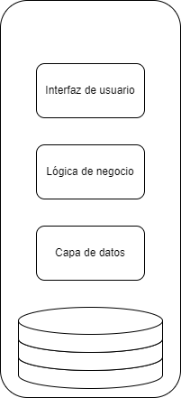
</p>

  las aplicaciones monolíticas pueden tener un buen rendimiento y suelen ser faciles de gestionar en las fases inciales de los proyectos de software; a medida que el software evoluciona suelen ser escalables hasta alguna medida dependiendo de la naturaleza del software, pero eventualmente pueden hacerse casi implosibles de escalar, patrón tiene una desventaja notable frente a otros, los despliegues e integraciones suelen hacerse más lentos y complejos, también Las aplicaciones monoliticas suelen ser dificiles de probar y mantener a medida que se hacen mas complejas, el acoplamiento entre los componentes, la deuda tecnica y la dificultad para separar las responsabilidades pueden ser factores de riesgo para este patrón.

- **arquitectura de capas( N layers)**: este patrón, suele ser complementario a aplicaciones monolíticas; consiste en organizar los componentes de la aplicación en capas horizontales, cada capa tiene una responsabilidad especifica ( ej. lógica de negocio, lógica de presentación ). El patrón no especifica la cantidad ni el tipo de capas, esta decision depende del equipo de desarrolladores; aún así, la mayoria de las arquitecturas de capas, cuenta con 4 capas principales: presentación, negocio, persistencia y datos. En algunos casos, las capas de persistencia y negocio se combinan en una sola capa.
  
  En la arquitectura de capas, las capas deben estar separadas e independientes. es decir que por ejemplo la capa de negocio, no debería tener información de como se muestra la información al usuario en la capa de presentación, tampoco debería necesitarla; lo mismo aplica para las demás capas, ya que cada capa debe proveer una abstración de sus funcionalidades, que permita la interación con el resto de los componentes de la aplicación.

  <p align="center">
  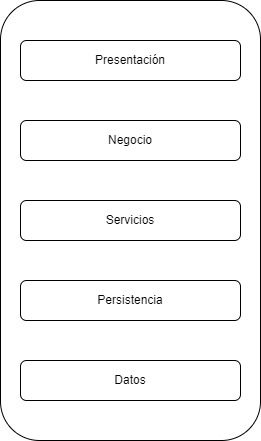

</p>

  En general este patrón permite un prototipado y desarrollo rapidos, además de adaptarse a una gran variedad de necesidades de negocio, sin embargo tiene una desventaja de escalabilidad; ya que a medida que el software se hace más complejo, puede ser dificil organizar las capas y separar sus responsabilidades. Además, es facil caer en el antipatrón de sumidero, es decir una solicitud a un servicio de arquitectura en capas debe pasar por todas las capas sin aplicar ninguna lógica empresarial.

- **arquitectura orientada a servicios ( service-oriented )**: este patrón consiste en separar los componentes del software en servicios desacoplados e independientes que se encargan de una fracción de la logica de negocio y se comunican entre ellos mediante peticiones de red( tradicionalmente http ). esta arquitectura le permite a los desarrolladores aprovechar codigo heredado, así como reutilizar componentes ya construidos e integrar nuevos facilmente.
  Este patrón consta de cuatro componentes principales:
  
  - Servicios: este es el componente basico de la arquitecura, pueden ser privados dentro de equipos y organizaciones o ser expuestos para el uso del publico en general. Internamente los servicios se componen de tres partes principales:
    - implementación: contiene toda la lógica necesaria para que el servicio realice sus funciones
    - contrato: define la naturaleza del servicio y sus condiciones, por ejemplo requisitos para su funcionamiento, tipo de datos, entre otros.
    - interfas: esta es la cara visible del servicio para los demás servicios, en ella se define que como se accede a los metodos del servicio.
  - proveedor de servicios: este crea mantiene y provee los servicios para ser usados
  - consumidor de servicios: es quien sea que utilice los servicios, puede ser una aplicación o otro servicio. entre el proveedor y consumidor debe haber un contrato, que indique como interactuan ambas partes.
  - registry (registro/ repositorio): en este componente se almacenan los servicios, consiste en un directorio que puede ser accedido por los consumidores para acceder a los servicios que necesiten.

   en este patrón se requiere implementar un contrato de comunicación,como puede ser: protocolo de acceso simpe a objetos (SOAP), RESTfull HTTP, colas de mensajes, entre otros; en general se suele usar una combinación de varios patrones y  es común el uso de un patrón complementario: *bus de servicios empresariales ESB por sus siglas en ingles*.
  un ESB, es en escencia un componente encargado de la comunicación entre otros componentes del software, en el caso de la arquitectura orientada a servicios, se encarga de gestionar: modelos, conecciones, mensajería, patrones de comunicación, entre otras. haciendo que los servicios puedan integrarse entre ellos y a otras aplicaciones de forma rapida y sencilla.
  si no se implementa un ESB o cualquier otro patrón de integración y comunicación, este patrón pierde su proposito, pues los servicios estarian aislados.
  
  <Mark>Nota: los servicios en este patrón deben ser desacoplados e independientes, sin embargo, cuando se implementa un ESB, este suele ser centralizado.</Mark>

<p align="center">
  
</p>

  en terminos generales, este patrón provee una adaptabilidad rendimiento y mantenibilidad altos, gracias a que sus componentes son independientes y están desacoplados; por otra parte, el ESB puede ser un factor de riesgo en esta arquitectura, siendo un componente centralizado en la arquitectura, si este falla, la aplicación no funcionará.
   Mientras el software evoluciona y se hace mas complejo, también se hacen mas complejas las comunicaciones entre los servicios, así mismo, un diseño ineficiente del ESB afecta el rendimiento y la escalabilidad del producto en su conjunto.
  La escalabilidad es limitada en este patrón de arquitectura, ya que varios servicios pueden necesitar uno o varios recursos simultaneamente y necesitan ser orquestados; sumado a esto, el acoplamiento en los servicios y el antipatrón de sumidero puede generar inconvenientes, a medida que la red de servicios crece, pueden darse casos de servicios repetidos y relaciones circulares

- **arquitectura de eventos ( event-driven )**: Esta arquitectura se compone de diversos servicios altamente desacoplados y con responsabilidad unica, los cuales reciven y procesan eventos de manera asincrona. En este patrón hay dos formas principales de organizar los componentes dependiendo de las necesidades: mediador( mediator ) y agente o corredor ( broker )
  - Mediador: esta topología consiste en delegar la orquestación de diversos pasos a un servicio; por ejemplo: al realizar una orden de compra en una aplicación de e-comerce, podria ser necesario verificar si el producto solicitado está en el inventario, luego verificar la información bancaria del usuario, la cobertura del envio y la confirmación de pago, para posteriormente generar un recibo de pago, enviar un correo electrónico de confirmación de orden y mostrar información sobre el envio del producto.
  
  todos estos pasos necesitan ser orquestados, para determinar el orden de los pasos y cuales se pueden ejecutar en paralelo o son dependientes de otros.

<p align="center">
  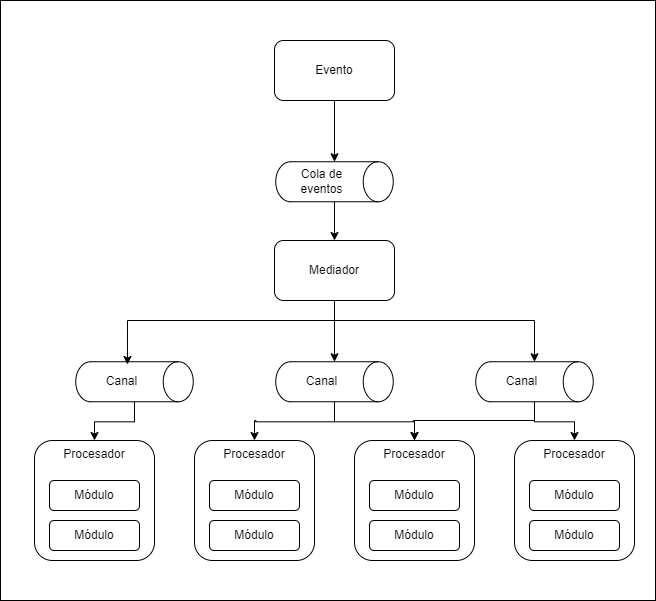
</p>

  el patrón de mediador consta de cuatro partes principales:

- la cola de eventos: este componente actua como punto de entrada, recibe los eventos y los transporta al mediador. El patrón no especifica que tipo de cola implementar, esta puede ser una cola de mensajes, el endpoint de un servicio web o una combinación de ambos.

- el mediador: es el responsable de recibir el evento inicial y orquestar los pasos que este contenga, al ejecutar cada uno de estos pasos, el mediador emite un mensaje de procesamiento al canal de eventos que será luego procesado. Es importante anotar que el mediador no ejecuta ni tiene conocimiento de ninguna lógica de negocio, sino mas bien conoce los pasos y el flujo entre los mismos.
  
- el canal de eventos: este componente es usado por el mediador para enviar mensajes a los procesadores, los canales pueden ser implementados en forma de colas de mensajes o temas de mensajes; generalmente se implementan temas, ya que permiten un procesamiento paralelo por parte de varios ejecutores
  
- el ejecutor o procesador: contiene toda la logica de negocio necesaria para procesar un evento; este componente debería ser autocontenido, indepentiente y altamente desacoplado. según los requerimientos, los procesadores pueden ser más o menos granulares, sin embargo el objetivo es que tengan responsabilidades unicas y no dependan de otros procesadores para realizar su trabajo.

- Agente: esta topología retira la orquestación de los eventos, en este caso, los eventos fluyen a traves de los ejecutores en forma de cadena. en este caso hay solamente dos componentes:
  - el corredor: es equivalente al canal de eventos, y contiene todos los canales pertinentes al flujo de eventos de la aplicación. este puede ser centralizado o distribuido; al igual que en la topología de mediador, se pueden implementar en forma de temas o colas de mensajes.
  - el ejecutor o procesador: cumple la misma función que en la topología de mediador.

    <p align="center">
      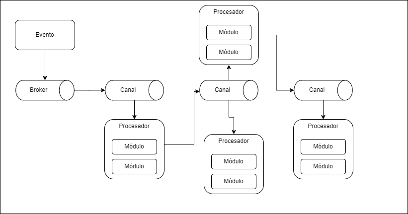
    </p>

    en este patrón, la escalabilidad y el rendimiento de la aplicación son destacables así como la mantenibilidad de los componentes de lógica de negocio sin embargo, el desarrollo puede ser mas compleja, en especial considerando que debido a su naturaleza asincrona y distribuida, se deben abordar requerimientos de disponibilidad y tolerancia a fallas, además de que la mantenibilidad y gobierno de los componentes de mensajería puede hacerse dificil a medida que el software se hace mas complejo.
- **Microkernel ( plug-in )**: esta arquitectura se compone tradicionalmente de 2 componentes basicos: un sistema principal o core y una serie de modulos intercambiables.
  - core: tradicionalmente, este componente debería contener la lógica minima para que el sistema funcione. Adicionalmente debe tener conocimiento de los modulos adicionales conectados y como acceder a estos; existen diversas formas de implementar este requerimiento, una de las más comunes es almacenar el registro de los modulos adicionales junto con datos o meta datos(nombre, protocolo de comunicación, protocolo de datos, datos de entrada y salida, etc.), segun sea el caso en algún formato conveniente.
  - los modulos: este componente debe ser independiente y autocontenido; permitiendo funcionalidades adicionales al sistema principal o apalancando las funcionalidades existentes del mismo. Si bien los modulos deben ser independientes entre sí, es posible diseñar modulos que se apoyen en uno o varios modulos más; siempre teniendo en cuenta que la interacción entre los modulos debe ser minima, para evitar problemas de dependencias y alto acoplamiento.
  
      <p align="center">
      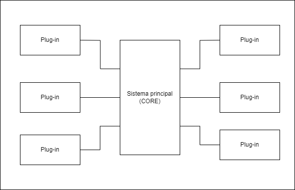
    </p>

  en este patrón es importante considerar que puede aplicarse facilmente junto con otros patrones, destacando su versatilidad y rendimiento. La mantenibilidad del software con esta arquitectura es alta, ya que es relativamente simple agregar nuevas funcionalidades así como mejorar las existentes, gracias a la separación marcada de responsabilidades. sin embargo, a medida que el sistema se hace más complejo puede tener menos escalabilidad adicionalmente es necesario determinar protocolos y contratos para la conexion de los modulos, junto con protocolos marcadados de gobierno de aplicación y esto puede hacer el desarrollo más complejo.
- **Microservicios**: la idea basica detras de este patrón es tener un conjunto de unidades desplegadas independientemente, estas unidades contienen servicios o componentes del software, y pueden variar en granularidad y complejidad ( similar a las clases en los lenguajes orientados a objetos ).
  
  la arquitectura de microservicios es distribuida, por ende es importante tener en cuenta los protocolos de comunicación entre los servicios que la componen( JMS, AMQP, REST, SOAP, RMI, etc.).
  
  Existen muchas topologías en una arquitectura de microservicios y estas varian segun los requerimientos del software; algunas de las mas populares son:
  
  - API-Rest: en esta topología se organizan varios componentes que tienen responsabilidades simples y especificas de forma independiente entre sí. estos servicios son accedidos a traves de una API desplegada de forma separada
  - aplicaciones Rest: en estos casos los componentes son accedidos a traves de un cliente(una aplicación web o mobil, un servicio en nube, etc) que de forma remota se comunica con servicios desplegados independientemente a traves de protocolos tipo rest. en esta topología los componentes tienden a ser mas complejos.
  - mensajes centralizados/ cola de mensajes: en esta topología un agente de mensajeria se encarga de gestionar la interacción entre los servicios; esta topología ayuda a gestionar aplicaciones con requerimientos mas complejos y es más escalable que las aproximaciones mas simbles basadas en rest.
    En este caso es importante destacar que se requiere implementar un agente de mensajería, así como gestores de errores, monitoreo, operaciones asincronas, balanceo de cargas, entre otros.
  
  La arquitectura de microservicios se creó originalmente para abordar problemas tipicos de la arquitectura monolitica y de la arquitectura basada en servicios(SOA), gracias a esto presenta grandes ventajas con respecto a estas ultimas arquitecturas, entre las principales se destaca la integración y despliegue continuos, brindando un mejor control sobre la interacción de los componentes distribuidos, permitiendo hacer más y mejores pruebas al software, ademas de evitar eventos de tipo "big bang" como puede ocurrir en las arquitecturas monolíticas.

  <p align="center">
  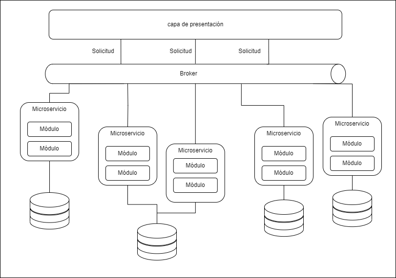

</p>

  en este patrón, la mantenibilidad, escalabilidad y versatilidad son altas, además de permitir un proceso de desarrollo y pruebas muy optimo, gracias a la separación marcada de responsabilidades; asún así, estas separaciones pueden ser un arma de doble filo, ya que en un diseño ineficiente, las responsabilidades pueden estar demasiado separadas, o no estarlo lo suficiente; sumado a esto, mantener el rendimiento de la aplicación puede hacerse complicado en el tiempo, ya que cuanto mas complejo es el software, más microservicios podrían ser agregados, esto representa carga sobre el agente de mensajería, integración de más componentes entre sí y en general más partes mobiles en el software, lo que se traduce en más entropía en el sistema.

- **Arquitectura basada en espacio** :  la idea de este patrón es abordar los problemas de escalabilidad que podria tener una aplicacion, apuntando a que tengan el menor impacto posible. esto se logra a traves de un espacio en tuplas o memoria distribuida, en otras palabras, usar una red de datos replicados, en lugar de una base de datos centralizada; los datos de la aplicación son replicados en las unidades de procesamiento activas, estas mismas pueden encenderse o apagarse dinamicamente, segun las necesidades de la aplicación.

  en esta arquitectura hay dos componentes basicos:
  - unidades de procesamiento: en este se despliegan los componentes del software ( en algunos casos parcialmente) que hagan falta, según el caso pueden ser componentes web,lógica de negocio o una combinación de ambos. Todo dependerá del tipo de software. así mismo, dependiendo de la complejidad del sistema, puede haber una o varias unidades de procesamiento.
    adicionalmente en las unidades de procesamiento se despliega una red de almacenamiento de datos y según el caso, un mecanismo para replicar los cambios en el resto de las unidades de procesamiento

  - intermediario o midleware: este componente es el encargado de gestionar las unidades de procesamiento y las comunicaciones. esta conformado por cuatro componentes:
    - red de mensajes: es el encargado de gestionar los datos de entrada y la información de sesión. En este componente se determina que unidades de procesamiento se encuentran disponibles para atender las peticiones y las redirige a la unidad corresponidente.
    - red de datos: este componente es el uno de los ejes centrales de la arquitectura, es el responsable de interactuar con el gestor de replicación de datos y cada una de las unidades de procesamiento para gestionar la replicación de datos cuando hay una actualización en alguna unidad de procesamiento. dado que la red de mensajes puede asignar una tarea a cualquier unidad de procesamiento, es crucial que todas las tengan exactamente los mismos datos.
    - red de procesamiento: este componente es opcional, y se encarga de gestionar peticiones distribuidas cuando las unidades de procesamiento tienen la logica de negocio distribuida en varias unidades de procesamiento( ej: Unidad1: inventario Unidad2: información de pago)
    - gestor de despliegue: está a cargo de gestionar dinamicamente ( encender o apagar ) unidades de procesamiento, según sea el caso, basandose en la carga que esté soportando el sistema. Este componente es muy importante para lograr una escalabilidad variable y optima en el sistema.

  <p align="center">
  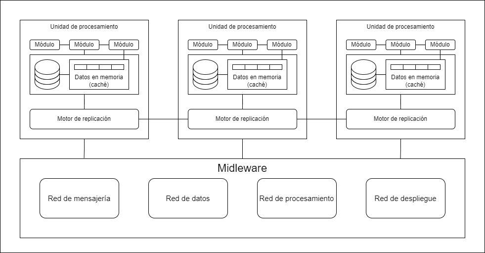

</p>
    Existen variaciones de este patrón, que incluyen una base de datos centralizada, donde se almacenan datos poco volatiles o para inicializar los datos de las bases de datos distribuidas. esta practica puede ayudar a reducir el estrés en las unidades de procesamiento causado por la red de datos en memoria.
    <mark>este patrón tambien es conocido como arquitecura basada en la nube, sin embargo, no necesariamente debe tener sus componentes alojados en un servicio basado en la nube o en PaaS(plataform as a service).</mark>
    este patrón destaca por la escalabilidad y el rendimiento, ademas de ser muy versatil y poderse aplicar a diversos requerimientos, sin embargo en cuanto a la mantenibilidad, desarrollo y aplicación de puede hacerse complicado, si bien la separacion de responsabilidades puede ser relativamente facil de ejecutar, estos factores deben ser atendidos con especial cuidado, de lo contrario puede verse afectado el rendimiento del software o su escalabilidad.  

|Patrón |mantenibilidad | testeabilidad | rendimiento| escalabilidad| complejidad en desarrollo|
|---|:---:|:---:|:---:|:---:|:---:|
|Monolítica | media | baja | alto | bajo | media |
|N-capas| baja | media | bajo | baja | media |
|orientada a servicios| alta | alta | bajo |media | media |
|orientada a eventos | alto | baja | alto | alto | alta|
|Microkernel| alta | alta | alta| baja| alta|
|Microservicios | alta |alta|  bajo | alta | baja |
|Basado en espacio| baja| baja| alta| alta | alta |  

## Modelos de mantenimiento

- **quick fix** : este metodo consiste en priorizar las soliciones mas rapidas por encima de las de mayor calidad. por lo general implica realizar un cambio rapido y localizado, esto con el fin de brindar una solición inmediata a los problemas que pueda presentar el software; además, es común que bajo este modelo se salten algunas reglas del proceso de diseño y deasarrollo, por ejemplo no implementar pruebas unitarias.

Cabe anotar que, esta estrategia genera un rapido deterioro del software, además de agregar entropía, deuda técnica y reducir la calidad general del sistema y solamente debería ser adoptada en casos de emergencia; en conjunto con un proceso de analisis *post mortem* para identificar la causa raiz del problema e implementar una solución de mayor calidad y que aporte al mejoramiento del sistema.

- **Modelo de Bohem**: en 1983 el cientifico de la computación Barry Bohem propuso este modelo, basandose en modelos y principios de economía, la tesis de Bohem propone que como la economía es el eje central de muchos procesos, incluido el desarrollo de software, sus modelos y principios podrían ayudar a entender y mejorar el desarrollo de software.
  
  El modelo de Bohem consiste en un ciclo circular, partiendo de las decisiones administrativas, el equipo administrativo es clave en este modelo pues es quien tiene la responsabilidad de alinear los objetivos de la compañia con las labores de mantenimiento de software y a la vez balancear estos objetivos con las diferentes limitaciones del proyecto( presupuesto, talento, herramientas, tiempo)

- **Modelo de Osborne**:En este modelo se lidia con el proceso de mantenimiento desde una perspectiva más realista; dado que la mayoría de los modelos parten del supuesto de condiciones ideales, como puede ser la existencia de documentación.
  
  El proceso de mantenimiento es tratado como una serie de reiteraciones continuas del ciclo de vida del software y en cada una de las etapas, se toman acciones para mejorar la mantenibilidad del software. Osborne planteó la hipotesis de que un alto porcentaje de los problemas técnicos que se presentan al realizar mantenimiento al software, se deben a una administracion inadecuada, falta de comunicación o una combinación de ambas; además propone estrategias para mitigar estos problemas:
  - incluir requerimientos de mantenimiento en las propuestas o solicitudes de cambio( historias de usuario )
  - adoptar un software de control de calidad en el proyecto
  - implementar estrategias para verificar que los objetivos de mantenimiento fueron alcanzados
  - evaluaciones de desempeño, para retroalimentar a los equipos y sus lideres.
- **Modelo de Taute**: fue propuesto en 1983 por B.J. Taute y popone el mantenimiento de software como un ciclo cerrado de 8 fases:
  - solicitud de cambio: un cliente o usuario realiza una solicitud de cambio
  - estimación: el equipo de mantenimiento se encarga de determinar la cantidad de esfuerzo y tiempo requerido para ejecutar la silicitud
  - planeación: se determina cuando serán desplegados los cambios solicitados al sistema
  - desarrollo: el codigo fuente de la aplicación es modificado para cumplir con el requermiento
  - pruebas: según la organización, el plan de pruebas y los requerimientos, el equipo se asegura de la calidad del nuevo codigo implementado en el sistema
  - documentación: el equipo debe encargarse de documentar el proceso de desarrollo, diseño y pruebas del nuevo requerimiento.
  - despliegue: la modificación o nueva funcionalidad son entregados al cliente
  - operación: el software permanecerá en este estado hasta que se desplieguen nuevas funcionalidades o modificaciones.
- **modelo iterativo**: parte de la premisa de que la implementación del software es un proceso iterativo que implica mejorar el sistema con el tiempo, consta de tres etapas principales:
  - Analisis del sistema
  - proposisción de soliciones candidato
  - implementación de la solución
  En este modelo es de suma importancia una documentación rigurosa del sistema, así como de su ciclo de vida( requerimientos, diseño, plan de pruebas ) puesto que dicha documentación es el punto de partida pra la fase de analisis. Asi mismo la fase de proposición e implementación pueden implicar un rediseño del componentes del sistema, el cual debe ser debidamente documentado, para ser usado en futuras iteraciones.
- **modelos reuso**: se basa en la idea de que el mantenimiento puede ser entendido como un proceso que implica reusar partes existentes del sistema, además de construir componentes que posteriormente podrán reutilizados; generalmente cuenta con cuatro etapas:
  - Identidicación de candidatos a reuso
  - analisis de los componentes del sistema
  - adaptar los componentes a reusar, para cumplir los nuevos requerimientos
  - integrar el nuevo componente al sistema
- **modelo reactivo**: en este modelo se aplica la estrategia de esperar a que los componentes del software fallen para repararlos, suele ser una estrategia de bajo costo y aplicarse solamente a componentes no escenciales o con poco impacto en la oprabilidad del sistema, esto debido a que en el modelo reactivo no se suelen contemplar fases de planeación, algunas topologías de este modelo son:
  - Mantenimiento de avería: puede ser planeado o no planeado, la idea es que una vez que un componente del software falle total o parcialmente, regresarlo a un estado en el cual sea nuevamente funcional. Existe una variación conocida como "run to failure" que consiste en permitir que el componente falle totalmente para reconstruirlo o restaurarlo a un estado operable.
  - Mantenimiento correctivo: la idea es que cuando un componente falle, se identifique la causa raiz del comportamiento inesperado y se rectifique el mismo, con el fin de evitar que uno o varios incidentes generen un fallo mayor
  - Mantenimiento de emergencia: es el tipo de mantenimiento que se ejecuta cuando el software presenta inoperabilidad en cualquier nivel, el objetivo es regresar el sistema a un estado operable lo antes posible, durante o despues de ejecutar el mantenimiento, se debe identificar y solucionar la causa raiz del incidente.
- **open source**: el software libre, no suele contar con un equipo establecido de mantenimiento, sino que sus comunidades se encargan de administrar y realizar dicha labor. En estos casos el ciclo de vida puede estar a cargo de diversas personas de la comunidad.
  |tarea| descripción | encargado|
  |:---:|:---:|:---:|
  |Analisis inicial| puede ser el reporte de un incidente, su verificación y documenteación o la solicitud de una nueva funconalidad  | cualquier persona(usuario, desarrollador, autor) |
  |asignación| uno o varios desarrolladores se encargarán de implementar el requerimiento| cualquier desarrollador( es común que un desarrollador se asigne tareas a si mismo)|
  |implementación | uno o varios desarrolladores implementan y documentan el requerimiento | desarrollador(es) asignado(s) |
  |enviar la modificación | la implementación es enviada para su revisión y validación, estos cambios se almacenan y administran usando diversas herramientas por ejemplo GitHub | desarrollador(es) asignado(s) |
  |revisión | implica la discusión y posterior aceptación o rechazo de la solución propuesta | comunidad|
  |pruebas|  se ejecuta un plan de pruebas sobre la implementación, que puede variar según el proyecto | moderadores/testers / autores |
  |despliegue| dependiendo del proyecto, puede existir una serie de ambientes previos a producción(stage, QA, lab) | moderadores /autores |
  |Anuncio | implica comunicar las nuevas funcionalidades del proyecto, además de información relevante, como fechas de despliegue. | moderadores/autores|
  |publicación | consiste en desplegar la nueva versión del software, para que esté disponible a los usuarios; dependiendo del proyecto, desplegar una nueva versión puede ser más o menos complejo,  | moderadores/autores|

## Estudios de caso

- [LinkedIn](#linkedin)
- [Netflix](#netflix)
- [Figma](#figma)
- [khan academy](#khan-academy)
- [airbnb](#airbnb)
- [Reddit](#reddit)
- [Rompiste Reddit](#rompiste-reddit)
- [El fallo de Roblox](#el-fallo-de-roblox)

---

- ### [LinkedIn](https://www.linkedin.com/)

  en el año 2003, LinkedIn se fundó con el objetivo de mejorar las conecciones profesionales de las personas, La primera base de usuarios fue de 2700; al igual que muchos productos, la versión inicial tenia una sencilla arquitectura monolitica, que alojaba la logica de negocio, base de datos servicios web y componentes visuales, este monolito era conocido como Leo.

    <p align="center">
  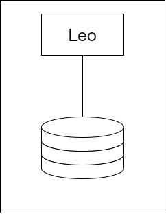

</p>

  Para LinkedIn, las conecciones entre los usuarios son su componente principal, por lo tanto desde las fases iniciales del proyecto, se apuntó a construir un servicio para gestionar la red de conexiones entre los usuarios. En terminos generales, consistia en un grafo donde cada nodo representa un miembro y era almacenado en memoria para maximizar el rendimiento; adicionalmente tenia el requerimiento de poder ser escalable de forma independiente del monolito Leo, este nuevo servicio se nombró Cloud, y se potenció gracias a otro servicio de busqueda [apache Lucene](https://lucene.apache.org/)

  Con el tiempo, el producto tomó fuerza, con lo cual Leo fue haciendose mas complejo; este requerimiento de escalabilidad fue resuelto de manera horizontal e implementando un balanceador de cargas para las diversas instancias desplegadas, sin embargo esta escalada afectó a Cloud, que no se encontraba equipado para asumir las nuevas cargas que infringía el sistema sobre la base de datos de usuarios.
  en un principio, se recurrió a una solución clasica, el escalado vertical; con mas capacidad en procesamiento y memoria. adicionalmente se comenzó a implementar una serie de replicas de las bases de datos, esta replicación necesitaba ser orquestada y para esto se desarrolló [databus](https://github.com/linkedin/databus) que es una herramienta de codigo abierto desde 2013.

  <p align="center">
  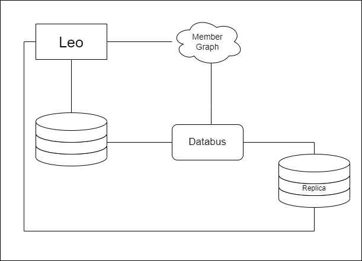
  </p>

  en este punto, comienza a acumularse deuda técnica, no es recomendable ni viable escalar indefinidamente, adicionalmente mientras crece la aplicación, la mantenibilidad se verá afectada, los monolitos más grandes tardan más en desplegarse y el rendimiento de la aplicación tiende a decaer.

  a medida que LinkedIn tenia más trafico, fallos en producción, dificultades para detectar fallos, recuperar la operabilidad y desplegar nuevas funcionalidades, sumado a un decremento en la disponibilidad; llevaron a un proceso de reingeniería en el software.

  progresivamente el equipo de ingeniería aisló varios servicios como las busquedas, comunicaciones, perfiles y grupos. Posteriormente las capas de presentación también fueron aisladas, como las funcionalidades de reclutamiento o perfiles publicos; al mismo tiempo algunas funcionalidades nuevas fueron estructuradas en forma de servicios independientes. en el año 2010 se estimaban mas de 150 servicios independientes y para 2015 más de 750.
  Estos servicios son libres de estado (Stateless), y se escalan de forma horizontal cuando es necesario, en conjunto con diversos tipos de balanceadores de carga; en esta instancia, se tienen datos de las capacidades de los servicios en terminos de carga y rendimiento. adicionalmente se implementaron diversas estrategias de monitoreo de rendimiento y disponibilidad.

  En cuanto a la gestión de datos, el equipo de ingeniería integró una memoria caché de varias capas, estó ayudó a la escalabilidad y reducir la carga sobre la base de datos.
  sin embargo, eventualmente se descartó esta estrategia, ya que se almacenaban datos de diversos dominios y mantener la validez de los datos y el grafo de solicitudes se estaba haciendo demasiado costoso en terminos de esfuerzo.  Por lo cual se adaptó una estrategia de caché más simple y cercana a la fuente de datos, permitiendo una escalabilidad horizontal, reduciendo la latencia y la carga cognitiva.

  eventualmente surgieron diversos requerimientos de flujos de datos, por ejemplo enviar una actualización de perfil al servicio de analítica y hacer logs de la operación, mantener una cola de mensajes para los diversos chats, entre otros.
  para abordar estos requerimients, se desarrolló [kafka](https://kafka.apache.org/), este actua como una gran autopista para alojar los flujos de datos y cuenta con un rendimiento y escalabilidad notables, una de sus mayores ventajas es la baja latencia de acceso a los datos, con estas nuevas capacidades, fue posible construir sistemas de alertas y monitoreo mas eficientes, ademas de herramientas de analitica en tiempo real y la capacidad de realizar seguimientos y visualizar el grafo de solicitudes.
    <p align="center">
  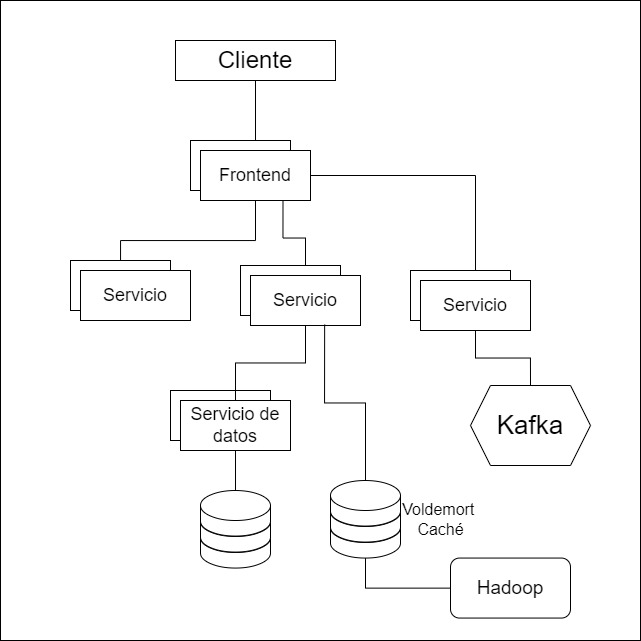
  </p>

  en la actualidad LinkedIn tiene iniciativas para asegurar una alta mantenibilidad en su producto:

- Inversion: esta iniciativa surgió en 2011, la idea era poner en pausa el desarrollo de nuevas funcionalidades para centrar los esguerzos en mejorar las estrategias de despliegue, realizar refactoring, evaluar la productividad de desarrollo, considerar la infraestructura, entre otras actividades, que aumentan el conocimiento general del producto, incrementan la agilidad de los equipos y permiten desarrollar software de mejor calidad.
  
- Superblocks: en escencia, es un grupo de servicios que realizan una serie de tareas en un solo acceso a la API del sistema. La iniciativa surgió con el llamado *call graph* o grafo de solicitudes; una solicitud simple como ver el perfil personal, requiere recolectar y organizar datos de diversos dominios que se alojan en diferentes servicios, todas estas solicitudes pueden ser complicadas de administrar y darles seguimiento. La idea es que equipos especificos se encarguen de administrar y gestionar bloques, logrando mantener los grafos de solicitudes optimizados.

- ### [Netflix](https://www.netflix.com/co-en/)

  en 1997, netflix inció sus operaciones como una compañia de alquiler de DVD por correo. Incialmente la aplicación tenia una arquitectura simple: una sola base de datos centralizada y un monolito; este concepto se fue adaptando a medida que la base de usuarios crecía. Sin embargo, la base de datos presentaba un factor de riesgo, ya que también era monolitica.

  cuando Netflix( streaming ) se lanzó al publico en 2007, el servicio EC2 de AWS no era lo suficientemente estable para cubrir los requerimientos de la aplicación; por lo cual la empresa decidió construir dos centros de datos propios. Sin embargo esto represento un reproceso para la empresa, ya que una vez completado el proceso de construir el centro de datos, se hacia necesario construir otro pues el primero se encontraba cerca de su limite. para evitar este ciclo, Netflix decidió realizar un escalamiento vertical para alojar su monolito.

  <p align="center">
  
  </p>
  en el año 2008, un incidente mayor de corrupción de datos hizo que la base de datos fallara y la aplicación dejó de estar disponible durante tres dias. a causa de esto, no fue posible realizar los envios durante este periodo de tiempo.
  Este fue el detonante para tomar medidas cruciales para la organización:
  - migrar todos los datos a AWS
  - migrar la arquitectura a una basada en microservicios

la arquitectura de Netflix, tiene tres componentes principales:

- el cliente: es cualquier dispositivo desde donde se pueda buscar y acceder al contenido de la plataforma.
- el backend: consiste en una serie de servicios corriendo sobre AWS que controlan todo lo que sucede, los servicios son accedidos por el cliente y permiten que los usuarios tengan una experiencia transparente en todas las acciones que realicen.
- la red de entrega de contenido: este componente también conocido como (CDN) por sus siglas en ingles. se encarga de almacenar los videos y es un componente clave, pues la idea es almacenar el contenido lo más cerca a los usuarios posible.

**Open Connect :** este componente ha pasado por varias iteraciones, en la actualidad consiste en una red de ubicaciones fisicas alrededor del mundo, cada ubicación es llamada punto de presencia (PoP por sus siglas en ingles), cada PoP tiene servidores, routers y equipo de red.

las fases iniciales del CDN consistieron en cinco ubicaciones propias en Estados Unidos, en cada una de ellas habia una replica de todo el contenido de la plataforma; con esta infraestructura, se soportaba el servicio de streaming, con aproximadamente 35 millones de usuarios distribuidos en 50 paises.

para el 2009, los costos de los CDN eran más bajos, así que para la organización era mas beneficioso usar CDN de terceros, esta decisión permitió abordar proyectos prioritarios, uno de estos proyectos fue el desarrollo de un switch para obtener datos de diferentes CDN de ser necesario, esto incrementó la calidad del servicio a los usuarios y aumentó la tolerancia a fallos.

en 2012 Netlix lanzó la primera version de su propio CDN dedicado y optimizado para sus requerimientos( streaming de video ), cada CDN consiste de un grupo de servidores, conocidos como OCA (Open connect Appliances), estos servidores están optimizados para procesar archivos grandes.

**Edge:** este componente es el punto más cercano al cliente y constituye el punto de entrada de diversas solicitudes al domino del servicio.

en un principio, la arquitectura de netflix tenía tres capas, presentación, negocio y datos; la capa de negocio era accedida por el cliente a traves de una API, a medida que la base de usuarios creció y se agregaron mas funcionalidades, se decidió separar la aplicación monolitica y adaptarla a microservicios, sin embargo, la lógica para orquestar los microservicios se mantuvo dentro del API principal(monolito).  

Para abordar el requerimiento de orquestación, inicialmente se separó la aplicación en dos partes, la primera consistia en las responsabilidades del streaming mientras que la segunda se encargaba de las funcionalidades de "descubrir", en este punto, habia varios dominios administrados por varios balanceadores de carga; posteriormente, se introdujo un API Gateway,Netflix desarrolló su propia API Gateway, llamada Zuul y fue desarrollada como una herramienta de codigo abierto, para continuar separando las responsabilidades en los microservicios y reducir el acoplamiento entre el cliente y los servicios.
  <p align="center">
  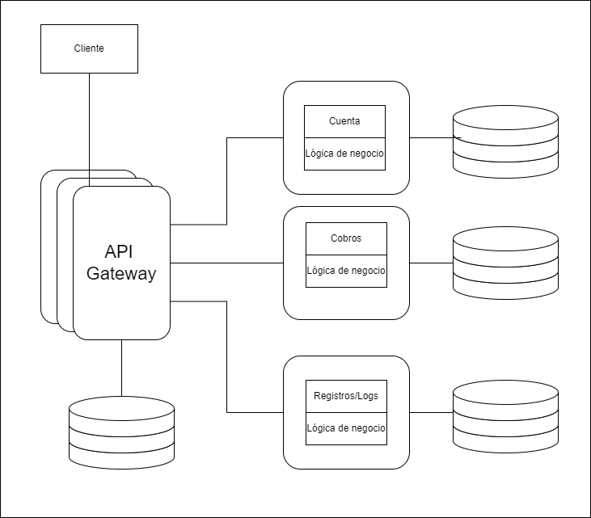
  </p>
Durante el proceso de adaptación a la nueva arquitectura de microservicios, uno de los objetivos mas importantes era hacer los microservicios altamente desacoplados y escalables; para manejar la complejidad adicional que representan los servicios independientes, se agregó una capa de unificación al API. Sin embargo al crecer la aplicación y hacerce mas complejo el dominio, escalar esta capa se hizo más complejo, la solución fue introducir un GraphQL descentralizado (federado); la idea era proveer una API unificada para los clientes y darle flexibilidad a los servicios del backend.

**EVCache:** Netflix es una aplicación que requiere alta disponibilidad, para reducir la latencia y aumentar el rendimiennto de la aplicación se utiliza EVCache, la cual está adaptada a los requerimientos de la organización, es distribuida y optimizada para usarse en AWS.
El sistema está diseñado para mantener tres copias de los datos de caché en ubicaciones diferentes de AWS, a su vez todos los clientes están conectados a todos los servidores, el cliente puede acceder a la memoria a traves de una libreria online, la cual se conecta directamente a la memoria caché con una conección TCP.

  <p align="center">
  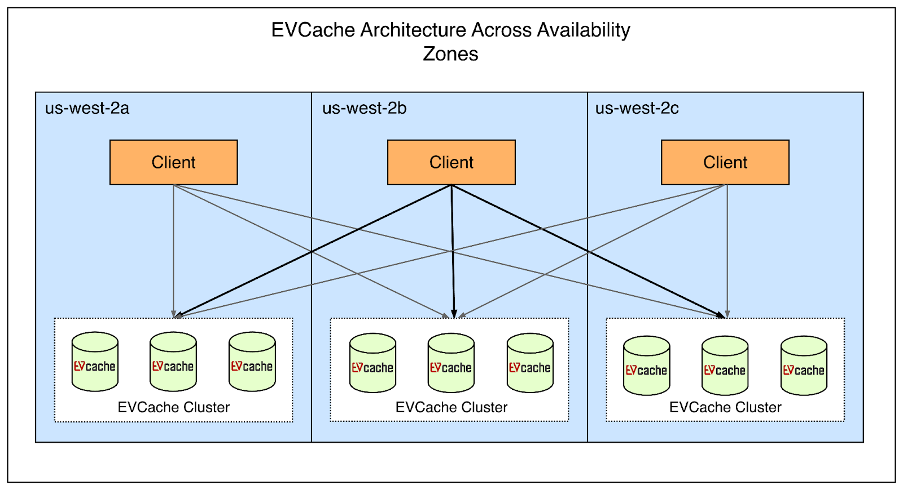
  </p>

- ### [Figma](https://www.figma.com/)

  Esta plataforma de diseño colaborativo, ha crecido aproximadamente un 200% desde el 2018, a la fecha cuenta con cerca de 3 millones de usuarios mensuales. La escalabilidad ha sido un reto constante para el equipo de ingeniería de este producto; la base de datos, representa un componente critico para esta plataforma, ya que de esta depende la funcionalidad del producto, en el componente de base de datos se gestiona metadata como los datos de autorización, información de los archivos compartidos, comentarios, cambios, entre otros.
  En 2020, Figma utilizaba una base de datos alojada en AWS para almacenar la mayoria de la metadata; esta solución cumplia con los requerimientos sin mayores inconvenientes, sin embargo, durante la pandemia del Covid-19, se vio un incremento de usuarios que no se tenia previsto; así durante los picos de uso, el uso de recursos de CPU se incrementaba por encima del 65%, esto causaba inestabilidad en la colaboración y latencias impredecibles en la base de datos.

  Aunque el pico de saturacion del sistema aún no era evidente, el equipo de infraestructura decidió proactivamente abordar los inconvenientes de escalabilidad, previendo posibles puntos de fallo, implementaron:
  - una actualización en la base de datos
  - replicación de base de datos
  - implementación de nuevas bases de datos
  - implementar [PgBouncer](https://www.pgbouncer.org/)

  Estas estrategias permitieron que el equipo pudiera preparar un plan para escalar el componente de datos.

  La primera fase, consistió en realizar una particion vertical de la base de datos; de forma simplificada, esto significa mover tablas a una nueva base de datos.
  Para identificar que tablas serian reubicadas, se consideraron dos factores:
  - Impacto: al mover la tabla, se separaría una porción significativa de la carga de trabajo
  - Aislamiento: la tabla no debía tener dependencias fuertes con otras tablas
  
  una vez identificadas las tablas, era necesario migrarlas sin afectar la disponibilidad de la información para los usuarios, es decir, no era viable "apagar" la plataforma para realizar la migración. Los requerimientos eran:
  - el impacto de la disponibilidad de los datos debe ser menos de 1 minuto
  - el proceso debe ser automatizado, para poder repetirlo facilmente
  - el proceso debe poderse deshacer
  
  dado que no fue posible encontrar un servicio o herramienta de software que cumpliera con estos requerimientos, Figma desarrolló su propia herramienta de software, este opera así:
  - prepara la aplicación para buscar en diferentes particiones de la base de datos
  - replica las tablas de la base de datos original en una nueva base de datos
  - pausa la actividad en la base de datos original
  - sincronizar bases de datos
  - redirigir el trafico a la nueva base de datos
  - reanudar la actividad.
  
  Adicionalmente, se usaron instancias replicadas de PgBouncer para mantener la consistencia del trafico y orquestar la concurrencia en los datos, ademas de permitirle al equipo detectar inconsistencias y corregirlas de ser necesario.

  <p align="center">
  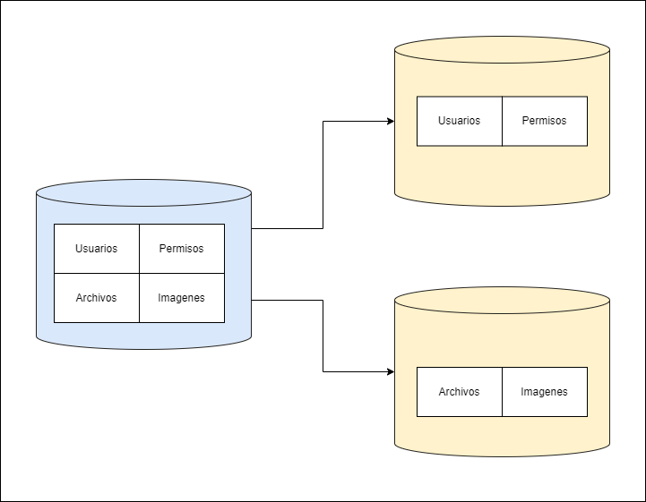
  </p>
  con el tiempo, la cantidad de usuarios en Figma se incrementó, desde 2020 se estima que ha crecido aproximadamente cien veces; con este incremento la carga en las bases de datos también se incrementó, dada la naturaleza de las tablas en Figma, las cuales en ocasiones pueden tener varios terabytes de información y millones de filas, no es viable mantenerlas en una sola base de datos.
  El equipo de infraestructura notó dos potenciales puntos de fallo:
  - Postgres Vacumm: Postgresql cuenta con un proceso que se ejecuta en segundo plano, que consiste en recuperar el espacio que ocupan las filas obsoletas o eliminadas (similar a los procesos de garbage collection); si la base de datos no se aspira regularmente, eventualmente no podrá ejecutar más operaciones. Sin embargo, este proceso consume muchos recursos en las tablas grandes y puede causar problemas de rendimiento e incluso inoperabilidad.
  - IOPS Limit: Amazon RDS, tiene un limite de operaciones de entrada y salida (IO) por segundo, el cual evetualmente seria excedido por las tablas más exigentes de la aplicación.
  
  para abordar estas problematicas, se implementó una estrategia de fragmentación horizontal, que consiste en separar la base de datos principal en bases de datos más pequeñas y alojarlas en varios servidores.
  el equipo de Ingeniería exploró diversas alternativas tanto SQL como NoSQL y eventualmente optaron por construir una solución adaptada al modelo de partición vertical. algunas de las razones para tomar esta decision fueron:
  - menor carga cognitiva: al no necesitar adaptarse a otro tipo de modelo de datos y poder aprovechar la experiencia obtenida con el tiempo en RDS Postgres
  - control sobre la solución: al ser una herramienta internamente desarrollada, estaría hecha a la medida de los requerimientos del equipo y sus necesidades especificas.
  - posibilidad de descartar: en caso de que demasiados inconvenientes se presentaran o la solución no funcionara como debía, podian regresar a la versión anterior de la base de datos con relativa facilidad.
  
    <p align="center">
  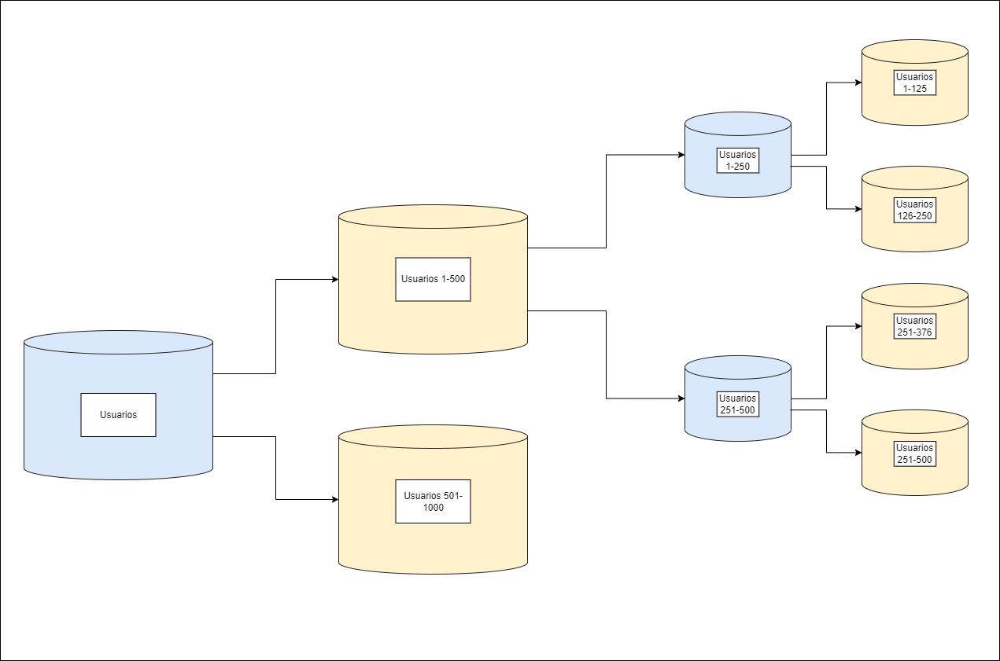
  </p>
  algunas de las caracteristicas de la implementación de fragmentación horizontal, son:
  - Colocaciones para grupos de tablas relacionados (Colos): Figma introdujo el concepto de colos, que son simplemente un grupo de tablas relacionadas que comparten una identificación de fragmento o un fragmento fisico.
  
    para crear los colos, se seleccionaron algunas llaves de fragmentación, como id de usuario, id de archivo, id de organización, entre otros; casi cualquier tabla de la organización puede ser compartida usando alguna de las llaves, esta estrategia permite a los ingenieros interactuar con las tablas distribuidas a traves de una abstracción simple.

    las tablas en un colo, aceptan combinaciones cruzadas y transacciones en la misma llave de fragmento; la aplicación ya interactuaba con la base de datos, de una forma similar, lo cual redujo al minimo la cantida de esfuerzo para hacer que las tablas pudieran ser fragmentadas y para adaptar la aplicación.

  <p align="center">
  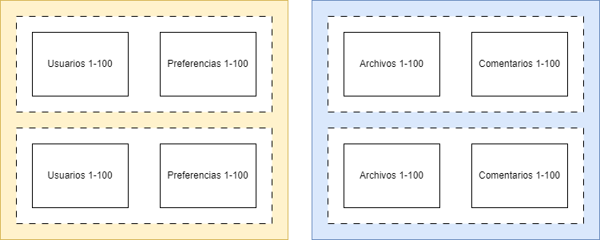
  </p>
  - Fragmentación logica y fisica: se separaron las fragmentaciones logicas en la capa de aplicación de las fragmentaciones fisicas en la capa de datos
  esta separación permitió desacoplar dos partes de la migración e implementarlas de manera independiente; la fragmentación logica, implica crear multiples vistas por tabla, cada una correspondiente a un fragmento especifico. todas las operaciones de lectura y escritura se ejecutan meidante esta vista, haciendo que la tabla parezca estar fragmentada horizontalmente aún con los datos fisicamente alojados en una base de datos unica.

    Así fue posible realizar fragmentaciones de manera mas segura, faciles de deshacer y con menos riesgo, antes de ejecutar las fragmentaciones fisicas, que son mas riesgoas y complejas.

  - DBProxy: este servicio, se ubica en medio de la aplicación y el banco de conexiones, consta de tres componentes:
    - un traductor de consultas, que lee el SQL enviado por la aplicación y lo transformas en arbol de sintaxis abstracto (AST)
    - un planeador logico, que traduce el AST extrae la consulta y el id lógico del fragmento
    - un planeador fisico, que toma el id lógico y lo mapea a la base de datos fisica, para luego reescribir la consula a ejecutar en la base de datos correspondiente.
  
  en septiembre de 2023 Figma desplegó la primera versión del proyecto de fragmentación horizontal, que resultó en un exito rotundo, con un impacto minimo en la operabilidad del sistema; además de que no se observaron regresiones ni afectaciones de rendimiento luego de la ejecución de la fragmentación.
  El objetivo final de Figma es fragmentar todas las tablas de su base de datos; esto representa una escalabilidad casi infinita.
  
- ### khan academy

  Khan academy inició como un simple servicio de tutorias por via telefonica, en 2004, Salman Khan recibió una llamada de un familiar que necesitaba ayuda con su tarea de mantematicas; con el tiempo comenzó a brindarle tutorías a más personas, sin embargo, no lograba atender a todos sus clientes, así que publicó sus videos en youtube.
  la primera versión de esta compañia, consistió en una pagina web desde la cual se reproducian videos que estaban alojados en youtube, esto debido a que el costo de almacenamiento es bajo y tiene un buen rendimiento; adicionalmente se integró un almacenamiento simple, usando Fastly CDN y S3 de AWS. Posteriormente la arquitectura se adaptaría para agregar funciones dinamicas, como el progreso de los estudiantes, mediante servicios serverles.

  La iteración siguiente, fue adaptar la arquitectura monolítica, a una de microservicios, actualmente cuenta con aproximadamente 20 servicios, que se integran a traves de GraphQL y cuentan con bases de datos propias.

  en este caso, la organización, delegó su proceso de escalabilidad a la infraestructura de google cloud. esto les permite concentrar sus esfuerzos en el software y las necesidades del cliente; ademas de que cuando es necesario escalar, puede hacerse con relativamente poco esfuerzo tecnico y operativo.

  el stack tecnologico consiste en lo siguiente:
  - Google cloud para gestionar su infraestructura
  - Fastly CDN para gestionar la entrega de contenido multimedia( videos )
  - GraphQL para integrar sus API
  - codigo fuente en GO, inicialmente la el software estaba construido en python, sin embargo, decidieron migrar a Go, para mejorar sus tiempos de compilación y optimizar el rendimiento.
  
  Durante la pandemia del Covid-19, la cantidad de usuarios de khan academy aumentó mas del doble en dos semanas, en el mes de abril atendieron alrededor de treinta millones de usuarios, la simple arquitectura se mantuvo estable gracias a que la organización tenia los aliados correctos; al apalancarse de la infraestuctura de Google could, el incremento en el trafico no representó un inconvenietne, puesto que con una intervención simple, el sistema podia escalar según las necesidades del momento.

- ### airbnb

  esta compañia inició con sus fundadores alquilando un colchón inflable en la sala de su apartamento; en la actualidad opera en mas de 200 paises y alrededor de 1.5 mil millones de huespedes han sido recibidos por 4 millones de anfitriones alrededor del mundo.

  la primera iteración de Airbnb, fue un monolito construido con Ruby on rails, conocido como *monorail*; En este se combinaban el modelo la vista y el controlador. esta topografía le permitió al equipo de ingenieros avanzar rapidamente en el desarrollo de nuevas funcionalidades con una complejidad manejable.

  Airbnb creció exponencialmente durante varios años, por lo tanto el equipo también debía expandirse, esto implicó varios retos tanto a nivel de ingenieria como a nivel de organización:
  - eventualmente varios cientos de ingenieros se encontraban trabajando simultaneamente en monorail, haciendo los despliegues complejos y lentos
  - Airbnb sigue una filosofía de despliegues democratizados, donde cada ingeniero es responsable de probar y desplegar sus cambios; esto generó una gran cantidad de conflictos en los repositorios.
  - la productividad de los ingenieros se redujo, causando frustración

  <p align="center">
  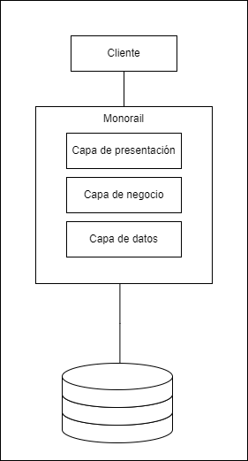
  </p>

  Ante estas problematicas, Airbnb decidió migrar su arquitectura a una basada en servicios; la idea basica era construir una red de servicios que diferentes clientes accederían a traves de un gateway, la cual se encargaría de enrutar las solicitudes.

  Con la intención de proveer a los ingenieros con un estandar y un concenso sobre la arquitectura de los servicios y sus patrones, se adaptaron los siguientes principios:
  - base de datos por servicio: cada servicio debia poder leer y escribir sus propios datos, así que cada servicio tiene una base de datos, de la cual es responsable por completo.
  - cada servicio debe tener una responsabilidad especifica: con el fin de evitar que monorail se transformara en una serie de monolitos mas pequeños, o que algún servicio se convirtiera en un monolito; adicionalmente Airbnb decidió evitar los microservicios, en su lugar prefirió que los servicios cumplieran funciones especificas referentes al negocio.
  - evitar las funcionalidades duplicadas: para aumentar la mantenibilidad, los servicios tienen partes que pueden compartirse dentro de la infraestructura a traves de librerias y servicios compartidos
  - la modificación de datos debe ejecutarse a traves de eventos estandarizados: si un servicio crea una nueva fila, el servicio de disponibilidad debe ser capaz de gestionar este evento y notificarlo a los interesados.
  - cada servicio es critico: los servicios deben tener mecanismos de alerta, observabilidad y altos estandares de calidad, ademas de mantener buenas practicas acordes a la infraestructura.
  
  <p align="center">
  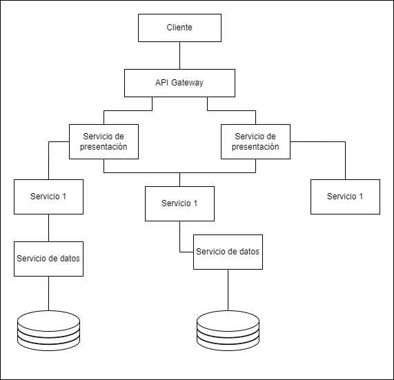
  </p>

  a medida que evolucionó el software, diversos requerimientos surgieron, como la integración de kubernetes, para orquestar los varios cientos de servicios alojados en instancias de EC2, adicionalmente la organización construyó herramientas propias, alugunos ejemplos son:
  - API Framework: con el fin de aumentar la productividad de los desarrolladores, esta herramienta provee un canal de comunicación limpio y simple entre servicios; así los desarrolladores puenden concentrar sus esfuerzos en desarrollar y gestionar la logica de negocio sin preocuparse de los detalles de la comunicación entre servicios.
  - Spinnaker: Airbnb usa Spinnaker para configurar ambientes de pruebas, donde corren analisis automatizados usando Canary; basandose en diversas metricas como el analisis de trafico de datos y el indice de fallo, se crea una calificación para el ambiente, con la cual se puede decidir si promover el codigo a la siguiente etapa del desarrollo o fallar.
  - Powergrid: esta libreria se desarrolló internamente, para gestionar las tareas paralelas con mayor facilidad; la idea es organizar tareas como un grafo asiclico dirigido (DAG) cada nodo del grafo es una tarea o una función.
  usando este concepto, es posible modelar cada endpoint de los servicios como un flujo de datos, donde las solicitudes son las entradas y las respuestas son las salidas.

  Adicionalmente se utiliza el concepto de Bloques de servicios, apuntando a simplificar la dependencia entre los servicios y mejorar la mantenibilidad; cada bloque puede entenderse como una colección de servicios que se agrupan según la funcionalidad de negocio que cumplen.
  Cada bloque puede exponer una fachada con endpoints que permiten a los clientes leer y escribir información.

- ### reddit

  esta empresa fue fundada en el año 2005, su vision era ser: "la pagina principal de internet". Con el tiempo evolucionó en una red social que alberga miles de comunidades de diversos temas.
  inicialmente fue construido usando Lisp, sin embargo a finales de 2005 fue migrado a python, la razón principal de esta decision fue que Lisp no contaba con suficientes librerias estables y aceptadas, por lo general no había mas de una opción de librería cuando se incurría en una necesidad, sumado a esto, la mayoría de las librerias no tenian una documentación pertinente.

  Al migrar a Python, adaptaron el marco de trabajo Web.py, el cual fue desarrollado por uno de los fundadores y posteriormente en 2009 se adoptó Pylons como marco de trabajo para la web.

  Reddit inició con una arquitectura monolitica, que convive con las nuevas adaptaciones hasta la fecha. Esta arquitectura se puede dividir en cuatro componentes principales.
  - Red de entrega de contenido (CDN): este componente se encarga te administrar la logica más cercana al cliente
  - Front end
  - Monolito R2: este fue construido en las versiones iniciales de la aplicación y se ha adaptado con el paso del tiempo a las nuevas necesidades y requerimientos.
  - servicios: a medida que la aplicación evolucionó, se han ido separando responsabilidades del monolito principal, para ser ubicadas en servicios independientes.
  
  <p align="center">
  
  </p>

  **Monolito R2:**
  este componente es la base del funcionamiento de Reddit y tiene internamente su propia arquitectura; ademas de estar desplegado en varios servidores simultaneamente.
  
  el punto de entrada es un balanceador de carga, que envia las solicitudes al servidor correspondiente. Para complementar, las tareas mas costosas, como encuestas o votaciones, son delegadas a un componente asincrono, a traves de Rabbit MQ.

  a medida que la base de usuarios creció, nuevas adaptaciones fueron realizadas al monolito original, una de estas fue la integración de GraphQL ditribuido en 2017.
  En terminos generales, el objetivo era combinar las diferentes API de GraphQL (subgraph) que usaban los diversos servicios, en una sola API conocida como supergraph, este actua como punto pincipal para los clientes solicitar y recibir datos.

  Varios subgraphs fueron agregados al monolito original, estos servicios se construyeron usando Go y conviven con los servicios originales construidos en Python. Eventualmente R2 será retirado una vez que todas sus funcionalidades se conviertan en microservicios. Es muy importante realizar esta migración de manera incremental y controlada para en caso de fallos poder regresar al monolitosin afectar la integridad y disponibilidad de la aplicación.

  Para ejecutar la migración, se implementó una estrategia de despliege conocida como blue/green, que consiste en darle control de la aplicación tanto al monolito como a los subgraph, luego ubicar un balanceador de cargas entre el supergraph y los subgraphs para que este redirija el trafico al componente respectivo, con esta estrategia también es posible controlar que porcentaje del trafico es administrado por el monolito o por el subgraph, lo que permite mantener la aplicación estable durante la migración.

  **Replicación de datos:**
  en las fases iniciales, reddit replicaba sus datos utilizando registros de escritura por adelantado (WAL) para garantizar que si una transacción de escritura fallaba, pudiera ser restaurada a partir de los registros.

  Esta estrategia tenía algunas desventajas en relación a la consistencia de los datos:
  - dado que los procesos de restauración se ejecutaban durante la noche, podia haber inconsistencias durante el dia
  - los cambios en los esquemas podian causar incosistencias en los datos a replicar
  - la base de datos principal y su replica se ejecutaban en instancias de EC2, haciendo que el proceso de replicación fuera poco tolerante a fallos.
  
  la siguiente iteración, con el fin de hacer el proceso de replicación mas estable fue usar un proceso de captura de cambios en los datos (CDC), usando Debezium y Kafka conect; el proceso consiste en que cada vez que se realice una transacción en la base de datos( agregar, modificar, borrar) Debezium detecta el evento y lo envia a un tema de kafka, posteriormente un procesador detecta el nuevo evento en el tema de kafka y replica los cambios.
  
  Esta estrategia se sigue utilziando acutalmente y permite que Reddit realice replicas en tiempo real a varios sistemas, ademas de que los procesos son livianos, por lo tanto ya no requiere instalarse en instancias EC2.

  <p align="center">
  
  </p>


  **Gestión de la metadata:**
  Inicialmente los datos de multimedia( fotos, videos, Gifs, contenido embebido), eran gestionados usando buckets S3 y distribuidos en varios sistemas, sin embargo no tenian un formato consistente para ser almacenados ni habia un mecanismo para auditar los cambios o analizar contenido.

  Reddit decidió reconstruir el almacenamiento de datos multimedia, con las siguientes caracteristicas:
  - todos los metadatos de multimedia provenientes de los diversos sistemas debian estar en la misma ubicación fisica
  - soportar creación y actualización
  - poder obtener datos a una velocidad de 100 mil solicitudes por segundo con un retraso de no mas de 50 milisegundos.
  
  la herramienta elegida, fue AWS Aurora Postgres, con un diseño simple, que consistió en ubicar una capa de servicios, que gestiona los proceso de lectura y escritura. La migración consistió en:
  - permitir a los clientes realizar escritura dual en las API de la metadata
  - mover los datos de la base de datos anterior a la nueva base de datos dedicada
  - permitir que los clientes realicen lectura dual de la metadata
  - monitorear las solicitudes de lectura y solucionar las inconsistencias
  - dirigir el trafico a la nueva base de datos
  
    <p align="center">
  
  </p>


  **optimización de la pagina principal (Feed):**  
  En las fases iniciales, cada publicación se representaba como un objeto que contenia toda la información referente al mismo, cada cliente contenia logica de negocio para determinar que partes del objeto debian ser mostradas en la interfas de usuario; usualmente esta logica no se sincronizaba entre plataformas.

  el Feed de Reddit tenía los siguientes requerimientos:
  - la arquitecura debe soportar altas velocidades de desarrollo y ser altamente escalable, ya que varios componentes se integran con Feed estos deben poderse entender, construir y probar rapidamente.
  - el tiempo a interactivo y el rendimiento del "scroll" deben ser satisfactorios, pues son clave para la experiencia del usuario
  - Feed debe ser consistente entre diferentes plataformas( Android, iOS, web)
  
  para cumplir con estos requerimientos, se adaptó una estrategia conocida como UI orientada a servidor, donde el backend controla el tipo de elementos y el orden  en los que se renderizan; mientras que al cliente solamente se le entrega la descripción de los elementos para renderizar.

  adiconalmente se implementaron otros componentes:

  - Optimización de imagenes:
    inicialmente la optimización de las imagenes era delegada a terceros, posteriormente con el incremento de la base de usuarios esta funcionalidad se movió al interior de la organización, con el fin de controlar costos y la experiencia de usuario; se construyeron dos servicios:
    - Gif2Vid: esta herramienta convierte archivos en formato Gif y MP4 en formatos estaticos, lo que optimiza costos y carga computacional
    - un servicio de optimización de imagenes se encarga de gestionar operaciones como cambios de tamaño, difuminado y transformación de imagenes en general.
  
  - Protección de los usuarios:
    moderar el contenido es escencial hacer de Reddit un espacio seguro para los usuarios de la plataforma, en 2016 se desarrolló un motor de ejecución de reglas llamado Rule-Executor-v1(REV1), esta herramienta le permitió al equipo de seguridad, crear reglas que ejecutarían acciones según la actividad de los usuarios.

    El funcionamiento de REV1 consiste en un script de Lua que se ejecuta ante eventos configurables; de manera simplificada podría representarse con el siguiente código:

    ```Lua
    if postBody.match("texto no permitido") then
      action(Usuario)
    end     
    ```

  REV1 tenía deuda técnica:
  - se ejecutaba en instancias de EC2, lo cual no era acorde con la arquitectura actual donde los servicios se ejecutaban en Kubernetes
  - cada regla se ejecutaba como un proceso individual en un nodo de REV1, por lo tanto era necesario escalar verticalmente a medida que se agregaban nuevas reglas.
  - REV1 estaba construido en Python 2.7, la cual está deprecada
  - las reglas no tenian un control de versiones (git).
  - no existia un ambiente para probar las reglas (QA, Stage).
  
  En 2021, se presentó REV2, basado en una nueva infaestructura llamada Snooron y con una serie de mejoras con respecto a la versión anterior:
  
  |REV1 | REV2|
  |---|---|
  |las reglas se configuran a traves de una interfas web| las reglas se configuran mediante codigo, adicionalmente cuenta con una interfas grafica que hace el proceso mas ciemple |
  | las reglas se almacenan usando Zookeeper | las reglas se alamacenan usando Github y cuentan con un respaldo en S3 |
  | cada regla tiene su propio proceso | mediante Flink, se administra un flujo de eventos que separa los procesos |
  |las acciones ejecutadas por las reglas eran administradas por R2 | cuando se dispara una regla, envia una acción estructurada a varios temas, que son procesados por una aplicación llamada Safety Actioninig Worker |
  <p align="center">
  
  </p>

- ### "rompiste reddit:"

  El dia 14 de marzo de 2023, Reddit sufrió un fallo que puso a la plataforma en un estado de inoperabilidad durante aproximadamente 5 horas (314 minutos); si bien la afectación no fue total, si causó que la mayoría de los flujos no pudieran ejecutarse y solamente las partes mas modernas del sistema resistieron el fallo.

  Reddit tiene su arquitectura basada en la nube desde el año 2009 y ha adaptado kubernetes desde etapas muy tempranas, a medida que el software ha evolucionado y se han agregado nuevos requerimientos, se han acumulado varios conjuntos de clusters adaptados a medida, configurados directamente desde la consola de kubernetes en lugar de plantillas estandarizadas.

  Reddit tiene un equipo llamado el equipo de computo, encargado de administrar las partes de la infraestructura que ejecutan cargas de trabajo, además de definir los procesos de actualización y mantenimiento necesarios para optimizar dicha tarea.
  El ciclo de actualización consiste en actualizar el componente en un ambiente controlado( stage, lab, etc. ) y realizar diversos tipos de pruebas a un conjunto de clusters para posteriormente desplegar los cambios en el ambiente de producción, inciando en el menos critico hasta llegar al más critico.

  En este caso, la actualización se ejecutó en "el viejo Reddit" un cluster que contiene los componentes más antiguos de la aplicación, el objetivo era actualizar la version de Kubernetes 1.23 a 1.24, sobre las 7:00 pm UTC se ejecutó el proceso de actualización, para dos minutos despues presentarse el fallo a gran escala. el sitió falló de golpe, y el equipo notó que el cluster afectado no entregaba ninguna estadistica, adicionalmente el DNS privado (entre ambientes o interno) no parecia funcionar sin embargo el DNS publico resolvía las solicitudes sin inconvenientes; este comportamiento nunca se había presentado en ningun ambiente, cluster, ambiente de pruebas o ambientes locales.

  En general, cuando un despliegue falla, revertir el cambio es el camino más claro a seguir; sin embargo, para las actualizaciones de Kubernetes, no existe un proceso para degradar la versión de la herramienta, dado que varios esquemas de datos e información son migrados automaticamente, cuando Kubernetes cambia de versión en un sistema.

  El flujo de la actualización requería que se realizara una copia de seguridad, con esta era posible recuperar el sistema y degradar la versión de Kubernetes( revertir el cambio ) sin embargo, el proceso para la restauración había sido programado varios años atras y no estaba debidamente actualizado, por lo que no había una garantía real de su confiabilidad. Adicionalmente nunca habia sido usado en un cluster de producción. El estimado inicial de inoperabilidad total fue de varias horas en caso de ejecutar el proceso de restauración, por lo cual el equipo decició continuar investigando e intentar reestablecer el servicio sin usar el proceso de restauración.

  Luego de aproximadamente una hora de analisis el equipo se dividió en dos frentes: el primero se encargó de preparar el sistema para la restauración y el segundo se concentraba en intentar reestablecer el servicio; adicionalmente se realizaron reinicios en varios componentes, con la esperanza de que algun ciclo infinito o una fuga de conexiones fuera el causante del fallo, en este proceso notaron algunas anomalias:
  - los pods tardaban excesivamente en iniciar y finalizar
  - las imagenes de contenedores estaban tardando mucho en ser obtenidas( varios minutos, para 100MB)
  - los registros de control de vuelo tenian muchas entradas, pero no había ningun mensaje de error explicito.
  
  Eventualmente, tambien notaron que la interfas de redes de contenedores(Calico) no funcionaba correctamente; este componente tiene 3 partes principales:
  - Calico kube controller: se encarga de ejecutar acciones basado en el estado del cluster, por ejemplo asignar direcciones IP a los nodos que utilizan los pods
  - Calico typha: es un proxy de la memoria caché, se ubica entre diversas partes de calico y el cluster de control de vuelo para reducir la carga en el API de kubernetes
  - calico node: es el componente central del la red, es un agente que se ejecuta en cada nodo del cluster,, para generar y registrar de manera dinamica interfaces para cada pod en el nodo.
  
  calico kube controller se encontraba en un estado permanente de *ContainerCreating*. Parte de la actualizacion, consiste en actualizar el control de vuelo del cluster, junto con la version de ejecucion del contenedor. Reddit usa CRI-O para la version de ejecución del contenedor y esta herramienta tiene un error menor, que consiste en que al actualizar CRI-o en un anfitrion(host), uno o varios contenedores se ejecutan para luego de manera aleatoria y lentamiente entrar en un estado permanente de inicialización; cuando esto ocurre una solución rapida es eliminar el pod, para que este sea recreado sin errores. sin embargo en este caso el problema no tenía que ver con el error de CRI-O.

  para calico typha, se ejecutó un reinicio completo, una vez eliminados los pods, estos no se reiniciaron, el equipo consideró la posibilidad de que se encontraran atorados en algún estado previo o un proceso anterior impidiera la ejecución de los pods, por lo que ejecutó un reinicio desde los componentes de control de vuelo e incluso se reinció el componente completo. Ninguna de estas acciones permitieron que se reiniciaran los pods de calico typha.

  los registros del API para las transacciones de escritura, mostraban varios errores de timeout, especificamente en las solicitudes a los controladores de adminsion del cluster(OPA); una vez eliminadas las configuraciones del controlador, los erroes dejaron de aparecer, sin embargo el cluster no se recuperó.

  luego de mas de dos horas de inoperabilidad, el equipo optó por ejecutar el proceso de restauración usando la copia de seguridad, dado que varios nodos serian inconsistentes una vez se ejecute la restauración, se apagaron todos los nodos, para no lidiar con el proceso de conciliación.

  una vez apagados todos los nodos, se ejecutó el proceso de restauración, de forma simplificada consistió en:
  - apagar dos nodos de control de vuelo
  - restaurar los componentes en un tercer nodo
  - restablecer los datos
  - iniciar nuevos nodos de control de vuelo y sincronizarlos
  
  Este procedimiento originalmente fue construido en una version de kubernetes anterior y deprecada, ademas de que no consideraba CRI-O, sino que las instrucciones estaban orientadas a Docker; esta situación llevó a confusión con la sintaxis y los estandares de nombramiento, además había comandos y argumentos en funciones que ya no eran soportados. El procedimiento fue tomado como una base para reconstruir uno nuevo que aplicara a las condiciones del sistema.

  en el procedimiento se especificaba que, todos los nodos debian ser finalizados excepto el primero, en el contexto de Reddit, el primer nodo de control de vuelo se utiliza como base para los procedimientos, además de que este no recibe un nombre en AWS, sino que mantiene el nombre asignado por defecto (ip-10-10.ec2.internal).
  La restauración del primer nodo se completó con exito, posteriormente varios nodos se ejecutaron una vez que el cluster de escalado (autoscaler) inició, esto se consideró una buena señal ya que significaba que la comunicación por red funcionaba correctamente, sin embargo, autoscaler se apagó mientras la restauración del sistema se completaba. Posteriormente se inicializaron los dos nodos restantes y se inció el proceso de sincronizacción.

  el equipo se enfrentó a un inconveniente en este punto, ya que los nodos nuevos no se sincronizaban, por lo tanto un grupo de ingenieros se encargó de abordar este incidente, mientras que los demás planeaban como restaurar lentamente el sistema con cargas de trabajo controladas. Eventualmente se detectó la causa del fallo de conexion y sincronización en los nodos, el cual fue solucionado.

  tras conseguir restaurar los nodos de control de vuelo, se ejecutó el proceso de recuperación de datos, mientras que se restauraba el trafico a la aplicación de manera controlada, eventualmente logrando restaurar el sistema por completo.

  **causa del fallo**

  Despues de restaurar el sistema, se procedió a la investigación de las causas del fallo; el punto de inicio fue el comportamiento detectado durante el fallo, sobre las 7:04 el volumen de registros para el API se incremento cinco veces, tras una revisión en el OPA, se pudo observar que cinco segundos antes de que el servidor comenzara a hacer spam, los registros de OPA cesaron completamente.
  dos segundos antes del fallo, el daemon de Calico-node comenzó a eliminar rutas del primer nodo de control de vuelo, este comportamiento es normal y esperado, sin embargo en este caso todas las rutas de todos los nodos estaban siendo eliminados.

  El colapso del sistema se debió a un fallo de configuracion en los nodos de control de vuelo; en terminos generales, estos nodos deben actuar como reflectores en la arquitectura, y ser usados por los demás nodos para operar. sin embargo con la actualización de Kubernetes a la versión 1.24, removió la terminología "master", este cambio se había introducido inicialmente en la version 1.2 permitiendo que los clusters en ejecución mantuvieran la terminologia original para los nombnres de los nodos, a partir de la versión 1.24 el nuevo termino es "control-plane".

  Cada nodo en el cluster de Calico es emparejado con todos los demás nodos generando una red de conecciones, para reducir la complejidad de la administración. Sin embargo en el contexto de Reddit, la red es demasiado compleja, el costo de administrarla es muy alto y la escalabilidad es limitada;
  la solución para Reddit es utilizar reflectores de ruta, consiste en designar algunos nodos para emparejar con todos los nodos, mientras los demás nodos se conectan a los nodos reflectores.

  los reflectores fueron configurados hace varios años, eventualmente el equipo original que realizó las configuraciones se disolvió y a su vez la estrategia de los reflectores se convirtió en un sistema heredado; por lo tanto el conocimiento se perdió.

  La inconsistencia es la verdadera causa raiz del fallo, dado que los clusters de Kubernetes que utiliza Reddit en su arquitectura están modificados para suplir necesidades especificas de la aplicación, como lo son componentes que solamente se ejecutan en clusters especificos, tareas que corren en una zona especifica, entre otros; si bien esta es una consecuencia del crecimiento de la aplicación, la heterogeneidad del amniente genera deuda tecnica que puede llevar a fallos e inoperabilidad.

  **acciones:**
  - El equipo se encuentra ejecutando acciones para hacer los ambientes de la arquitectura de Reddit más homogeneos.
  - varios componentes de la aplicación están siendo estandarizados permitiendo su reutilizción y apuntando a aumentar la mantenibilidad del sistema
  - se han introducido más cluster de pruebas, para evitar desplegar cambios a producción que puedan causar fallos o inoperabilidad
  - se están adaptando herramientas para adminstrar el ciclo de vida de los cluster, además de hacerlos lo más homogeneos, reusables y recreables posible
  - se están adoptando politicas para evitar los componentes unicos
  - se están implementando herramientas de documentación en alto detalle.

- ### el fallo de roblox

  El 20 de junio de 2022, Roblox sufrió un fallo que causo inoperabilidad en sus servicios durante aproximadamente 73 horas, afectando a 50 millones de jugadores.
  la compañia posee sus propios centros de datos, servidores, infraestructura de red y hardware de computo en genera, con el fin de tener control de la escalabilidad costos y otras variables criticas para cumplir los requerimientos del software.
  
  La administración de los servidores y demás servicios de hardware, se realiza usando un stack tecnologico llamado HashiStack, que consiste en:
  - Nomad para agendar tareas, este decide que contenedores serán ejecutados en cuales nodos y que puertos están disponibles, además valida el estado de los contenedores(health check)
  - Consul, para realizar tareas conocidas como "service discovery", es decir, permitir a los servicios encontrar otros servicios que puedan necesitar a traves de una base de datos de registro de servicios(service registry), que contiene combinaciones de tipo IP:Puerto. Adicionalmente cumple labores de verificación de estado, bloqueo de sesiones y almacenamiento de tipo clave valor(KV).

      Consul es desplegado como un cluster de maquinas que pueden tener dos roles: "votantes" que se encargan de mantener el estado del cluster y "no votantes" los cuales son replicas de solo lectura, que ayudan a escalar las solicitudes de lectura; cada cierto tiempo, uno de los votantes es elegido como lider, su trabajo será replicar los datos en todos los demás votantes y determinar si los datos han sido guardados por completo. Consul elige el lider mediante el algoritmo Raft y distribuye el estado de forma que cada nodo esté de acuerdo con las actualizaciones, es común que el lider cambie durante el dia varias veces.
  - Vault, para administrar contraseñas, certificados y demás datos sensibles.
  
  El 28 de octubre a la 1:37 pm, el desempeño de Vault, se vió reducido y un solo servidor de Consul presentó altas cargas de CPU; sin embargo los Jugadores no se vieron afectados. La primera hipotesis fue una posible degradación de hardware,
  estas situaciones son comunes para la organización y Consul fue equipado con mecanismos para resistir fallos de hardware, sin embargo, cuando el hardware funciona lento en lugar de fallar, afecta directamente al rendimiento de Consul;
  Tras investigar, los ingenieros determinaron que el cluster de Consul, del cual Vault y otros servicios dependian, se encontraba en un estado "unhealthy". las metricas mostraban una latencia de escritura elevada para el sistema de KV (2 segundos, el promedio es de 300 ms ). Por lo tanto, el equipo decidió reemplazar el nodo de Cluster que presentaba problemas.

  Aún con el nodo reestablecido y ejecutandose en un nuevo hardware, este no se recuperó adicionalmente sobre las 4:35 pm el numero de jugadores se redujo al 50% y el sistema comenzó a presentar una reducción de calidad notable( unhealthy ), hasta que eventualmente colapsó por completo. Debido a que los servicios dependen de Consul para obtener la información de los demás servicios que necesita para funcionar, además, Nomad y Vault dependen de Consul.

  la siguiente hipotesis, fue que los servidores que alojana consul no podian soportar la carga actual de trabajo, afectando el rendimiento de Consul; por ende  el equipo decidió reemplazar los nodos de Consul con nuevo hardware, más potente. Sin embargo sobre las 7:00 pm una vez instalado el nuevo hardware el sistema seguia reportando que la mayoría de los nodos no tenía el rendimiendo esperado y la latencia de escritura seguia estando alrededor de los 2 segundos.

  sobre las 2:00 am del 29 de octubre, un nuevo sintoma se presentó en el sistema, el lider de Consul no se sincronizaba correctamente con los votantes.
  el equipo decidió apagar el cluster por completo y regresarlo al estado anterior al fallo del sistema; si bien esto podria representar la perdida de algunos datos de configuración, era mas viable reestablecer las configuraciones manualmente a cambio de reestablecer el sistema.

  Si bien no habia flujo de datos de usuarios en el sistema, los componentes internos de Roblox seguian solicitando información de sus dependencias a Consul; estas solicitudes generaban carga de trabajo en el cluster. El equipo consideró la posibilidad de que esta carga, hiciera que el sistema fallara de nuevo, por lo tanto configuraron tablas ip en el cluster para bloquear el acceso, esto con el fin de asignar cargas de forma controlada y averiguar si la carga de trabajo era un factor relevante en el problema.

  Una vez reestablecido el nodo, las metricas indicaban un correcto funcionamiento, al remover las tablas ip el servicio continuó funcionando con normalidad, eventualmente Consul comenzó a degradar su rendimiento nuevamente y el sistema volvió a presentar la latencia en las operaciones de escritura, luego los sistemas dependientes de Consul comenzaron a indicar fallos, hasta que finalmente el sistema colapsó nuevamente sobre las 4:00 am.

  la siguiente hipotesis consistia en que posiblemente una vez iniciado Consul, el trafico de solicitudes de conexion por parte de los contenedores de los servicios internos del software, era demasiado grande. El equipo redujo el uso de Consul para luego introducirlo de forma controlada, con el fin de garantizar un punto de partida solido, se tomaron diversas medidas:
  - el trafico externo fue bloqueado
  - se redujo el uso de consul en los sistemas al minimo, todos los usos no escenciales fueron desactivados
  - varios servicios fueron escalados a cantidades minimas de instancias
  - se redujo la frecuencia de revisión de 1 a 10 minutos
  
  Con estas medidas sobre las 4:00 pm se intentó reestablecer el servicio, las metricas indicaban un funcionamiento correcto; pero sobre las 2:00 am del 30 de octubre Consul comenzó a fallar nuevamente. Se descartó la hipotesis de que las cargas de trabajo eran la causa del incidente, por lo tanto el equipo decidió investigar Consul internamente.

  La investigación indicaba que las transacciones de escritura en Consul KV eran bloqueadas por largos periodos de tiempo (contención); la causa no era clara, sin embargo una hipotesis era que el cambio de hardware( de una cpu de 60 nucleos a una de 128) podria haber contribuido a este sintoma, por lo tanto el equipo decidió revertir el cambio de hardware; sin embargo esto no solucionó el fallo principal.

  al revisar los reportes provenientes de `perf report` y analizar los flame graph del servidor de Consul; el equipo notó que el servicio de streaming causaba contención y a su vez el incremento del uso de CPU, al desactivar la funcionalidad de streaming para todos los sistemas de Consul, incluidos los nodos de enrutamiento de trafico, sobre las 3:50 pm la latencia de escritura en Consul KV se redujo al promedio.
  Adicionalmente Consul eligió un lider de cluster, lo cual era normal, pero algunos lideres mostraban los mismos problemas de latencia ya conocidos, lo cual no era normal

  El equipo decidió ejecutar una solución temporal, dado que el cluster se comportaba con normalidad siempre que determinados servidores no se eligieran como lideres, se adoptaron estrategias para que los lideres problematicos no permanecieran elegidos; con esto, fue posible retornar los servicios que dependen de Consul a un estado funcional(healthy).

  Consul retornó a un estado confiable, el siguiente paso fue recuperar el servicio de caché, la estrategia para esta operación consistió en desplegar el servicio nuevamente, esta acción tuvo diversos inconvenientes:
  - los datos almacenados de Consul KV eran inconsistentes
  - un nodo que se encontraba en un estado "unhealthy" estaba siendo identificado como disponible, por lo que varias tareas de caché estaban siendo asignadas al nodo, las cuales fallaban debido a su estado
  - la herramienta de despliegue estaba diseñada para realizar ajustes incrementales en despliegues en ejecución, no para desplegar una gran cantidad de datos desde cero.

  a pesar de los inconvenientes, sobre las 5:00 am del 31 de octubre el servicio de caché se encontraba operable.

  Con el fin de evitar nuevos fallos al permitir que los jugadores ingresaran nuevamente, se implementó una herramienta de control de acceso para un determinado porcentaje de jugadores al azar, este porcentaje se incrementó progresivamente en intervalos de aproximadamente 10 %, finalmente sobre las 4:45 pm del 31 de octubre luego de 73 horas Roblox era completamente operacional.

**Causa del fallo**
Roblox introdujo una funcionalidad de streaming en Consul a una porción de sus servicios internos. el objetivo de esta actualización era reducir el uso de CPU y ancho de banda en los cluster de Consul, la actualización fue exitosa, por lo que se fue incorporando de forma incremental en el resto de los servicios del backend. el 27 de octubre a as 2:00 PM un dia antes del fallo, la actualización de streaming fue añadida al servicio responsable de enrutamiento de trafico. Previendo el incremento de usuarios tipico de los ultimos meses del año, adicionalmente se incremento el numero de nodos que soportan enrutamiento de trafico en un 50%

Streaming era mas eficiente en general, sin embargo, usaba menos elementos de control de concurrencia( canales ). para casos de alta carga de escritura y lectura, Streaming causaba un alto estres de contención en los canales, causando bloqueos en las transacciones de escritura y haciendolas menos eficientes, adicionalmente la arquitectura de sockets dobles para el hardware de mas nucleos, con modelos de memoria NUMA generaba contención adicional.

Los lideres problematicos( lentos ) se debieron a la configuración de una librería de persistencia usada por Consul, llamada BoltDB. Esta se encarga de almacenar los registros de Raft( elección de lideres ), además de un registro de las operaciones aplicadas. BoltDB está diseñado para tomar registros(fotos/snapshots) regularmente. esta operación escribe el estado actual de Consul al disco y luego elimina el registro mas antiguo de BoltDB.

El espacio designado paara BoltDB en disco nunca se reduce, incluso cuando los registros mas antiguos son eliminados, en cambio todas las paginas que a eliminar, son marcadas como "libres" y reescritas en transacciones futuras, las paginas para reusar, se almacenan enuna estructura llamada freelist. En general la latencia de escritura no se ve afectada por las actualizaciones del freelist; sin embargo Roblox presenta cargas de trabajo que hacen que el mantenimiento del freelist sea muy costoso.

**accionables :**

- mejoras en Telemetry:
  - Telemetry y Consul, tenían una dependencia circular al momento del fallo, por lo que cuando Consul falló no era posible obtener datos de Telemetry. Esta dependencia fue eliminada en varios sistemas, no solo en Consul por lo que ahora Telemetry es independiente de los servicios que debe monitorear.
  - se configuraron registros para el rendimiento de Consul y BoltDB, se implementaron alertas especificas para detectar señales de un fallo similar al ocurrido
  - se aumentó el alcance de Telemetry para tener mejor visibilida de de los patrones de trafico en los sistemas de Roblox.
- expansión de los centros de datos: Consul representaba un punto de fallo unico, por lo que se adelantaron esfuerzos para agregar un centro de datos adicional para respaldar los servicios de backend actuales.
- actualizaciones de Consul y fragmentación:  
  - se han separado servicios criticos para Consul en clusters dedicados, reduciendo la carga en el cluster central.
  - se adelantaron esfuerzos para migrar los datos de Consul kV a un sistema de almacenamiento más apropiado.
  - se implementó una versión nueva de Consul, reemplazando BoltDB con un sucesor llamado bbolt, con el fin de evitar el problema de los freelist.
- mejoras en los procedimientos de arranque y administración de configuracion:
  - dado que el reestablecimiento de la operabilidad se vió afectado por varios factores entre los que se encuentran el despliegue y preparación de los datos en caché, se desarrollaron herramientas para automatizar este proceso
  - se implementaron mejoras en Nomad, para facilitar la ejecución de diversas tareas luego de largos periodos de inoperabilidad
  - se desarrollaron mecanismos para gestionar cambios de configuración
- Reintroducir Streaming: la idea es que una vez el servicio sea propiamente implementado con los nuevos requerimientos y probado a la escala necesaria, se introducirá nuevamente en los sistemas.

## Fuentes

este manual se ha construido con una variedad de publicaciones cientificas, blogs y articulos de la web, esta es la lista de las fuentes consultadas en el dia 01/06/2024
****

[Why Architecture Conformance Matters for Software Systems](https://insights.sei.cmu.edu/library/why-architecture-conformance-matters-for-software-systems/)

[When Your Software’s “Check Engine” Light Is On: Identifying Design Problems that Impact Software Failure](https://insights.sei.cmu.edu/blog/when-your-softwares-check-engine-light-is-on-identifying-design-problems-that-impact-software-failure/)

[A Refactoring Classification Framework for
Efficient Software Maintenance](https://ieeexplore.ieee.org/stamp/stamp.jsp?arnumber=10192906)

[Supporting Software Architecture Maintenance by
Providing Task-specific Recommendations](https://ctreude.ca/wp-content/uploads/2019/12/icsme19c.pdf)

[Software maintenance improvement in small software
companies: Reflections on experiences](https://ceur-ws.org/Vol-2913/paper14.pdf)

[Managing the Consequences of Technical Debt: 5 Stories from the Field](https://insights.sei.cmu.edu/blog/managing-the-consequences-of-technical-debt-5-stories-from-the-field/)

[Software Maintenance and Evolution: a Roadmap](http://www0.cs.ucl.ac.uk/staff/a.finkelstein/fose/finalbennett.pdf)

[Microsoft Word - SM Documentation - revison - Sept 26](https://ruhe.cpsc.ucalgary.ca/downloads/publications/journals/Cost%20Benefits%20and%20Quality%20of%20Software%20Development.pdf)

[Information | Free Full-Text | Challenges in Agile Software Maintenance for Local and Global Development: An Empirical Assessment](https://www.mdpi.com/2078-2489/14/5/261)

[Manifesto for Agile Software Development](https://agilemanifesto.org/)

[Understanding documentation value in software maintenance | Proceedings of the 2007 symposium on Computer human interaction for the management of information technology](https://dl.acm.org/doi/abs/10.1145/1234772.1234790)

[The Information Gathering Strategies of Software Maintainers | Proceedings of the International Conference on Software Maintenance (ICSM'02)](https://dl.acm.org/doi/10.5555/876882.879805)

[The information gathering strategies of software maintainers | IEEE Conference Publication | IEEE Xplore](https://ieeexplore.ieee.org/abstract/document/1167761/references#references)

[SciELO - Brazil - Which documentation for software maintenance? Which documentation for software maintenance?](https://www.scielo.br/j/jbcos/a/zsF5pwLk9twFvTBnvQ4DxLB/)

[Revealing actual documentation usage in software maintenance through war stories - ScienceDirect](https://www.sciencedirect.com/science/article/abs/pii/S0950584907000158)

[A study of the documentation essential to software maintenance | Proceedings of the 23rd annual international conference on Design of communication: documenting & designing for pervasive information](https://dl.acm.org/doi/abs/10.1145/1085313.1085331)

[A Refactoring Classification Framework for Efficient Software Maintenance | Abdullah Almogahed - Academia.edu](https://www.academia.edu/107043475/A_Refactoring_Classification_Framework_for_Efficient_Software_Maintenance?rhid=28108104279&swp=rr-rw-wc-2407010)

[Maintenance and agile development: Challenges, opportunities and future directions | Leon Moonen and Aiko Yamashita - Academia.edu](https://www.academia.edu/2407010/Maintenance_and_agile_development_Challenges_opportunities_and_future_directions)

[Iterative rework: the good, the bad, and the ugly | Richard Fairley - Academia.edu](https://www.academia.edu/26550984/Iterative_rework_the_good_the_bad_and_the_ugly?rhid=28108104279&swp=rr-rw-wc-2407010)

[Software Maintenance Supported by Refactoring | Gustavo Villavicencio - Academia.edu](https://www.academia.edu/19601254/Software_Maintenance_Supported_by_Refactoring?rhid=28108213376&swp=rr-rw-wc-107043475)

[A New Software Maintenance Scenario Based on Refactoring Techniques | Gustavo Villavicencio - Academia.edu](https://www.academia.edu/19613162/A_New_Software_Maintenance_Scenario_Based_on_Refactoring_Techniques&nav_from=11a21cf6-f95e-4c1d-8eeb-f771ac478b97&rw_pos=0)

[Refactoring Tools and Complementary Techniques | Andrew Boake - Academia.edu](https://www.academia.edu/14695374/Refactoring_Tools_and_Complementary_Techniques?rhid=28132117168&swp=rr-rw-wc-19601254)

[The Need of Re-engineering in Software Engineering | Dr. Ahmed Saleem - Academia.edu](https://www.academia.edu/40345182/The_Need_of_Re_engineering_in_Software_Engineering?rhid=28132135328&swp=rr-rw-wc-73820142)

[What you Need to Know about Software Maintenance | Alain Abran - Academia.edu](https://www.academia.edu/16763941/What_you_Need_to_Know_about_Software_Maintenance?rhid=28134869797&swp=rr-rw-wc-19613182)

[Safe upgrading without restarting | Susan Eisenbach - Academia.edu](https://www.academia.edu/54997167/Safe_upgrading_without_restarting)

[Software Maintenance and Evolution: The Implication for Software Development | Edward Ogheneovo - Academia.edu](https://www.academia.edu/87322976/Software_Maintenance_and_Evolution_The_Implication_for_Software_Development?rhid=28134924437&swp=rr-rw-wc-3058317)

[Tasks and Methods for Software Maintenance: a process oriented framework | Torbjørn Skramstad - Academia.edu](https://www.academia.edu/47567411/Tasks_and_Methods_for_Software_Maintenance_a_process_oriented_framework?rhid=28134924437&swp=rr-rw-wc-3058317)

[Open source software maintenance process framework | Virpi Hotti - Academia.edu](https://www.academia.edu/7232641/Open_source_software_maintenance_process_framework?rhid=28170170229&swp=rr-rw-wc-47567411)

[Fault-Proneness of Open Source Software: Exploring its Relations to Internal Software Quality and Maintenance Process | Markku Sakkinen - Academia.edu](https://www.academia.edu/58526119/Fault_Proneness_of_Open_Source_Software_Exploring_its_Relations_to_Internal_Software_Quality_and_Maintenance_Process?rhid=28170504457&swp=rr-rw-wc-7232641)

[A Comparison of the Reliability Growth of Open Source and In-House Software | Sharifah Mashita Syed-Mohamad - Academia.edu](https://www.academia.edu/8272192/A_Comparison_of_the_Reliability_Growth_of_Open_Source_and_In_House_Software?rhid=28170589578&swp=rr-rw-wc-58526119)

[Open Source, Agile and Reliability Measures | Sharifah Mashita Syed-Mohamad - Academia.edu](https://www.academia.edu/107606137/Open_Source_Agile_and_Reliability_Measures&nav_from=b6cbfde0-e1d4-47ff-bc10-e4d004270572&rw_pos=0)

[Exploring the Maintenance Process through the Defect Management in the Open Source Projects - Four Case Studies | Virpi Hotti - Academia.edu](https://www.academia.edu/7232638/Exploring_the_Maintenance_Process_through_the_Defect_Management_in_the_Open_Source_Projects_Four_Case_Studies?rhid=28170504457&swp=rr-rw-wc-7232641)

[Improving Open Source Software Maintenance | rahul singh - Academia.edu](https://www.academia.edu/86836736/Improving_Open_Source_Software_Maintenance?rhid=28170504457&swp=rr-rw-wc-7232641)

[On the Relationship between Software Complexity and Maintenance Costs | Edward Ogheneovo - Academia.edu](https://www.academia.edu/36522872/On_the_Relationship_between_Software_Complexity_and_Maintenance_Costs?rhid=28170593708&swp=rr-rw-wc-86836736)

[Open Source Programmers' Information Seeking During Software Maintenance | KHAIRONI YATIM SHARIF - Academia.edu](https://www.academia.edu/53322828/Open_Source_Programmers_Information_Seeking_During_Software_Maintenance?rhid=28170593708&swp=rr-rw-wc-86836736)

[Hybrid Intelligent Model for Software Maintenance Prediction | Mohammad Alshayeb - Academia.edu](https://www.academia.edu/118087765/Hybrid_Intelligent_Model_for_Software_Maintenance_Prediction)

[Software Maintainability Prediction using Machine Learning Algorithms | anuradha chug - Academia.edu](https://www.academia.edu/9039152/Software_Maintainability_Prediction_using_Machine_Learning_Algorithms?rhid=28134467667&swp=rr-rw-wc-118087765)

[Machine Learning Algorithm Evaluate the maintainability | IJCT Editor - Academia.edu](https://www.academia.edu/29916636/Machine_Learning_Algorithm_Evaluate_the_maintainability?rhid=28134467667&swp=rr-rw-wc-118087765)

[Deep Learning Approach for Software Maintainability Metrics Prediction | ishaani priyadarshini - Academia.edu](https://www.academia.edu/48409087/Deep_Learning_Approach_for_Software_Maintainability_Metrics_Prediction?rhid=28134467667&swp=rr-rw-wc-118087765)

[Measuring of Software Maintainability Using Adaptive Fuzzy Neural Network | mohammad zavvar - Academia.edu](https://www.academia.edu/91014291/Measuring_of_Software_Maintainability_Using_Adaptive_Fuzzy_Neural_Network?rhid=28134467667&swp=rr-rw-wc-118087765)

[Progress on approaches to software defect prediction - Li - 2018 - IET Software - Wiley Online Library](https://ietresearch.onlinelibrary.wiley.com/doi/full/10.1049/iet-sen.2017.0148)

[Towards a Framework for Guiding Aspect-Oriented Software Maintenance Empirical Studies | Sérgio Soares - Academia.edu](https://www.academia.edu/117835996/Towards_a_Framework_for_Guiding_Aspect_Oriented_Software_Maintenance_Empirical_Studies)

[Managing architectural technical debt: A unified model and systematic literature review | Terese Besker - Academia.edu](https://www.academia.edu/117007232/Managing_architectural_technical_debt_A_unified_model_and_systematic_literature_review)

[Technical Debt: An empirical investigation of its harmfulness and on management strategies in industry | Terese Besker - Academia.edu](https://www.academia.edu/86452877/Technical_Debt_An_empirical_investigation_of_its_harmfulness_and_on_management_strategies_in_industry?rhid=28197659385&swp=rr-rw-wc-117007232)

[Software process re-engineering and improvement | Mikio Aoyama - Academia.edu](https://www.academia.edu/21128455/Software_process_re_engineering_and_improvement?rhid=28134380659&swp=rr-rw-wc-40345182)

[Maintenance and agile development: Challenges, opportunities and future directions | Leon Moonen and Aiko Yamashita - Academia.edu](https://www.academia.edu/2407010/Maintenance_and_agile_development_Challenges_opportunities_and_future_directions?email_work_card=view-paper)

[Software Entropy in Agile Product Evolution | Aiko Yamashita - Academia.edu](https://www.academia.edu/2407022/Software_Entropy_in_Agile_Product_Evolution?rhid=28104544603&swp=rr-rw-wc-2407010)

[Software maintenance seen as a knowledge management issue | Nicolas Anquetil - Academia.edu](https://www.academia.edu/18057430/Software_maintenance_seen_as_a_knowledge_management_issue)

[Software Análisis de requisitos y especificación de una aplicación](https://www.yumpu.com/es/document/read/24150999/software-analisis-de-requisitos-y-especificacion-de-una-aplicacion)

[Requerimientos NO funcionales | OVA2\_IngenieriaDeSoftware](https://repositorio.konradlorenz.edu.co/micrositios/001-1527/requerimientos_no_funcionales.html)

[Microsoft PowerPoint - Capitulo 6 Ingenieria\_de\_Requerimientos \[Compatibility Mode\]](https://www.uv.mx/personal/fcastaneda/files/2015/08/G_Capitulo_6_Ingenieria_de_Requerimientos.pdf)

[Amazon.com: Ingeniería de software (Spanish Edition): 9786073206037: Ian Sommerville: Libros](https://www.amazon.com/Ingenier%C3%ADa-software-Spanish-Ian-Sommerville/dp/6073206038/ref=as_li_ss_tl?ie=UTF8&qid=1545258089&sr=8-4&keywords=Ingenieria+de+software&linkCode=sl1&tag=laofideprodei-20&linkId=e47cc795353f282582bdbe59f42e4a27)

[Requerimientos no funcionales: Una clasificación - La Oficina de Proyectos de Informática](https://www.pmoinformatica.com/2015/04/requerimientos-no-funcionales-una.html)

[Videotutorial Requisitos funcionales y no funcionales del proyecto - Fundamentos de la gestión de proyectos: Requisitos | LinkedIn Learning, antes Lynda.com](https://es.linkedin.com/learning/fundamentos-de-la-gestion-de-proyectos-requisitos-21905853/requisitos-funcionales-y-no-funcionales-del-proyecto)

[The difference between functional and non-functional requirements - Reqtest](https://reqtest.com/en/knowledgebase/understanding-the-difference-between-functional-and-non-functional-requirements/)

[Patrones de diseño / Design patterns](https://refactoring.guru/es/design-patterns)

[Patrones de Diseño de Software en Java | EPAM Anywhere](https://anywhere.epam.com/es/blog/patrones-de-diseno-de-software-en-java)

[Refactoring and Design Patterns](https://refactoring.guru/)

[Software Design Patterns Tutorial - GeeksforGeeks](https://www.geeksforgeeks.org/software-design-patterns/?ref=shm)

[System Design Tutorial - GeeksforGeeks](https://www.geeksforgeeks.org/system-design-tutorial/?ref=shm)

[Software Architecture Patterns](https://theswissbay.ch/pdf/Books/Computer%20science/O%27Reilly/software-architecture-patterns.pdf)

[14 software architecture design patterns to know | Enable Architect](https://www.redhat.com/architect/14-software-architecture-patterns)

[Who Needs an Architect?](https://martinfowler.com/ieeeSoftware/whoNeedsArchitect.pdf)

[Software Architecture Guide](https://martinfowler.com/architecture/)

[A Brief History of Scaling LinkedIn | LinkedIn Engineering](https://engineering.linkedin.com/architecture/brief-history-scaling-linkedin)

[What Is the CAP Theorem? | IBM](https://www.ibm.com/topics/cap-theorem)

[Analysis of a master-slave architecture for distributed evolutionary computations | IEEE Journals & Magazine | IEEE Xplore](https://ieeexplore.ieee.org/document/1580635)

[The Great Migration: from Monolith to Service-Oriented - InfoQ](https://www.infoq.com/presentations/airbnb-soa-migration/)

[Airbnb's Migration from Monolith to Services - InfoQ](https://www.infoq.com/news/2019/02/airbnb-monolith-migration-soa/?utm_source=substack&utm_medium=email)

[How Engineering Principles Can Help You Scale - Khan Academy Blog](https://blog.khanacademy.org/how-engineering-principles-can-help-you-scale/)

[How Khan Academy Successfully Handled 2.5x Traffic in a Week - Khan Academy Blog](https://blog.khanacademy.org/how-khan-academy-successfully-handled-2-5x-traffic-in-a-week/)

[Khan Academy Architecture - by Neo Kim](https://newsletter.systemdesign.one/p/khan-academy-architecture?utm_source=post-email-title&publication_id=1511845&post_id=142302191&utm_campaign=email-post-title&isFreemail=true&r=1ilv0t&triedRedirect=true)

[PRINCIPLES OF CHAOS ENGINEERING - Principles of chaos engineering](https://principlesofchaos.org/?utm_source=substack&utm_medium=email)

[A Brief History of Airbnb’s Architecture](https://blog.bytebytego.com/p/a-brief-history-of-airbnbs-architecture?utm_source=post-email-title&publication_id=817132&post_id=141850581&utm_campaign=email-post-title&isFreemail=true&r=1ilv0t&triedRedirect=true)

[A Brief History of Scaling Netflix - ByteByteGo Newsletter](https://blog.bytebytego.com/p/a-brief-history-of-scaling-netflix?utm_source=post-email-title&publication_id=817132&post_id=142814811&utm_campaign=email-post-title&isFreemail=true&r=1ilv0t&triedRedirect=true)

[A Brief History of Scaling Netflix - ByteByteGo Newsletter](https://blog.bytebytego.com/p/a-brief-history-of-scaling-netflix)

[Microservices at Netflix Scale: Principles, Tradeoffs & Lessons Learned • R. Meshenberg • GOTO 2016 - YouTube](https://www.youtube.com/watch?v=57UK46qfBLY&ab_channel=GOTOConferences)

[The Evolution of Reddit.com's Architecture - InfoQ](https://www.infoq.com/presentations/reddit-architecture-evolution/)

[Reddit's Architecture: The Evolutionary Journey](https://blog.bytebytego.com/p/reddits-architecture-the-evolutionary?utm_source=post-email-title&publication_id=817132&post_id=143342954&utm_campaign=email-post-title&isFreemail=true&r=1ilv0t&triedRedirect=true)

[What is Application Migration? | IBM](https://www.ibm.com/topics/application-migration)

[Software migration made easier! | LinkedIn](https://www.linkedin.com/pulse/software-migration-made-easier-vable/)

[Roblox Return to Service 10/28-10/31 2021 - Roblox Blog](https://blog.roblox.com/2022/01/roblox-return-to-service-10-28-10-31-2021/?utm_source=newsletter&utm_medium=email&utm_campaign=pragmatic_engineer)

[100X Scaling: How Figma Scaled its Databases](https://blog.bytebytego.com/p/100x-scaling-how-figma-scaled-its?utm_source=post-email-title&publication_id=817132&post_id=144363634&utm_campaign=email-post-title&isFreemail=true&r=1ilv0t&triedRedirect=true&utm_medium=email)

[How Figma's Databases Team Lived to Tell the Scale | Figma Blog](https://www.figma.com/blog/how-figmas-databases-team-lived-to-tell-the-scale/)

[The growing pains of database architecture | Figma Blog](https://www.figma.com/blog/how-figma-scaled-to-multiple-databases/)

[Using a qualitative research method for building a software maintenance methodology | rizal ahmad - Academia.edu](https://www.academia.edu/3208857/Using_a_qualitative_research_method_for_building_a_software_maintenance_methodology?rhid=28405537889&swp=rr-rw-wc-32816299)

[Microservices vs. monolithic architecture | Atlassian](https://www.atlassian.com/microservices/microservices-architecture/microservices-vs-monolith#:~:text=A%20monolithic%20architecture%20is%20a%20singular%2C%20large%20computing%20network%20with,of%20the%20service%2Dside%20interface.)

[Pattern: Monolithic Architecture](https://microservices.io/patterns/monolithic.html)

[How modular can your monolith go? Part 1 - the basics](https://microservices.io/post/architecture/2023/07/31/how-modular-can-your-monolith-go-part-1.html)

[Monolithic Approach vs. Microservices Approach: Which is Right for Your Application? | LinkedIn](https://www.linkedin.com/pulse/monolithic-approach-vs-microservices-which-right-your-majid-sheikh/)

[What is Service-Oriented Architecture (SOA)? | IBM](https://www.ibm.com/topics/soa)

[Service-Oriented Architecture - GeeksforGeeks](https://www.geeksforgeeks.org/service-oriented-architecture/)

[What is SOA? - SOA Architecture Explained - AWS](https://aws.amazon.com/what-is/service-oriented-architecture/#:~:text=you%20implement%20microservices%3F-,What%20is%20service%2Doriented%20architecture%3F,other%20across%20platforms%20and%20languages.)

[What Is an Enterprise Service Bus (ESB)? | IBM](https://www.ibm.com/topics/esb)

[On the Benefits of Planning and Grouping Software Maintenance Requests | Humberto Almeida - Academia.edu](https://www.academia.edu/32816299/On_the_Benefits_of_Planning_and_Grouping_Software_Maintenance_Requests?sm=b)

[How to Manage Knowledge in the Software Maintenance Process | Ana Martínez García - Academia.edu](https://www.academia.edu/5274045/How_to_Manage_Knowledge_in_the_Software_Maintenance_Process?rhid=28405555647&swp=rr-rw-wc-18057443)

[Apache Lucene - Welcome to Apache Lucene](https://lucene.apache.org/)

[Antipatterns | DevIQ](https://deviq.com/antipatterns/antipatterns-overview)

[Open sourcing Databus: LinkedIn's low latency change data capture system | LinkedIn Engineering](https://engineering.linkedin.com/data-replication/open-sourcing-databus-linkedins-low-latency-change-data-capture-system)

[GitHub - linkedin/databus: Source-agnostic distributed change data capture system](https://github.com/linkedin/databus)

[Putting Apache Kafka To Use: A Practical Guide To Building an Event Streaming Platform (Part 1) | Confluent](https://www.confluent.io/blog/event-streaming-platform-1/)

[You Broke Reddit: The Pi-Day Outage : r/RedditEng](https://www.reddit.com/r/RedditEng/comments/11xx5o0/you_broke_reddit_the_piday_outage/?utm_source=newsletter&utm_medium=email&utm_campaign=pragmaticengineer&utm_id=pragmaticengineer)

[Keeping Figma Fast | Figma Blog](https://www.figma.com/blog/keeping-figma-fast/#the-little-macbook-that-could-until-it-could-no)

[Figma’s infrastructure: What goes into powering a web-based design tool | Figma Blog](https://www.figma.com/blog/under-the-hood-of-figmas-infrastructure/)

[How Figma’s multiplayer technology works | Figma Blog](https://www.figma.com/blog/how-figmas-multiplayer-technology-works/)

[What is Sharding? - Database Sharding Explained - AWS](https://aws.amazon.com/what-is/database-sharding/)

[File loading, dragging & zooming is up to 3x faster | Figma Blog](https://www.figma.com/blog/figma-faster/)

[PgBouncer - lightweight connection pooler for PostgreSQL](https://www.pgbouncer.org/)

[Open-Connect-TOP-IX-January-2017-1.pdf](https://www.top-ix.org/wp-content/uploads/2016/10/Open-Connect-TOP-IX-January-2017-1.pdf)

[A Brief History of Scaling Netflix - ByteByteGo Newsletter](https://blog.bytebytego.com/p/a-brief-history-of-scaling-netflix?utm_source=post-email-title&publication_id=817132&post_id=142814811&utm_campaign=email-post-title&isFreemail=false&r=1ilv0t&triedRedirect=true&utm_medium=email)

[System Design Netflix | A Complete Architecture - GeeksforGeeks](https://www.geeksforgeeks.org/system-design-netflix-a-complete-architecture/)

[Seeing the forest in the trees: two years of technology changes in one post : r/RedditEng](https://www.reddit.com/r/RedditEng/comments/10egj46/seeing_the_forest_in_the_trees_two_years_of/)

[Thundering herd problem](https://en.wikipedia.org/wiki/Thundering_herd_problem)

[Vault by HashiCorp](https://www.vaultproject.io/)

[What is a Flame Graph? How it Works & Use Cases | Datadog](https://www.datadoghq.com/knowledge-center/distributed-tracing/flame-graph/)

[Consul Streaming: What’s behind it? | by Pierre Souchay | Criteo R&D Blog | Medium](https://medium.com/criteo-engineering/consul-streaming-whats-behind-it-6f44f77a5175)

[What is IT migration?](https://www.redhat.com/en/topics/automation/what-is-it-migration)

[Boehm’s Software Maintenance Model - GeeksforGeeks](https://www.geeksforgeeks.org/boehms-software-maintenance-model/)

[Software Maintenance Models - DZone](https://dzone.com/articles/software-maintenance-models)

[Quick-fix Model - Software Engineering - GeeksforGeeks](https://www.geeksforgeeks.org/software-engineering-quick-fix-model/)

[Software Maintenance: Concepts and Practice - Penny Grubb, Armstrong A. Takang - Google Books](https://books.google.com.co/books/about/Software_Maintenance.html?id=ge8o_VkAsiYC&redir_esc=y)

[Grubb\_Takang-Software\_Maintenance\_Ch5.pdf](https://rti.etf.bg.ac.rs/rti/ms1es/Literatura/Grubb_Takang-Software_Maintenance_Ch5.pdf)

[Types of Reactive Maintenance - GeeksforGeeks](https://www.geeksforgeeks.org/types-of-reactive-maintenance/)

[Taute Software Maintenance Model - GeeksforGeeks](https://www.geeksforgeeks.org/taute-software-maintenance-model/?ref=ml_lbp)

[Reactive Maintenance in Software Engineering - GeeksforGeeks](https://www.geeksforgeeks.org/reactive-maintenance-in-software-engineering/)
.
.

## Contacto

Información de contacto para soporte.

articulos, proyecto
