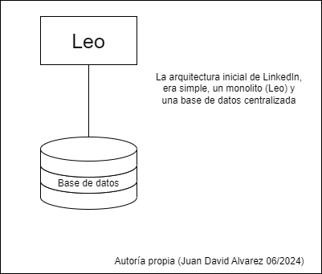

## Estudios de caso

- [LinkedIn](#linkedin)
- [Netflix](#netflix)
- [Figma](#figma)
- [khan academy](#khan-academy)
- [airbnb](#airbnb)
- [Reddit](#reddit)
- [Rompiste Reddit](#rompiste-reddit)
- [El fallo de Roblox](#el-fallo-de-roblox)

---

- ### [LinkedIn](https://www.linkedin.com/)

  en el año 2003, LinkedIn se fundó con el objetivo de mejorar las conecciones profesionales de las personas, La primera base de usuarios fue de 2700; al igual que muchos productos, la versión inicial tenia una sencilla arquitectura monolitica, que alojaba la logica de negocio, base de datos servicios web y componentes visuales, este monolito era conocido como Leo.

  <p align="center">
    
  </p>

  Para LinkedIn, las conecciones entre los usuarios son su componente principal, por lo tanto desde las fases iniciales del proyecto, se apuntó a construir un servicio para gestionar la red de conexiones entre los usuarios. En terminos generales, consistia en un grafo donde cada nodo representa un miembro y era almacenado en memoria para maximizar el rendimiento; adicionalmente tenia el requerimiento de poder ser escalable de forma independiente del monolito Leo, este nuevo servicio se nombró Cloud, y se potenció gracias a otro servicio de busqueda [apache Lucene](https://lucene.apache.org/)

  Con el tiempo, el producto tomó fuerza, con lo cual Leo fue haciendose mas complejo; este requerimiento de escalabilidad fue resuelto de manera horizontal e implementando un balanceador de cargas para las diversas instancias desplegadas, sin embargo esta escalada afectó a Cloud, que no se encontraba equipado para asumir las nuevas cargas que infringía el sistema sobre la base de datos de usuarios.
  en un principio, se recurrió a una solución clasica, el escalado vertical; con mas capacidad en procesamiento y memoria. adicionalmente se comenzó a implementar una serie de replicas de las bases de datos, esta replicación necesitaba ser orquestada y para esto se desarrolló [databus](https://github.com/linkedin/databus) que es una herramienta de codigo abierto desde 2013.

  <p align="center">
  
  </p>

  en este punto, comienza a acumularse deuda técnica, no es recomendable ni viable escalar indefinidamente un monolito, adicionalmente mientras crece la aplicación, la mantenibilidad se verá afectada, los monolitos más grandes tardan más en desplegarse y el rendimiento de la aplicación tiende a decaer.

  a medida que LinkedIn tenia más trafico, fallos en producción, dificultades para detectar fallos, recuperar la operabilidad y desplegar nuevas funcionalidades, sumado a un decremento en la disponibilidad; llevaron a un proceso de reingeniería en el software.

  progresivamente el equipo de ingeniería aisló varios servicios como las busquedas, comunicaciones, perfiles y grupos. Posteriormente las capas de presentación también fueron aisladas, como las funcionalidades de reclutamiento o perfiles publicos; al mismo tiempo algunas funcionalidades nuevas fueron estructuradas en forma de servicios independientes. en el año 2010 se estimaban mas de 150 servicios independientes y para 2015 más de 750.
  Estos servicios son libres de estado (Stateless), y se escalan de forma horizontal cuando es necesario, en conjunto con diversos tipos de balanceadores de carga; en esta instancia, se tienen datos de las capacidades de los servicios en terminos de carga y rendimiento. adicionalmente se implementaron diversas estrategias de monitoreo de rendimiento y disponibilidad.

  En cuanto a la gestión de datos, el equipo de ingeniería integró una memoria caché de varias capas, estó ayudó a la escalabilidad y reducir la carga sobre la base de datos.
  sin embargo, eventualmente se descartó esta estrategia, ya que se almacenaban datos de diversos dominios y mantener la validez de los datos y el grafo de solicitudes se estaba haciendo demasiado costoso en terminos de esfuerzo.  Por lo cual se adaptó una estrategia de caché más simple y cercana a la fuente de datos, permitiendo una escalabilidad horizontal, reduciendo la latencia y la carga cognitiva.

  eventualmente surgieron diversos requerimientos de flujos de datos, por ejemplo enviar una actualización de perfil al servicio de analítica y hacer logs de la operación, mantener una cola de mensajes para los diversos chats, entre otros.
  para abordar estos requerimients, se desarrolló [kafka](https://kafka.apache.org/), este actua como una gran autopista para alojar los flujos de datos y cuenta con un rendimiento y escalabilidad notables, una de sus mayores ventajas es la baja latencia de acceso a los datos, con estas nuevas capacidades, fue posible construir sistemas de alertas y monitoreo mas eficientes, ademas de herramientas de analitica en tiempo real y la capacidad de realizar seguimientos y visualizar el grafo de solicitudes.
    <p align="center">
  
  </p>

  en la actualidad LinkedIn tiene iniciativas para asegurar una alta mantenibilidad en su producto:

- Inversion: esta iniciativa surgió en 2011, la idea era poner en pausa el desarrollo de nuevas funcionalidades para centrar los esguerzos en mejorar las estrategias de despliegue, realizar refactoring, evaluar la productividad de desarrollo, considerar la infraestructura, entre otras actividades, que aumentan el conocimiento general del producto, incrementan la agilidad de los equipos y permiten desarrollar software de mejor calidad.
  
- Superblocks: en escencia, es un grupo de servicios que realizan una serie de tareas en un solo acceso a la API del sistema. La iniciativa surgió con el llamado *call graph* o grafo de solicitudes; una solicitud simple como ver el perfil personal, requiere recolectar y organizar datos de diversos dominios que se alojan en diferentes servicios, todas estas solicitudes pueden ser complicadas de administrar y darles seguimiento. La idea es que equipos especificos se encarguen de administrar y gestionar bloques, logrando mantener los grafos de solicitudes optimizados.

- ### [Netflix](https://www.netflix.com/co-en/)

  en 1997, netflix inció sus operaciones como una compañia de alquiler de DVD por correo. Incialmente la aplicación tenia una arquitectura simple: una sola base de datos centralizada y un monolito; este concepto se fue adaptando a medida que la base de usuarios crecía. Sin embargo, la base de datos presentaba un factor de riesgo, ya que también era monolitica.

  cuando Netflix( streaming ) se lanzó al publico en 2007, el servicio EC2 de AWS no era lo suficientemente estable para cubrir los requerimientos de la aplicación; por lo cual la empresa decidió construir dos centros de datos propios. Sin embargo esto represento un reproceso para la empresa, ya que una vez completado el proceso de construir el centro de datos, se hacia necesario construir otro pues el primero se encontraba cerca de su limite. para evitar este ciclo, Netflix decidió realizar un escalamiento vertical para alojar su monolito.

  <p align="center">
  
  </p>
  en el año 2008, un incidente mayor de corrupción de datos hizo que la base de datos fallara y la aplicación dejó de estar disponible durante tres dias. a causa de esto, no fue posible realizar los envios durante este periodo de tiempo.
  Este fue el detonante para tomar medidas cruciales para la organización:
  - migrar todos los datos a AWS
  - migrar la arquitectura a una basada en microservicios

la arquitectura de Netflix, tiene tres componentes principales:

- el cliente: es cualquier dispositivo desde donde se pueda buscar y acceder al contenido de la plataforma.
- el backend: consiste en una serie de servicios corriendo sobre AWS que controlan todo lo que sucede, los servicios son accedidos por el cliente y permiten que los usuarios tengan una experiencia transparente en todas las acciones que realicen.
- la red de entrega de contenido: este componente también conocido como (CDN) por sus siglas en ingles. se encarga de almacenar los videos y es un componente clave, pues la idea es almacenar el contenido lo más cerca a los usuarios posible.

**Open Connect :** este componente ha pasado por varias iteraciones, en la actualidad consiste en una red de ubicaciones fisicas alrededor del mundo, cada ubicación es llamada punto de presencia (PoP por sus siglas en ingles), cada PoP tiene servidores, routers y equipo de red.

las fases iniciales del CDN consistieron en cinco ubicaciones propias en Estados Unidos, en cada una de ellas habia una replica de todo el contenido de la plataforma; con esta infraestructura, se soportaba el servicio de streaming, con aproximadamente 35 millones de usuarios distribuidos en 50 paises.

para el 2009, los costos de los CDN eran más bajos, así que para la organización era mas beneficioso usar CDN de terceros, esta decisión permitió abordar proyectos prioritarios, uno de estos proyectos fue el desarrollo de un switch para obtener datos de diferentes CDN de ser necesario, esto incrementó la calidad del servicio a los usuarios y aumentó la tolerancia a fallos.

en 2012 Netlix lanzó la primera version de su propio CDN dedicado y optimizado para sus requerimientos( streaming de video ), cada CDN consiste de un grupo de servidores, conocidos como OCA (Open connect Appliances), estos servidores están optimizados para procesar archivos grandes.

**Edge:** este componente es el punto más cercano al cliente y constituye el punto de entrada de diversas solicitudes al domino del servicio.

en un principio, la arquitectura de netflix tenía tres capas, presentación, negocio y datos; la capa de negocio era accedida por el cliente a traves de una API, a medida que la base de usuarios creció y se agregaron mas funcionalidades, se decidió separar la aplicación monolitica y adaptarla a microservicios, sin embargo, la lógica para orquestar los microservicios se mantuvo dentro del API principal(monolito).  

Para abordar el requerimiento de orquestación, inicialmente se separó la aplicación en dos partes, la primera consistia en las responsabilidades del streaming mientras que la segunda se encargaba de las funcionalidades de "descubrir", en este punto, habia varios dominios administrados por varios balanceadores de carga; posteriormente, se introdujo un API Gateway,Netflix desarrolló su propia API Gateway, llamada Zuul y fue desarrollada como una herramienta de codigo abierto, para continuar separando las responsabilidades en los microservicios y reducir el acoplamiento entre el cliente y los servicios.
  <p align="center">
  
  </p>
Durante el proceso de adaptación a la nueva arquitectura de microservicios, uno de los objetivos mas importantes era hacer los microservicios altamente desacoplados y escalables; para manejar la complejidad adicional que representan los servicios independientes, se agregó una capa de unificación al API. Sin embargo al crecer la aplicación y hacerce mas complejo el dominio, escalar esta capa se hizo más complejo, la solución fue introducir un GraphQL descentralizado (federado); la idea era proveer una API unificada para los clientes y darle flexibilidad a los servicios del backend.

**EVCache:** Netflix es una aplicación que requiere alta disponibilidad, para reducir la latencia y aumentar el rendimiennto de la aplicación se utiliza EVCache, la cual está adaptada a los requerimientos de la organización, es distribuida y optimizada para usarse en AWS.
El sistema está diseñado para mantener tres copias de los datos de caché en ubicaciones diferentes de AWS, a su vez todos los clientes están conectados a todos los servidores, el cliente puede acceder a la memoria a traves de una libreria online, la cual se conecta directamente a la memoria caché con una conección TCP.

  <p align="center">
  
  </p>

<mark>tomado de [Byte Byte Go](https://blog.bytebytego.com/p/a-brief-history-of-scaling-netflix?utm_source=post-email-title&publication_id=817132&post_id=142814811&utm_campaign=email-post-title&isFreemail=false&r=1ilv0t&triedRedirect=true&utm_medium=email) creditos al autor.</mark>

- ### [Figma](https://www.figma.com/)

  Esta plataforma de diseño colaborativo, ha crecido aproximadamente un 200% desde el 2018, a la fecha cuenta con cerca de 3 millones de usuarios mensuales. La escalabilidad ha sido un reto constante para el equipo de ingeniería de este producto; la base de datos, representa un componente critico para esta plataforma, ya que de esta depende la funcionalidad del producto, en el componente de base de datos se gestiona metadata como los datos de autorización, información de los archivos compartidos, comentarios, cambios, entre otros.
  En 2020, Figma utilizaba una base de datos alojada en AWS para almacenar la mayoria de la metadata; esta solución cumplia con los requerimientos sin mayores inconvenientes, sin embargo, durante la pandemia del Covid-19, se vio un incremento de usuarios que no se tenia previsto; así durante los picos de uso, el uso de recursos de CPU se incrementaba por encima del 65%, esto causaba inestabilidad en la colaboración y latencias impredecibles en la base de datos.

  Aunque el pico de saturacion del sistema aún no era evidente, el equipo de infraestructura decidió proactivamente abordar los inconvenientes de escalabilidad, previendo posibles puntos de fallo, implementaron:
  - una actualización en la base de datos
  - replicación de base de datos
  - implementación de nuevas bases de datos
  - implementar [PgBouncer](https://www.pgbouncer.org/)

  Estas estrategias permitieron que el equipo pudiera preparar un plan para escalar el componente de datos.

  La primera fase, consistió en realizar una particion vertical de la base de datos; de forma simplificada, esto significa mover tablas a una nueva base de datos.
  Para identificar que tablas serian reubicadas, se consideraron dos factores:
  - Impacto: al mover la tabla, se separaría una porción significativa de la carga de trabajo
  - Aislamiento: la tabla no debía tener dependencias fuertes con otras tablas
  
  una vez identificadas las tablas, era necesario migrarlas sin afectar la disponibilidad de la información para los usuarios, es decir, no era viable "apagar" la plataforma para realizar la migración. Los requerimientos eran:
  - el impacto de la disponibilidad de los datos debe ser menos de 1 minuto
  - el proceso debe ser automatizado, para poder repetirlo facilmente
  - el proceso debe poderse deshacer
  
  dado que no fue posible encontrar un servicio o herramienta de software que cumpliera con estos requerimientos, Figma desarrolló su propia herramienta de software, este opera así:
  - prepara la aplicación para buscar en diferentes particiones de la base de datos
  - replica las tablas de la base de datos original en una nueva base de datos
  - pausa la actividad en la base de datos original
  - sincronizar bases de datos
  - redirigir el trafico a la nueva base de datos
  - reanudar la actividad.
  
  Adicionalmente, se usaron instancias replicadas de PgBouncer para mantener la consistencia del trafico y orquestar la concurrencia en los datos, ademas de permitirle al equipo detectar inconsistencias y corregirlas de ser necesario.

  <p align="center">
  
  </p>
  con el tiempo, la cantidad de usuarios en Figma se incrementó, desde 2020 se estima que ha crecido aproximadamente cien veces; con este incremento la carga en las bases de datos también se incrementó, dada la naturaleza de las tablas en Figma, las cuales en ocasiones pueden tener varios terabytes de información y millones de filas, no es viable mantenerlas en una sola base de datos.
  El equipo de infraestructura notó dos potenciales puntos de fallo:
  - Postgres Vacumm: Postgresql cuenta con un proceso que se ejecuta en segundo plano, que consiste en recuperar el espacio que ocupan las filas obsoletas o eliminadas (similar a los procesos de garbage collection); si la base de datos no se aspira regularmente, eventualmente no podrá ejecutar más operaciones. Sin embargo, este proceso consume muchos recursos en las tablas grandes y puede causar problemas de rendimiento e incluso inoperabilidad.
  - IOPS Limit: Amazon RDS, tiene un limite de operaciones de entrada y salida (IO) por segundo, el cual evetualmente seria excedido por las tablas más exigentes de la aplicación.
  
  para abordar estas problematicas, se implementó una estrategia de fragmentación horizontal, que consiste en separar la base de datos principal en bases de datos más pequeñas y alojarlas en varios servidores.
  el equipo de Ingeniería exploró diversas alternativas tanto SQL como NoSQL y eventualmente optaron por construir una solución adaptada al modelo de partición vertical. algunas de las razones para tomar esta decision fueron:
  - menor carga cognitiva: al no necesitar adaptarse a otro tipo de modelo de datos y poder aprovechar la experiencia obtenida con el tiempo en RDS Postgres
  - control sobre la solución: al ser una herramienta internamente desarrollada, estaría hecha a la medida de los requerimientos del equipo y sus necesidades especificas.
  - posibilidad de descartar: en caso de que demasiados inconvenientes se presentaran o la solución no funcionara como debía, podian regresar a la versión anterior de la base de datos con relativa facilidad.
  
  <p align="center">
  
  </p>
  algunas de las caracteristicas de la implementación de fragmentación horizontal, son:
  - Colocaciones para grupos de tablas relacionados (Colos): Figma introdujo el concepto de colos, que son simplemente un grupo de tablas relacionadas que comparten una identificación de fragmento o un fragmento fisico.
  
    para crear los colos, se seleccionaron algunas llaves de fragmentación, como id de usuario, id de archivo, id de organización, entre otros; casi cualquier tabla de la organización puede ser compartida usando alguna de las llaves, esta estrategia permite a los ingenieros interactuar con las tablas distribuidas a traves de una abstracción simple.

    las tablas en un colo, aceptan combinaciones cruzadas y transacciones en la misma llave de fragmento; la aplicación ya interactuaba con la base de datos, de una forma similar, lo cual redujo al minimo la cantida de esfuerzo para hacer que las tablas pudieran ser fragmentadas y para adaptar la aplicación.

  <p align="center">
  
  </p>
  - Fragmentación logica y fisica: se separaron las fragmentaciones logicas en la capa de aplicación de las fragmentaciones fisicas en la capa de datos
  esta separación permitió desacoplar dos partes de la migración e implementarlas de manera independiente; la fragmentación logica, implica crear multiples vistas por tabla, cada una correspondiente a un fragmento especifico. todas las operaciones de lectura y escritura se ejecutan meidante esta vista, haciendo que la tabla parezca estar fragmentada horizontalmente aún con los datos fisicamente alojados en una base de datos unica.

    Así fue posible realizar fragmentaciones de manera mas segura, faciles de deshacer y con menos riesgo, antes de ejecutar las fragmentaciones fisicas, que son mas riesgoas y complejas.

  - DBProxy: este servicio, se ubica en medio de la aplicación y el banco de conexiones, consta de tres componentes:
    - un traductor de consultas, que lee el SQL enviado por la aplicación y lo transformas en arbol de sintaxis abstracto (AST)
    - un planeador logico, que traduce el AST extrae la consulta y el id lógico del fragmento
    - un planeador fisico, que toma el id lógico y lo mapea a la base de datos fisica, para luego reescribir la consula a ejecutar en la base de datos correspondiente.
  
  en septiembre de 2023 Figma desplegó la primera versión del proyecto de fragmentación horizontal, que resultó en un exito rotundo, con un impacto minimo en la operabilidad del sistema; además de que no se observaron regresiones ni afectaciones de rendimiento luego de la ejecución de la fragmentación.
  El objetivo final de Figma es fragmentar todas las tablas de su base de datos; esto representa una escalabilidad casi infinita.
  
- ### khan academy

  Khan academy inició como un simple servicio de tutorias por via telefonica, en 2004, Salman Khan recibió una llamada de un familiar que necesitaba ayuda con su tarea de mantematicas; con el tiempo comenzó a brindarle tutorías a más personas, sin embargo, no lograba atender a todos sus clientes, así que publicó sus videos en youtube.
  la primera versión de esta compañia, consistió en una pagina web desde la cual se reproducian videos que estaban alojados en youtube, esto debido a que el costo de almacenamiento es bajo y tiene un buen rendimiento; adicionalmente se integró un almacenamiento simple, usando Fastly CDN y S3 de AWS. Posteriormente la arquitectura se adaptaría para agregar funciones dinamicas, como el progreso de los estudiantes, mediante servicios serverles.

  La iteración siguiente, fue adaptar la arquitectura monolítica, a una de microservicios, actualmente cuenta con aproximadamente 20 servicios, que se integran a traves de GraphQL y cuentan con bases de datos propias.

  en este caso, la organización, delegó su proceso de escalabilidad a la infraestructura de google cloud. esto les permite concentrar sus esfuerzos en el software y las necesidades del cliente; ademas de que cuando es necesario escalar, puede hacerse con relativamente poco esfuerzo tecnico y operativo.

  el stack tecnologico consiste en lo siguiente:
  - Google cloud para gestionar su infraestructura
  - Fastly CDN para gestionar la entrega de contenido multimedia( videos )
  - GraphQL para integrar sus API
  - codigo fuente en GO, inicialmente la el software estaba construido en python, sin embargo, decidieron migrar a Go, para mejorar sus tiempos de compilación y optimizar el rendimiento.
  
  Durante la pandemia del Covid-19, la cantidad de usuarios de khan academy aumentó mas del doble en dos semanas, en el mes de abril atendieron alrededor de treinta millones de usuarios, la simple arquitectura se mantuvo estable gracias a que la organización tenia los aliados correctos; al apalancarse de la infraestuctura de Google could, el incremento en el trafico no representó un inconvenietne, puesto que con una intervención simple, el sistema podia escalar según las necesidades del momento.

- ### airbnb

  esta compañia inició con sus fundadores alquilando un colchón inflable en la sala de su apartamento; en la actualidad opera en mas de 200 paises y alrededor de 1.5 mil millones de huespedes han sido recibidos por 4 millones de anfitriones alrededor del mundo.

  la primera iteración de Airbnb, fue un monolito construido con Ruby on rails, conocido como *monorail*; En este se combinaban el modelo la vista y el controlador. esta topografía le permitió al equipo de ingenieros avanzar rapidamente en el desarrollo de nuevas funcionalidades con una complejidad manejable.

  Airbnb creció exponencialmente durante varios años, por lo tanto el equipo también debía expandirse, esto implicó varios retos tanto a nivel de ingenieria como a nivel de organización:
  - eventualmente varios cientos de ingenieros se encontraban trabajando simultaneamente en monorail, haciendo los despliegues complejos y lentos
  - Airbnb sigue una filosofía de despliegues democratizados, donde cada ingeniero es responsable de probar y desplegar sus cambios; esto generó una gran cantidad de conflictos en los repositorios.
  - la productividad de los ingenieros se redujo, causando frustración

  <p align="center">
  
  </p>

  Ante estas problematicas, Airbnb decidió migrar su arquitectura a una basada en servicios; la idea basica era construir una red de servicios que diferentes clientes accederían a traves de un gateway, la cual se encargaría de enrutar las solicitudes.

  Con la intención de proveer a los ingenieros con un estandar y un concenso sobre la arquitectura de los servicios y sus patrones, se adaptaron los siguientes principios:
  - base de datos por servicio: cada servicio debia poder leer y escribir sus propios datos, así que cada servicio tiene una base de datos, de la cual es responsable por completo.
  - cada servicio debe tener una responsabilidad especifica: con el fin de evitar que monorail se transformara en una serie de monolitos mas pequeños, o que algún servicio se convirtiera en un monolito; adicionalmente Airbnb decidió evitar los microservicios, en su lugar prefirió que los servicios cumplieran funciones especificas referentes al negocio.
  - evitar las funcionalidades duplicadas: para aumentar la mantenibilidad, los servicios tienen partes que pueden compartirse dentro de la infraestructura a traves de librerias y servicios compartidos
  - la modificación de datos debe ejecutarse a traves de eventos estandarizados: si un servicio crea una nueva fila, el servicio de disponibilidad debe ser capaz de gestionar este evento y notificarlo a los interesados.
  - cada servicio es critico: los servicios deben tener mecanismos de alerta, observabilidad y altos estandares de calidad, ademas de mantener buenas practicas acordes a la infraestructura.
  
  <p align="center">
  
  </p>

  a medida que evolucionó el software, diversos requerimientos surgieron, como la integración de kubernetes, para orquestar los varios cientos de servicios alojados en instancias de EC2, adicionalmente la organización construyó herramientas propias, alugunos ejemplos son:
  - API Framework: con el fin de aumentar la productividad de los desarrolladores, esta herramienta provee un canal de comunicación limpio y simple entre servicios; así los desarrolladores puenden concentrar sus esfuerzos en desarrollar y gestionar la logica de negocio sin preocuparse de los detalles de la comunicación entre servicios.
  - Spinnaker: Airbnb usa Spinnaker para configurar ambientes de pruebas, donde corren analisis automatizados usando Canary; basandose en diversas metricas como el analisis de trafico de datos y el indice de fallo, se crea una calificación para el ambiente, con la cual se puede decidir si promover el codigo a la siguiente etapa del desarrollo o fallar.
  - Powergrid: esta libreria se desarrolló internamente, para gestionar las tareas paralelas con mayor facilidad; la idea es organizar tareas como un grafo asiclico dirigido (DAG) cada nodo del grafo es una tarea o una función.
  usando este concepto, es posible modelar cada endpoint de los servicios como un flujo de datos, donde las solicitudes son las entradas y las respuestas son las salidas.

  Adicionalmente se utiliza el concepto de Bloques de servicios, apuntando a simplificar la dependencia entre los servicios y mejorar la mantenibilidad; cada bloque puede entenderse como una colección de servicios que se agrupan según la funcionalidad de negocio que cumplen.
  Cada bloque puede exponer una fachada con endpoints que permiten a los clientes leer y escribir información.

- ### Reddit

  esta empresa fue fundada en el año 2005, su vision era ser: "la pagina principal de internet". Con el tiempo evolucionó en una red social que alberga miles de comunidades de diversos temas.
  inicialmente fue construido usando Lisp, sin embargo a finales de 2005 fue migrado a python, la razón principal de esta decision fue que Lisp no contaba con suficientes librerias estables y aceptadas, por lo general no había mas de una opción de librería cuando se incurría en una necesidad, sumado a esto, la mayoría de las librerias no tenian una documentación pertinente.

  Al migrar a Python, adaptaron el marco de trabajo Web.py, el cual fue desarrollado por uno de los fundadores y posteriormente en 2009 se adoptó Pylons como marco de trabajo para la web.

  Reddit inició con una arquitectura monolitica, que convive con las nuevas adaptaciones hasta la fecha. Esta arquitectura se puede dividir en cuatro componentes principales.
  - Red de entrega de contenido (CDN): este componente se encarga te administrar la logica más cercana al cliente
  - Front end
  - Monolito R2: este fue construido en las versiones iniciales de la aplicación y se ha adaptado con el paso del tiempo a las nuevas necesidades y requerimientos.
  - servicios: a medida que la aplicación evolucionó, se han ido separando responsabilidades del monolito principal, para ser ubicadas en servicios independientes.
  
  <p align="center">
  
  </p>

  **Monolito R2:**
  este componente es la base del funcionamiento de Reddit y tiene internamente su propia arquitectura; ademas de estar desplegado en varios servidores simultaneamente.
  
  el punto de entrada es un balanceador de carga, que envia las solicitudes al servidor correspondiente. Para complementar, las tareas mas costosas, como encuestas o votaciones, son delegadas a un componente asincrono, a traves de Rabbit MQ.

  a medida que la base de usuarios creció, nuevas adaptaciones fueron realizadas al monolito original, una de estas fue la integración de GraphQL ditribuido en 2017.
  En terminos generales, el objetivo era combinar las diferentes API de GraphQL (subgraph) que usaban los diversos servicios, en una sola API conocida como supergraph, este actua como punto pincipal para los clientes solicitar y recibir datos.

  Varios subgraphs fueron agregados al monolito original, estos servicios se construyeron usando Go y conviven con los servicios originales construidos en Python. Eventualmente R2 será retirado una vez que todas sus funcionalidades se conviertan en microservicios. Es muy importante realizar esta migración de manera incremental y controlada para en caso de fallos poder regresar al monolitosin afectar la integridad y disponibilidad de la aplicación.

  Para ejecutar la migración, se implementó una estrategia de despliege conocida como blue/green, que consiste en darle control de la aplicación tanto al monolito como a los subgraph, luego ubicar un balanceador de cargas entre el supergraph y los subgraphs para que este redirija el trafico al componente respectivo, con esta estrategia también es posible controlar que porcentaje del trafico es administrado por el monolito o por el subgraph, lo que permite mantener la aplicación estable durante la migración.
   <p align="center">
  
  </p>

  **Replicación de datos:**
  en las fases iniciales, reddit replicaba sus datos utilizando registros de escritura por adelantado (WAL) para garantizar que si una transacción de escritura fallaba, pudiera ser restaurada a partir de los registros.

  Esta estrategia tenía algunas desventajas en relación a la consistencia de los datos:
  - dado que los procesos de restauración se ejecutaban durante la noche, podia haber inconsistencias durante el dia
  - los cambios en los esquemas podian causar incosistencias en los datos a replicar
  - la base de datos principal y su replica se ejecutaban en instancias de EC2, haciendo que el proceso de replicación fuera poco tolerante a fallos.
  
  la siguiente iteración, con el fin de hacer el proceso de replicación mas estable fue usar un proceso de captura de cambios en los datos (CDC), usando Debezium y Kafka conect; el proceso consiste en que cada vez que se realice una transacción en la base de datos( agregar, modificar, borrar) Debezium detecta el evento y lo envia a un tema de kafka, posteriormente un procesador detecta el nuevo evento en el tema de kafka y replica los cambios.
  
  Esta estrategia se sigue utilziando acutalmente y permite que Reddit realice replicas en tiempo real a varios sistemas, ademas de que los procesos son livianos, por lo tanto ya no requiere instalarse en instancias EC2.

  **Gestión de la metadata:**
  Inicialmente los datos de multimedia( fotos, videos, Gifs, contenido embebido), eran gestionados usando buckets S3 y distribuidos en varios sistemas, sin embargo no tenian un formato consistente para ser almacenados ni habia un mecanismo para auditar los cambios o analizar contenido.

  Reddit decidió reconstruir el almacenamiento de datos multimedia, con las siguientes caracteristicas:
  - todos los metadatos de multimedia provenientes de los diversos sistemas debian estar en la misma ubicación fisica
  - soportar creación y actualización
  - poder obtener datos a una velocidad de 100 mil solicitudes por segundo con un retraso de no mas de 50 milisegundos.
  
  la herramienta elegida, fue AWS Aurora Postgres, con un diseño simple, que consistió en ubicar una capa de servicios, que gestiona los proceso de lectura y escritura. La migración consistió en:
  - permitir a los clientes realizar escritura dual en las API de la metadata
  - mover los datos de la base de datos anterior a la nueva base de datos dedicada
  - permitir que los clientes realicen lectura dual de la metadata
  - monitorear las solicitudes de lectura y solucionar las inconsistencias
  - dirigir el trafico a la nueva base de datos
  
  <p align="center">
  
  </p>

  **optimización de la pagina principal (Feed):**  
  En las fases iniciales, cada publicación se representaba como un objeto que contenia toda la información referente al mismo, cada cliente contenia logica de negocio para determinar que partes del objeto debian ser mostradas en la interfas de usuario; usualmente esta logica no se sincronizaba entre plataformas.

  el Feed de Reddit tenía los siguientes requerimientos:
  - la arquitecura debe soportar altas velocidades de desarrollo y ser altamente escalable, ya que varios componentes se integran con Feed estos deben poderse entender, construir y probar rapidamente.
  - el tiempo a interactivo y el rendimiento del "scroll" deben ser satisfactorios, pues son clave para la experiencia del usuario
  - Feed debe ser consistente entre diferentes plataformas( Android, iOS, web)
  
  para cumplir con estos requerimientos, se adaptó una estrategia conocida como UI orientada a servidor, donde el backend controla el tipo de elementos y el orden  en los que se renderizan; mientras que al cliente solamente se le entrega la descripción de los elementos para renderizar.

  adiconalmente se implementaron otros componentes:

  - Optimización de imagenes:
    inicialmente la optimización de las imagenes era delegada a terceros, posteriormente con el incremento de la base de usuarios esta funcionalidad se movió al interior de la organización, con el fin de controlar costos y la experiencia de usuario; se construyeron dos servicios:
    - Gif2Vid: esta herramienta convierte archivos en formato Gif y MP4 en formatos estaticos, lo que optimiza costos y carga computacional
    - un servicio de optimización de imagenes se encarga de gestionar operaciones como cambios de tamaño, difuminado y transformación de imagenes en general.
  
  - Protección de los usuarios:
    moderar el contenido es escencial hacer de Reddit un espacio seguro para los usuarios de la plataforma, en 2016 se desarrolló un motor de ejecución de reglas llamado Rule-Executor-v1(REV1), esta herramienta le permitió al equipo de seguridad, crear reglas que ejecutarían acciones según la actividad de los usuarios.

    El funcionamiento de REV1 consiste en un script de Lua que se ejecuta ante eventos configurables; de manera simplificada podría representarse con el siguiente código:

    ```Lua
    if postBody.match("texto no permitido") then
      action(Usuario)
    end     
    ```

  REV1 tenía deuda técnica:
  - se ejecutaba en instancias de EC2, lo cual no era acorde con la arquitectura actual donde los servicios se ejecutaban en Kubernetes
  - cada regla se ejecutaba como un proceso individual en un nodo de REV1, por lo tanto era necesario escalar verticalmente a medida que se agregaban nuevas reglas.
  - REV1 estaba construido en Python 2.7, la cual está deprecada
  - las reglas no tenian un control de versiones (git).
  - no existia un ambiente para probar las reglas (QA, Stage).
  
  En 2021, se presentó REV2, basado en una nueva infaestructura llamada Snooron y con una serie de mejoras con respecto a la versión anterior:
  
  |REV1 | REV2|
  |---|---|
  |las reglas se configuran a traves de una interfas web| las reglas se configuran mediante codigo, adicionalmente cuenta con una interfas grafica que hace el proceso mas ciemple |
  | las reglas se almacenan usando Zookeeper | las reglas se alamacenan usando Github y cuentan con un respaldo en S3 |
  | cada regla tiene su propio proceso | mediante Flink, se administra un flujo de eventos que separa los procesos |
  |las acciones ejecutadas por las reglas eran administradas por R2 | cuando se dispara una regla, envia una acción estructurada a varios temas, que son procesados por una aplicación llamada Safety Actioninig Worker |
  <p align="center">
  
  </p>

<mark>tomado de [Byte Byte Go](https://blog.bytebytego.com/p/reddits-architecture-the-evolutionary?utm_source=post-email-title&publication_id=817132&post_id=143342954&utm_campaign=email-post-title&isFreemail=true&r=1ilv0t&triedRedirect=true) creditos al autor. </mark>

- ### "rompiste Reddit:"

  El dia 14 de marzo de 2023, Reddit sufrió un fallo que puso a la plataforma en un estado de inoperabilidad durante aproximadamente 5 horas (314 minutos); si bien la afectación no fue total, si causó que la mayoría de los flujos no pudieran ejecutarse y solamente las partes mas modernas del sistema resistieron el fallo.

  Reddit tiene su arquitectura basada en la nube desde el año 2009 y ha adaptado kubernetes desde etapas muy tempranas, a medida que el software ha evolucionado y se han agregado nuevos requerimientos, se han acumulado varios conjuntos de clusters adaptados a medida, configurados directamente desde la consola de kubernetes en lugar de plantillas estandarizadas.

  Reddit tiene un equipo llamado el equipo de computo, encargado de administrar las partes de la infraestructura que ejecutan cargas de trabajo, además de definir los procesos de actualización y mantenimiento necesarios para optimizar dicha tarea.
  El ciclo de actualización consiste en actualizar el componente en un ambiente controlado( stage, lab, etc. ) y realizar diversos tipos de pruebas a un conjunto de clusters para posteriormente desplegar los cambios en el ambiente de producción, inciando en el menos critico hasta llegar al más critico.

  En este caso, la actualización se ejecutó en "el viejo Reddit" un cluster que contiene los componentes más antiguos de la aplicación, el objetivo era actualizar la version de Kubernetes 1.23 a 1.24, sobre las 7:00 pm UTC se ejecutó el proceso de actualización, para dos minutos despues presentarse el fallo a gran escala. el sitió falló de golpe, y el equipo notó que el cluster afectado no entregaba ninguna estadistica, adicionalmente el DNS privado (entre ambientes o interno) no parecia funcionar sin embargo el DNS publico resolvía las solicitudes sin inconvenientes; este comportamiento nunca se había presentado en ningun ambiente, cluster, ambiente de pruebas o ambientes locales.

  En general, cuando un despliegue falla, revertir el cambio es el camino más claro a seguir; sin embargo, para las actualizaciones de Kubernetes, no existe un proceso para degradar la versión de la herramienta, dado que varios esquemas de datos e información son migrados automaticamente, cuando Kubernetes cambia de versión en un sistema.

  El flujo de la actualización requería que se realizara una copia de seguridad, con esta era posible recuperar el sistema y degradar la versión de Kubernetes( revertir el cambio ) sin embargo, el proceso para la restauración había sido programado varios años atras y no estaba debidamente actualizado, por lo que no había una garantía real de su confiabilidad. Adicionalmente nunca habia sido usado en un cluster de producción. El estimado inicial de inoperabilidad total fue de varias horas en caso de ejecutar el proceso de restauración, por lo cual el equipo decició continuar investigando e intentar reestablecer el servicio sin usar el proceso de restauración.

  Luego de aproximadamente una hora de analisis el equipo se dividió en dos frentes: el primero se encargó de preparar el sistema para la restauración y el segundo se concentraba en intentar reestablecer el servicio; adicionalmente se realizaron reinicios en varios componentes, con la esperanza de que algun ciclo infinito o una fuga de conexiones fuera el causante del fallo, en este proceso notaron algunas anomalias:
  - los pods tardaban excesivamente en iniciar y finalizar
  - las imagenes de contenedores estaban tardando mucho en ser obtenidas( varios minutos, para 100MB)
  - los registros de control de vuelo tenian muchas entradas, pero no había ningun mensaje de error explicito.
  
  Eventualmente, tambien notaron que la interfas de redes de contenedores(Calico) no funcionaba correctamente; este componente tiene 3 partes principales:
  - Calico kube controller: se encarga de ejecutar acciones basado en el estado del cluster, por ejemplo asignar direcciones IP a los nodos que utilizan los pods
  - Calico typha: es un proxy de la memoria caché, se ubica entre diversas partes de calico y el cluster de control de vuelo para reducir la carga en el API de kubernetes
  - calico node: es el componente central del la red, es un agente que se ejecuta en cada nodo del cluster,, para generar y registrar de manera dinamica interfaces para cada pod en el nodo.
  
  calico kube controller se encontraba en un estado permanente de *ContainerCreating*. Parte de la actualizacion, consiste en actualizar el control de vuelo del cluster, junto con la version de ejecucion del contenedor. Reddit usa CRI-O para la version de ejecución del contenedor y esta herramienta tiene un error menor, que consiste en que al actualizar CRI-o en un anfitrion(host), uno o varios contenedores se ejecutan para luego de manera aleatoria y lentamiente entrar en un estado permanente de inicialización; cuando esto ocurre una solución rapida es eliminar el pod, para que este sea recreado sin errores. sin embargo en este caso el problema no tenía que ver con el error de CRI-O.

  para calico typha, se ejecutó un reinicio completo, una vez eliminados los pods, estos no se reiniciaron, el equipo consideró la posibilidad de que se encontraran atorados en algún estado previo o un proceso anterior impidiera la ejecución de los pods, por lo que ejecutó un reinicio desde los componentes de control de vuelo e incluso se reinció el componente completo. Ninguna de estas acciones permitieron que se reiniciaran los pods de calico typha.

  los registros del API para las transacciones de escritura, mostraban varios errores de timeout, especificamente en las solicitudes a los controladores de adminsion del cluster(OPA); una vez eliminadas las configuraciones del controlador, los erroes dejaron de aparecer, sin embargo el cluster no se recuperó.

  luego de mas de dos horas de inoperabilidad, el equipo optó por ejecutar el proceso de restauración usando la copia de seguridad, dado que varios nodos serian inconsistentes una vez se ejecute la restauración, se apagaron todos los nodos, para no lidiar con el proceso de conciliación.

  una vez apagados todos los nodos, se ejecutó el proceso de restauración, de forma simplificada consistió en:
  - apagar dos nodos de control de vuelo
  - restaurar los componentes en un tercer nodo
  - restablecer los datos
  - iniciar nuevos nodos de control de vuelo y sincronizarlos
  
  Este procedimiento originalmente fue construido en una version de kubernetes anterior y deprecada, ademas de que no consideraba CRI-O, sino que las instrucciones estaban orientadas a Docker; esta situación llevó a confusión con la sintaxis y los estandares de nombramiento, además había comandos y argumentos en funciones que ya no eran soportados. El procedimiento fue tomado como una base para reconstruir uno nuevo que aplicara a las condiciones del sistema.

  en el procedimiento se especificaba que, todos los nodos debian ser finalizados excepto el primero, en el contexto de Reddit, el primer nodo de control de vuelo se utiliza como base para los procedimientos, además de que este no recibe un nombre en AWS, sino que mantiene el nombre asignado por defecto (ip-10-10.ec2.internal).
  La restauración del primer nodo se completó con exito, posteriormente varios nodos se ejecutaron una vez que el cluster de escalado (autoscaler) inició, esto se consideró una buena señal ya que significaba que la comunicación por red funcionaba correctamente, sin embargo, autoscaler se apagó mientras la restauración del sistema se completaba. Posteriormente se inicializaron los dos nodos restantes y se inció el proceso de sincronizacción.

  el equipo se enfrentó a un inconveniente en este punto, ya que los nodos nuevos no se sincronizaban, por lo tanto un grupo de ingenieros se encargó de abordar este incidente, mientras que los demás planeaban como restaurar lentamente el sistema con cargas de trabajo controladas. Eventualmente se detectó la causa del fallo de conexion y sincronización en los nodos, el cual fue solucionado.

  tras conseguir restaurar los nodos de control de vuelo, se ejecutó el proceso de recuperación de datos, mientras que se restauraba el trafico a la aplicación de manera controlada, eventualmente logrando restaurar el sistema por completo.

  **causa del fallo**

  Despues de restaurar el sistema, se procedió a la investigación de las causas del fallo; el punto de inicio fue el comportamiento detectado durante el fallo, sobre las 7:04 el volumen de registros para el API se incremento cinco veces, tras una revisión en el OPA, se pudo observar que cinco segundos antes de que el servidor comenzara a hacer spam, los registros de OPA cesaron completamente.
  dos segundos antes del fallo, el daemon de Calico-node comenzó a eliminar rutas del primer nodo de control de vuelo, este comportamiento es normal y esperado, sin embargo en este caso todas las rutas de todos los nodos estaban siendo eliminados.

  El colapso del sistema se debió a un fallo de configuracion en los nodos de control de vuelo; en terminos generales, estos nodos deben actuar como reflectores en la arquitectura, y ser usados por los demás nodos para operar. sin embargo con la actualización de Kubernetes a la versión 1.24, removió la terminología "master", este cambio se había introducido inicialmente en la version 1.2 permitiendo que los clusters en ejecución mantuvieran la terminologia original para los nombnres de los nodos, a partir de la versión 1.24 el nuevo termino es "control-plane".

  Cada nodo en el cluster de Calico es emparejado con todos los demás nodos generando una red de conecciones, para reducir la complejidad de la administración. Sin embargo en el contexto de Reddit, la red es demasiado compleja, el costo de administrarla es muy alto y la escalabilidad es limitada;
  la solución para Reddit es utilizar reflectores de ruta, consiste en designar algunos nodos para emparejar con todos los nodos, mientras los demás nodos se conectan a los nodos reflectores.

  los reflectores fueron configurados hace varios años, eventualmente el equipo original que realizó las configuraciones se disolvió y a su vez la estrategia de los reflectores se convirtió en un sistema heredado; por lo tanto el conocimiento se perdió.

  La inconsistencia es la verdadera causa raiz del fallo, dado que los clusters de Kubernetes que utiliza Reddit en su arquitectura están modificados para suplir necesidades especificas de la aplicación, como lo son componentes que solamente se ejecutan en clusters especificos, tareas que corren en una zona especifica, entre otros; si bien esta es una consecuencia del crecimiento de la aplicación, la heterogeneidad del amniente genera deuda tecnica que puede llevar a fallos e inoperabilidad.

  **acciones:**
  - El equipo se encuentra ejecutando acciones para hacer los ambientes de la arquitectura de Reddit más homogeneos.
  - varios componentes de la aplicación están siendo estandarizados permitiendo su reutilizción y apuntando a aumentar la mantenibilidad del sistema
  - se han introducido más cluster de pruebas, para evitar desplegar cambios a producción que puedan causar fallos o inoperabilidad
  - se están adaptando herramientas para adminstrar el ciclo de vida de los cluster, además de hacerlos lo más homogeneos, reusables y recreables posible
  - se están adoptando politicas para evitar los componentes unicos
  - se están implementando herramientas de documentación en alto detalle.

- ### el fallo de roblox

  El 28 de octubre de 2022, Roblox sufrió un fallo que causo inoperabilidad en sus servicios durante aproximadamente 73 horas, afectando a 50 millones de jugadores.
  la compañia posee sus propios centros de datos, servidores, infraestructura de red y hardware de computo en genera, con el fin de tener control de la escalabilidad costos y otras variables criticas para cumplir los requerimientos del software.
  
  La administración de los servidores y demás servicios de hardware, se realiza usando un stack tecnologico llamado HashiStack, que consiste en:
  - Nomad para agendar tareas, este decide que contenedores serán ejecutados en cuales nodos y que puertos están disponibles, además valida el estado de los contenedores(health check)
  - Consul, para realizar tareas conocidas como "service discovery", es decir, permitir a los servicios encontrar otros servicios que puedan necesitar a traves de una base de datos de registro de servicios(service registry), que contiene combinaciones de tipo IP:Puerto. Adicionalmente cumple labores de verificación de estado, bloqueo de sesiones y almacenamiento de tipo clave valor(KV).

      Consul es desplegado como un cluster de maquinas que pueden tener dos roles: "votantes" que se encargan de mantener el estado del cluster y "no votantes" los cuales son replicas de solo lectura, que ayudan a escalar las solicitudes de lectura; cada cierto tiempo, uno de los votantes es elegido como lider, su trabajo será replicar los datos en todos los demás votantes y determinar si los datos han sido guardados por completo. Consul elige el lider mediante el algoritmo Raft y distribuye el estado de forma que cada nodo esté de acuerdo con las actualizaciones, es común que el lider cambie durante el dia varias veces.
  - Vault, para administrar contraseñas, certificados y demás datos sensibles.
  
  El 28 de octubre a la 1:37 pm, el desempeño de Vault, se vió reducido y un solo servidor de Consul presentó altas cargas de CPU; sin embargo los Jugadores no se vieron afectados. La primera hipotesis fue una posible degradación de hardware,
  estas situaciones son comunes para la organización y Consul fue equipado con mecanismos para resistir fallos de hardware, sin embargo, cuando el hardware funciona lento en lugar de fallar, afecta directamente al rendimiento de Consul;
  Tras investigar, los ingenieros determinaron que el cluster de Consul, del cual Vault y otros servicios dependian, se encontraba en un estado "unhealthy". las metricas mostraban una latencia de escritura elevada para el sistema de KV (2 segundos, el promedio es de 300 ms ). Por lo tanto, el equipo decidió reemplazar el nodo de Cluster que presentaba problemas.

  Aún con el nodo reestablecido y ejecutandose en un nuevo hardware, este no se recuperó adicionalmente sobre las 4:35 pm el numero de jugadores se redujo al 50% y el sistema comenzó a presentar una reducción de calidad notable( unhealthy ), hasta que eventualmente colapsó por completo. Debido a que los servicios dependen de Consul para obtener la información de los demás servicios que necesita para funcionar, además, Nomad y Vault dependen de Consul.

  la siguiente hipotesis, fue que los servidores que alojana consul no podian soportar la carga actual de trabajo, afectando el rendimiento de Consul; por ende  el equipo decidió reemplazar los nodos de Consul con nuevo hardware, más potente. Sin embargo sobre las 7:00 pm una vez instalado el nuevo hardware el sistema seguia reportando que la mayoría de los nodos no tenía el rendimiendo esperado y la latencia de escritura seguia estando alrededor de los 2 segundos.

  sobre las 2:00 am del 29 de octubre, un nuevo sintoma se presentó en el sistema, el lider de Consul no se sincronizaba correctamente con los votantes.
  el equipo decidió apagar el cluster por completo y regresarlo al estado anterior al fallo del sistema; si bien esto podria representar la perdida de algunos datos de configuración, era mas viable reestablecer las configuraciones manualmente a cambio de reestablecer el sistema.

  Si bien no habia flujo de datos de usuarios en el sistema, los componentes internos de Roblox seguian solicitando información de sus dependencias a Consul; estas solicitudes generaban carga de trabajo en el cluster. El equipo consideró la posibilidad de que esta carga, hiciera que el sistema fallara de nuevo, por lo tanto configuraron tablas ip en el cluster para bloquear el acceso, esto con el fin de asignar cargas de forma controlada y averiguar si la carga de trabajo era un factor relevante en el problema.

  Una vez reestablecido el nodo, las metricas indicaban un correcto funcionamiento, al remover las tablas ip el servicio continuó funcionando con normalidad, eventualmente Consul comenzó a degradar su rendimiento nuevamente y el sistema volvió a presentar la latencia en las operaciones de escritura, luego los sistemas dependientes de Consul comenzaron a indicar fallos, hasta que finalmente el sistema colapsó nuevamente sobre las 4:00 am.

  la siguiente hipotesis consistia en que posiblemente una vez iniciado Consul, el trafico de solicitudes de conexion por parte de los contenedores de los servicios internos del software, era demasiado grande. El equipo redujo el uso de Consul para luego introducirlo de forma controlada, con el fin de garantizar un punto de partida solido, se tomaron diversas medidas:
  - el trafico externo fue bloqueado
  - se redujo el uso de consul en los sistemas al minimo, todos los usos no escenciales fueron desactivados
  - varios servicios fueron escalados a cantidades minimas de instancias
  - se redujo la frecuencia de revisión de 1 a 10 minutos
  
  Con estas medidas sobre las 4:00 pm se intentó reestablecer el servicio, las metricas indicaban un funcionamiento correcto; pero sobre las 2:00 am del 30 de octubre Consul comenzó a fallar nuevamente. Se descartó la hipotesis de que las cargas de trabajo eran la causa del incidente, por lo tanto el equipo decidió investigar Consul internamente.

  La investigación indicaba que las transacciones de escritura en Consul KV eran bloqueadas por largos periodos de tiempo (contención); la causa no era clara, sin embargo una hipotesis era que el cambio de hardware( de una cpu de 60 nucleos a una de 128) podria haber contribuido a este sintoma, por lo tanto el equipo decidió revertir el cambio de hardware; sin embargo esto no solucionó el fallo principal.

  al revisar los reportes provenientes de `perf report` y analizar los flame graph del servidor de Consul; el equipo notó que el servicio de streaming causaba contención y a su vez el incremento del uso de CPU, al desactivar la funcionalidad de streaming para todos los sistemas de Consul, incluidos los nodos de enrutamiento de trafico, sobre las 3:50 pm la latencia de escritura en Consul KV se redujo al promedio.
  Adicionalmente Consul eligió un lider de cluster, lo cual era normal, pero algunos lideres mostraban los mismos problemas de latencia ya conocidos, lo cual no era normal

  El equipo decidió ejecutar una solución temporal, dado que el cluster se comportaba con normalidad siempre que determinados servidores no se eligieran como lideres, se adoptaron estrategias para que los lideres problematicos no permanecieran elegidos; con esto, fue posible retornar los servicios que dependen de Consul a un estado funcional(healthy).

  Consul retornó a un estado confiable, el siguiente paso fue recuperar el servicio de caché, la estrategia para esta operación consistió en desplegar el servicio nuevamente, esta acción tuvo diversos inconvenientes:
  - los datos almacenados de Consul KV eran inconsistentes
  - un nodo que se encontraba en un estado "unhealthy" estaba siendo identificado como disponible, por lo que varias tareas de caché estaban siendo asignadas al nodo, las cuales fallaban debido a su estado
  - la herramienta de despliegue estaba diseñada para realizar ajustes incrementales en despliegues en ejecución, no para desplegar una gran cantidad de datos desde cero.

  a pesar de los inconvenientes, sobre las 5:00 am del 31 de octubre el servicio de caché se encontraba operable.

  Con el fin de evitar nuevos fallos al permitir que los jugadores ingresaran nuevamente, se implementó una herramienta de control de acceso para un determinado porcentaje de jugadores al azar, este porcentaje se incrementó progresivamente en intervalos de aproximadamente 10 %, finalmente sobre las 4:45 pm del 31 de octubre luego de 73 horas Roblox era completamente operacional.

**Causa del fallo**
Roblox introdujo una funcionalidad de streaming en Consul a una porción de sus servicios internos. el objetivo de esta actualización era reducir el uso de CPU y ancho de banda en los cluster de Consul, la actualización fue exitosa, por lo que se fue incorporando de forma incremental en el resto de los servicios del backend. el 27 de octubre a as 2:00 PM un dia antes del fallo, la actualización de streaming fue añadida al servicio responsable de enrutamiento de trafico. Previendo el incremento de usuarios tipico de los ultimos meses del año, adicionalmente se incremento el numero de nodos que soportan enrutamiento de trafico en un 50%

Streaming era mas eficiente en general, sin embargo, usaba menos elementos de control de concurrencia( canales ). para casos de alta carga de escritura y lectura, Streaming causaba un alto estres de contención en los canales, causando bloqueos en las transacciones de escritura y haciendolas menos eficientes, adicionalmente la arquitectura de sockets dobles para el hardware de mas nucleos, con modelos de memoria NUMA generaba contención adicional.

Los lideres problematicos( lentos ) se debieron a la configuración de una librería de persistencia usada por Consul, llamada BoltDB. Esta se encarga de almacenar los registros de Raft( elección de lideres ), además de un registro de las operaciones aplicadas. BoltDB está diseñado para tomar registros(fotos/snapshots) regularmente. esta operación escribe el estado actual de Consul al disco y luego elimina el registro mas antiguo de BoltDB.

El espacio designado paara BoltDB en disco nunca se reduce, incluso cuando los registros mas antiguos son eliminados, en cambio todas las paginas que a eliminar, son marcadas como "libres" y reescritas en transacciones futuras, las paginas para reusar, se almacenan enuna estructura llamada freelist. En general la latencia de escritura no se ve afectada por las actualizaciones del freelist; sin embargo Roblox presenta cargas de trabajo que hacen que el mantenimiento del freelist sea muy costoso.

**accionables :**

- mejoras en Telemetry:
  - Telemetry y Consul, tenían una dependencia circular al momento del fallo, por lo que cuando Consul falló no era posible obtener datos de Telemetry. Esta dependencia fue eliminada en varios sistemas, no solo en Consul por lo que ahora Telemetry es independiente de los servicios que debe monitorear.
  - se configuraron registros para el rendimiento de Consul y BoltDB, se implementaron alertas especificas para detectar señales de un fallo similar al ocurrido
  - se aumentó el alcance de Telemetry para tener mejor visibilida de de los patrones de trafico en los sistemas de Roblox.
- expansión de los centros de datos: Consul representaba un punto de fallo unico, por lo que se adelantaron esfuerzos para agregar un centro de datos adicional para respaldar los servicios de backend actuales.
- actualizaciones de Consul y fragmentación:  
  - se han separado servicios criticos para Consul en clusters dedicados, reduciendo la carga en el cluster central.
  - se adelantaron esfuerzos para migrar los datos de Consul kV a un sistema de almacenamiento más apropiado.
  - se implementó una versión nueva de Consul, reemplazando BoltDB con un sucesor llamado bbolt, con el fin de evitar el problema de los freelist.
- mejoras en los procedimientos de arranque y administración de configuracion:
  - dado que el reestablecimiento de la operabilidad se vió afectado por varios factores entre los que se encuentran el despliegue y preparación de los datos en caché, se desarrollaron herramientas para automatizar este proceso
  - se implementaron mejoras en Nomad, para facilitar la ejecución de diversas tareas luego de largos periodos de inoperabilidad
  - se desarrollaron mecanismos para gestionar cambios de configuración
- Reintroducir Streaming: la idea es que una vez el servicio sea propiamente implementado con los nuevos requerimientos y probado a la escala necesaria, se introducirá nuevamente en los sistemas.
