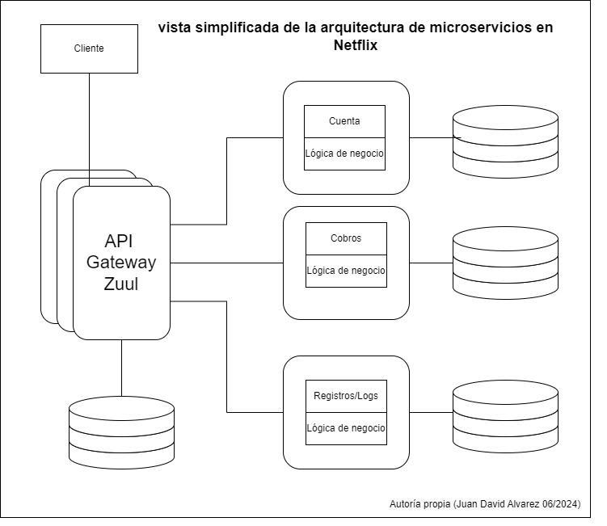

## Estudios de caso

- [LinkedIn](#linkedin)
- [Netflix](#netflix)
- [Figma](#figma)
- [khan academy](#khan-academy)
- [airbnb](#airbnb)
- [Reddit](#reddit)
- [Rompiste Reddit](#rompiste-reddit)
- [El fallo de Roblox](#el-fallo-de-roblox)

---

- ### [LinkedIn](https://www.linkedin.com/)

  En el año 2003, LinkedIn se fundó con el objetivo de mejorar las conexiones profesionales de las personas. La primera base de usuarios fue de 2,700. Al igual que muchos productos, la versión inicial tenía una sencilla arquitectura monolítica, que alojaba la lógica de negocio, la base de datos, los servicios web y los componentes visuales. Este monolito era conocido como Leo.

  <p align="center">
    
  </p>

  Para LinkedIn, las conexiones entre los usuarios son su componente principal. Por lo tanto, desde las fases iniciales del proyecto, se apuntó a construir un servicio para gestionar la red de conexiones entre los usuarios. En términos generales, consistía en un grafo donde cada nodo representa a un miembro y era almacenado en memoria para maximizar el rendimiento. Adicionalmente, tenía el requerimiento de poder ser escalable de forma independiente del monolito Leo. Este nuevo servicio se nombró Cloud, y se potenció gracias a otro servicio de búsqueda, [Apache Lucene](https://lucene.apache.org/).

  Con el tiempo, el producto tomó fuerza, con lo cual Leo fue haciéndose más complejo. Este requerimiento de escalabilidad fue resuelto de manera horizontal e implementando un balanceador de cargas para las diversas instancias desplegadas. Sin embargo, esta escalada afectó a Cloud, que no se encontraba equipado para asumir las nuevas cargas que infringía el sistema sobre la base de datos de usuarios.

  En un principio, se recurrió a una solución clásica, el escalado vertical, con más capacidad en procesamiento y memoria. Adicionalmente, se comenzó a implementar una serie de réplicas de las bases de datos. Esta replicación necesitaba ser orquestada y para esto se desarrolló [Databus](https://github.com/linkedin/databus), que es una herramienta de código abierto desde 2013.

  <p align="center">
  
  </p>

  En este punto, comienza a acumularse deuda técnica. No es recomendable ni viable escalar indefinidamente un monolito. Adicionalmente, mientras crece la aplicación, la mantenibilidad se verá afectada. Los monolitos más grandes tardan más en desplegarse y el rendimiento de la aplicación tiende a decaer.

  A medida que LinkedIn tenía más tráfico, los fallos en producción, las dificultades para detectar fallos, recuperar la operabilidad y desplegar nuevas funcionalidades, sumado a un decremento en la disponibilidad, llevaron a un proceso de reingeniería en el software.

  Progresivamente, el equipo de ingeniería aisló varios servicios como las búsquedas, comunicaciones, perfiles y grupos. Posteriormente, las capas de presentación también fueron aisladas, como las funcionalidades de reclutamiento o perfiles públicos. Al mismo tiempo, algunas funcionalidades nuevas fueron estructuradas en forma de servicios independientes. En el año 2010, se estimaban más de 150 servicios independientes y para 2015, más de 750.

  Estos servicios son libres de estado (stateless) y se escalan de forma horizontal cuando es necesario, en conjunto con diversos tipos de balanceadores de carga. En esta instancia, se tienen datos de las capacidades de los servicios en términos de carga y rendimiento. Adicionalmente, se implementaron diversas estrategias de monitoreo de rendimiento y disponibilidad.

  En cuanto a la gestión de datos, el equipo de ingeniería integró una memoria caché de varias capas. Esto ayudó a la escalabilidad y a reducir la carga sobre la base de datos. Sin embargo, eventualmente se descartó esta estrategia, ya que se almacenaban datos de diversos dominios y mantener la validez de los datos y el grafo de solicitudes se estaba haciendo demasiado costoso en términos de esfuerzo. Por lo tanto, se adaptó una estrategia de caché más simple y cercana a la fuente de datos, permitiendo una escalabilidad horizontal, reduciendo la latencia y la carga cognitiva.

  Eventualmente, surgieron diversos requerimientos de flujos de datos, como enviar una actualización de perfil al servicio de analítica, hacer logs de la operación, y mantener una cola de mensajes para los diversos chats, entre otros.

  Para abordar estos requerimientos, se desarrolló [Kafka](https://kafka.apache.org/). Este actúa como una gran autopista para alojar los flujos de datos y cuenta con un rendimiento y escalabilidad notables. Una de sus mayores ventajas es la baja latencia de acceso a los datos. Con estas nuevas capacidades, fue posible construir sistemas de alertas y monitoreo más eficientes, además de herramientas de analítica en tiempo real y la capacidad de realizar seguimientos y visualizar el grafo de solicitudes.

  <p align="center">
    
  </p>

  En la actualidad, LinkedIn tiene iniciativas para asegurar una alta mantenibilidad en su producto:

  - Inversión: Esta iniciativa surgió en 2011. La idea era poner en pausa el desarrollo de nuevas funcionalidades para centrar los esfuerzos en mejorar las estrategias de despliegue, realizar refactoring, evaluar la productividad de desarrollo, considerar la infraestructura, entre otras actividades, que aumentan el conocimiento general del producto, incrementan la agilidad de los equipos y permiten desarrollar software de mejor calidad.

  - Superblocks: En esencia, es un grupo de servicios que realizan una serie de tareas en un solo acceso a la API del sistema. La iniciativa surgió con el llamado call graph o grafo de solicitudes; una solicitud simple, como ver el perfil personal, requiere recolectar y organizar datos de diversos dominios que se alojan en diferentes servicios. Todas estas solicitudes pueden ser complicadas de administrar y darles seguimiento. La idea es que equipos específicos se encarguen de administrar y gestionar bloques, logrando mantener los grafos de solicitudes optimizados.

- ### [Netflix](https://www.netflix.com/co-en/)

  En 1997, Netflix inició sus operaciones como una compañía de alquiler de DVD por correo. Inicialmente, la aplicación tenía una arquitectura simple: una sola base de datos centralizada y un monolito. Este concepto se fue adaptando a medida que la base de usuarios crecía. Sin embargo, la base de datos presentaba un factor de riesgo, ya que también era monolítica.

  Cuando Netflix (streaming) se lanzó al público en 2007, el servicio EC2 de AWS no era lo suficientemente estable para cubrir los requerimientos de la aplicación, por lo cual la empresa decidió construir dos centros de datos propios. Sin embargo, esto representó un retroceso para la empresa, ya que una vez completado el proceso de construir el centro de datos, se hacía necesario construir otro, pues el primero se encontraba cerca de su límite. Para evitar este ciclo, Netflix decidió realizar un escalamiento vertical para alojar su monolito.

  <p align="center">
  
  </p>
  En el año 2008, un incidente mayor de corrupción de datos hizo que la base de datos fallara y la aplicación dejara de estar disponible durante tres días. A causa de esto, no fue posible realizar los envíos durante este periodo de tiempo.

  Este fue el detonante para tomar medidas cruciales para la organización:
  - Migrar todos los datos a AWS.
  - Migrar la arquitectura a una basada en microservicios.

  La arquitectura de Netflix tiene tres componentes principales:

  - **El cliente**: Es cualquier dispositivo desde donde se pueda buscar y acceder al contenido de la plataforma.
  - **El backend**: Consiste en una serie de servicios corriendo sobre AWS que controlan todo lo que sucede. Los servicios son accedidos por el cliente y permiten que los usuarios tengan una experiencia transparente en todas las acciones que realicen.
  - **La red de entrega de contenido**: Este componente, también conocido como CDN (por sus siglas en inglés), se encarga de almacenar los videos y es un componente clave, pues la idea es almacenar el contenido lo más cerca posible de los usuarios.

  **Open Connect:** Este componente ha pasado por varias iteraciones. En la actualidad, consiste en una red de ubicaciones físicas alrededor del mundo, cada una llamada punto de presencia (PoP, por sus siglas en inglés). Cada PoP tiene servidores, routers y equipo de red.

  Las fases iniciales del CDN consistieron en cinco ubicaciones propias en Estados Unidos. En cada una de ellas había una réplica de todo el contenido de la plataforma. Con esta infraestructura, se soportaba el servicio de streaming, con aproximadamente 35 millones de usuarios distribuidos en 50 países.

  Para 2009, los costos de los CDN eran más bajos, así que para la organización era más beneficioso usar CDN de terceros. Esta decisión permitió abordar proyectos prioritarios. Uno de estos proyectos fue el desarrollo de un switch para obtener datos de diferentes CDN de ser necesario. Esto incrementó la calidad del servicio a los usuarios y aumentó la tolerancia a fallos.

  En 2012, Netflix lanzó la primera versión de su propio CDN dedicado y optimizado para sus requerimientos (streaming de video). Cada CDN consiste en un grupo de servidores, conocidos como OCA (Open Connect Appliances). Estos servidores están optimizados para procesar archivos grandes.

  **Edge:** Este componente es el punto más cercano al cliente y constituye el punto de entrada de diversas solicitudes al dominio del servicio.

  En un principio, la arquitectura de Netflix tenía tres capas: presentación, negocio y datos. La capa de negocio era accedida por el cliente a través de una API. A medida que la base de usuarios creció y se agregaron más funcionalidades, se decidió separar la aplicación monolítica y adaptarla a microservicios. Sin embargo, la lógica para orquestar los microservicios se mantuvo dentro del API principal (monolito).

  Para abordar el requerimiento de orquestación, inicialmente se separó la aplicación en dos partes. La primera consistía en las responsabilidades del streaming, mientras que la segunda se encargaba de las funcionalidades de "descubrir". En este punto, había varios dominios administrados por varios balanceadores de carga. Posteriormente, se introdujo un API Gateway. Netflix desarrolló su propia API Gateway, llamada Zuul, y fue desarrollada como una herramienta de código abierto, para continuar separando las responsabilidades en los microservicios y reducir el acoplamiento entre el cliente y los servicios.

  <p align="center">
  
  </p>

  Durante el proceso de adaptación a la nueva arquitectura de microservicios, uno de los objetivos más importantes era hacer los microservicios altamente desacoplados y escalables. Para manejar la complejidad adicional que representan los servicios independientes, se agregó una capa de unificación al API. Sin embargo, al crecer la aplicación y hacerse más complejo el dominio, escalar esta capa se hizo más complejo. La solución fue introducir un GraphQL descentralizado (federado). La idea era proveer una API unificada para los clientes y darle flexibilidad a los servicios del backend.

  **EVCache:** Netflix es una aplicación que requiere alta disponibilidad. Para reducir la latencia y aumentar el rendimiento de la aplicación, se utiliza EVCache, la cual está adaptada a los requerimientos de la organización, es distribuida y optimizada para usarse en AWS.
  El sistema está diseñado para mantener tres copias de los datos de caché en ubicaciones diferentes de AWS. A su vez, todos los clientes están conectados a todos los servidores. El cliente puede acceder a la memoria a través de una librería online, la cual se conecta directamente a la memoria caché con una conexión TCP.

  <p align="center">
  
  </p>

<mark>tomado de [Byte Byte Go](https://blog.bytebytego.com/p/a-brief-history-of-scaling-netflix?utm_source=post-email-title&publication_id=817132&post_id=142814811&utm_campaign=email-post-title&isFreemail=false&r=1ilv0t&triedRedirect=true&utm_medium=email) creditos al autor.</mark>

- ### [Figma](https://www.figma.com/)

  Esta plataforma de diseño colaborativo ha experimentado un crecimiento aproximado del 200% desde 2018 y, hasta la fecha, cuenta con cerca de 3 millones de usuarios mensuales. La escalabilidad ha sido un reto constante para el equipo de ingeniería de este producto. La base de datos representa un componente crítico para esta plataforma, ya que de ella depende la funcionalidad del producto. En el componente de base de datos se gestiona metadata como los datos de autorización, información de los archivos compartidos, comentarios, cambios, entre otros.

  En 2020, Figma utilizaba una base de datos alojada en AWS para almacenar la mayoría de la metadata. Esta solución cumplía con los requerimientos sin mayores inconvenientes. Sin embargo, durante la pandemia del Covid-19, se observó un incremento de usuarios que no se tenía previsto. Así, durante los picos de uso, el uso de recursos de CPU se incrementaba por encima del 65%, lo que causaba inestabilidad en la colaboración y latencias impredecibles en la base de datos.

  Aunque el pico de saturación del sistema aún no era evidente, el equipo de infraestructura decidió proactivamente abordar los inconvenientes de escalabilidad. Previendo posibles puntos de fallo, implementaron:
  - Una actualización en la base de datos.
  - Replicación de base de datos.
  - Implementación de nuevas bases de datos.
  - Implementar [PgBouncer](https://www.pgbouncer.org/).

  Estas estrategias permitieron que el equipo pudiera preparar un plan para escalar el componente de datos.

  La primera fase consistió en realizar una partición vertical de la base de datos. De forma simplificada, esto significa mover tablas a una nueva base de datos. Para identificar qué tablas serían reubicadas, se consideraron dos factores:
  - Impacto: Al mover la tabla, se separaría una porción significativa de la carga de trabajo.
  - Aislamiento: La tabla no debía tener dependencias fuertes con otras tablas.

  Una vez identificadas las tablas, era necesario migrarlas sin afectar la disponibilidad de la información para los usuarios, es decir, no era viable "apagar" la plataforma para realizar la migración. Los requerimientos eran:
  - El impacto de la disponibilidad de los datos debe ser menos de 1 minuto.
  - El proceso debe ser automatizado, para poder repetirlo fácilmente.
  - El proceso debe poder deshacerse.

  Dado que no fue posible encontrar un servicio o herramienta de software que cumpliera con estos requerimientos, Figma desarrolló su propia herramienta de software. Este opera así:
  - Prepara la aplicación para buscar en diferentes particiones de la base de datos.
  - Replica las tablas de la base de datos original en una nueva base de datos.
  - Pausa la actividad en la base de datos original.
  - Sincroniza bases de datos.
  - Redirige el tráfico a la nueva base de datos.
  - Reanuda la actividad.

  Adicionalmente, se usaron instancias replicadas de PgBouncer para mantener la consistencia del tráfico y orquestar la concurrencia en los datos, además de permitirle al equipo detectar inconsistencias y corregirlas de ser necesario.

  <p align="center">
  
  </p>

  Con el tiempo, la cantidad de usuarios en Figma se incrementó considerablemente. Desde 2020, se estima que ha crecido aproximadamente cien veces. Con este incremento, la carga en las bases de datos también se incrementó. Dada la naturaleza de las tablas en Figma, las cuales en ocasiones pueden tener varios terabytes de información y millones de filas, no es viable mantenerlas en una sola base de datos.

  El equipo de infraestructura notó dos potenciales puntos de fallo:
  - **Postgres Vacuum**: PostgreSQL cuenta con un proceso que se ejecuta en segundo plano, que consiste en recuperar el espacio que ocupan las filas obsoletas o eliminadas (similar a los procesos de garbage collection). Si la base de datos no se aspira regularmente, eventualmente no podrá ejecutar más operaciones. Sin embargo, este proceso consume muchos recursos en las tablas grandes y puede causar problemas de rendimiento e incluso inoperabilidad.
  - **IOPS Limit**: Amazon RDS tiene un límite de operaciones de entrada y salida (IO) por segundo, el cual eventualmente sería excedido por las tablas más exigentes de la aplicación.

  Para abordar estas problemáticas, se implementó una estrategia de fragmentación horizontal, que consiste en separar la base de datos principal en bases de datos más pequeñas y alojarlas en varios servidores.
  El equipo de Ingeniería exploró diversas alternativas tanto SQL como NoSQL y eventualmente optaron por construir una solución adaptada al modelo de partición vertical. Algunas de las razones para tomar esta decisión fueron:
  - Menor carga cognitiva: Al no necesitar adaptarse a otro tipo de modelo de datos y poder aprovechar la experiencia obtenida con el tiempo en RDS Postgres.
  - Control sobre la solución: Al ser una herramienta internamente desarrollada, estaría hecha a la medida de los requerimientos del equipo y sus necesidades específicas.
  - Posibilidad de descartar: En caso de que demasiados inconvenientes se presentaran o la solución no funcionara como debía, podían regresar a la versión anterior de la base de datos con relativa facilidad.
  
  <p align="center">
  
  </p>

 Algunas de las características de la implementación de fragmentación horizontal son:

- **Colocaciones para grupos de tablas relacionadas (Colos)**: Figma introdujo el concepto de colos, que son simplemente un grupo de tablas relacionadas que comparten una identificación de fragmento o un fragmento físico.

    Para crear los colos, se seleccionaron algunas llaves de fragmentación, como id de usuario, id de archivo, id de organización, entre otros. Casi cualquier tabla de la organización puede ser compartida usando alguna de las llaves. Esta estrategia permite a los ingenieros interactuar con las tablas distribuidas a través de una abstracción simple.

    Las tablas en un colo aceptan combinaciones cruzadas y transacciones en la misma llave de fragmento. La aplicación ya interactuaba con la base de datos de una forma similar, lo cual redujo al mínimo la cantidad de esfuerzo para hacer que las tablas pudieran ser fragmentadas y para adaptar la aplicación.

  <p align="center">
  
  </p>
  - **Fragmentación lógica y física**: Se separaron las fragmentaciones lógicas en la capa de aplicación de las fragmentaciones físicas en la capa de datos. Esta separación permitió desacoplar dos partes de la migración e implementarlas de manera independiente. La fragmentación lógica implica crear múltiples vistas por tabla, cada una correspondiente a un fragmento específico. Todas las operaciones de lectura y escritura se ejecutan mediante esta vista, haciendo que la tabla parezca estar fragmentada horizontalmente, aunque los datos estén físicamente alojados en una base de datos única.

  Así fue posible realizar fragmentaciones de manera más segura, fáciles de deshacer y con menos riesgo, antes de ejecutar las fragmentaciones físicas, que son más riesgosas y complejas.

  - **DBProxy**: Este servicio se ubica en medio de la aplicación y el banco de conexiones. Consta de tres componentes:
    - Un traductor de consultas, que lee el SQL enviado por la aplicación y lo transforma en árbol de sintaxis abstracto (AST).
    - Un planificador lógico, que traduce el AST, extrae la consulta y el id lógico del fragmento.
    - Un planificador físico, que toma el id lógico y lo mapea a la base de datos física, para luego reescribir la consulta a ejecutar en la base de datos correspondiente.

En septiembre de 2023, Figma desplegó la primera versión del proyecto de fragmentación horizontal, que resultó en un éxito rotundo, con un impacto mínimo en la operabilidad del sistema. Además, no se observaron regresiones ni afectaciones de rendimiento luego de la ejecución de la fragmentación. El objetivo final de Figma es fragmentar todas las tablas de su base de datos, lo que representa una escalabilidad casi infinita.

- ### khan academy
  
  Khan Academy inició como un simple servicio de tutorías por vía telefónica en 2004. Salman Khan recibió una llamada de un familiar que necesitaba ayuda con su tarea de matemáticas. Con el tiempo, comenzó a brindarle tutorías a más personas. Sin embargo, no lograba atender a todos sus clientes, así que publicó sus videos en YouTube.

  La primera versión de esta compañía consistió en una página web desde la cual se reproducían videos alojados en YouTube, debido al bajo costo de almacenamiento y su buen rendimiento. Adicionalmente, se integró un almacenamiento simple usando Fastly CDN y S3 de AWS. Posteriormente, la arquitectura se adaptaría para agregar funciones dinámicas, como el progreso de los estudiantes, mediante servicios serverless.

  La iteración siguiente fue adaptar la arquitectura monolítica a una de microservicios. Actualmente, cuenta con aproximadamente 20 servicios que se integran a través de GraphQL y cuentan con bases de datos propias.

  En este caso, la organización delegó su proceso de escalabilidad a la infraestructura de Google Cloud. Esto les permite concentrar sus esfuerzos en el software y las necesidades del cliente. Además, cuando es necesario escalar, puede hacerse con relativamente poco esfuerzo técnico y operativo.

  El stack tecnológico consiste en lo siguiente:
  - Google Cloud para gestionar su infraestructura.
  - Fastly CDN para gestionar la entrega de contenido multimedia (videos).
  - GraphQL para integrar sus API.
  - Código fuente en Go. Inicialmente, el software estaba construido en Python, sin embargo, decidieron migrar a Go para mejorar sus tiempos de compilación y optimizar el rendimiento.

  Durante la pandemia del Covid-19, la cantidad de usuarios de Khan Academy aumentó más del doble en dos semanas. En el mes de abril, atendieron alrededor de treinta millones de usuarios. La simple arquitectura se mantuvo estable gracias a que la organización tenía los aliados correctos. Al apalancarse de la infraestructura de Google Cloud, el incremento en el tráfico no representó un inconveniente, puesto que con una intervención simple, el sistema podía escalar según las necesidades del momento.

- ### airbnb

  Esta compañía inició con sus fundadores alquilando un colchón inflable en la sala de su apartamento. En la actualidad, opera en más de 200 países y alrededor de 1.5 mil millones de huéspedes han sido recibidos por 4 millones de anfitriones alrededor del mundo.

  La primera iteración de Airbnb fue un monolito construido con Ruby on Rails, conocido como "monorail". En este, se combinaban el modelo, la vista y el controlador. Esta topografía permitió al equipo de ingenieros avanzar rápidamente en el desarrollo de nuevas funcionalidades con una complejidad manejable.

  Airbnb creció exponencialmente durante varios años, lo que implicó varios retos tanto a nivel de ingeniería como a nivel de organización:

  - Eventualmente, varios cientos de ingenieros se encontraban trabajando simultáneamente en monorail, haciendo los despliegues complejos y lentos.
  - Airbnb sigue una filosofía de despliegues democratizados, donde cada ingeniero es responsable de probar y desplegar sus cambios. Esto generó una gran cantidad de conflictos en los repositorios.
  - La productividad de los ingenieros se redujo, causando frustración.

  <p align="center">
  
  </p>

  Ante estas problemáticas, Airbnb decidió migrar su arquitectura a una basada en servicios. La idea básica era construir una red de servicios a la cual diferentes clientes accederían a través de un gateway, el cual se encargaría de enrutar las solicitudes.

  Con la intención de proveer a los ingenieros con un estándar y un consenso sobre la arquitectura de los servicios y sus patrones, se adaptaron los siguientes principios:

  - Base de datos por servicio: cada servicio debía poder leer y escribir sus propios datos, por lo que cada servicio tiene una base de datos de la cual es responsable por completo.
  - Cada servicio debe tener una responsabilidad específica: con el fin de evitar que monorail se transformara en una serie de monolitos más pequeños, o que algún servicio se convirtiera en un monolito. Adicionalmente, Airbnb decidió evitar los microservicios; en su lugar, prefirió que los servicios cumplieran funciones específicas referentes al negocio.
  - Evitar las funcionalidades duplicadas: para aumentar la mantenibilidad, los servicios tienen partes que pueden compartirse dentro de la infraestructura a través de librerías y servicios compartidos.
  - La modificación de datos debe ejecutarse a través de eventos estandarizados: si un servicio crea una nueva fila, el servicio de disponibilidad debe ser capaz de gestionar este evento y notificarlo a los interesados.
  - Cada servicio es crítico: los servicios deben tener mecanismos de alerta, observabilidad y altos estándares de calidad, además de mantener buenas prácticas acordes a la infraestructura.
  
  <p align="center">
  
  </p>

  A medida que evolucionó el software, surgieron diversos requerimientos, como la integración de Kubernetes para orquestar los varios cientos de servicios alojados en instancias de EC2. Adicionalmente, la organización construyó herramientas propias, algunos ejemplos son:

  - API Framework: Con el fin de aumentar la productividad de los desarrolladores, esta herramienta provee un canal de comunicación limpio y simple entre servicios. Así, los desarrolladores pueden concentrar sus esfuerzos en desarrollar y gestionar la lógica de negocio sin preocuparse por los detalles de la comunicación entre servicios.
  - Spinnaker: Airbnb usa Spinnaker para configurar ambientes de pruebas, donde corren análisis automatizados usando Canary. Basándose en diversas métricas como el análisis de tráfico de datos y el índice de fallo, se crea una calificación para el ambiente. Con esta calificación, se puede decidir si promover el código a la siguiente etapa del desarrollo o fallar.
  - Powergrid: Esta librería se desarrolló internamente para gestionar las tareas paralelas con mayor facilidad. La idea es organizar tareas como un grafo acíclico dirigido (DAG), donde cada nodo del grafo es una tarea o una función. Usando este concepto, es posible modelar cada endpoint de los servicios como un flujo de datos, donde las solicitudes son las entradas y las respuestas son las salidas.

  Adicionalmente, se utiliza el concepto de Bloques de Servicios, apuntando a simplificar la dependencia entre los servicios y mejorar la mantenibilidad. Cada bloque puede entenderse como una colección de servicios que se agrupan según la funcionalidad de negocio que cumplen. Cada bloque puede exponer una fachada con endpoints que permiten a los clientes leer y escribir información.

- ### Reddit

  Esta empresa fue fundada en el año 2005 con la visión de ser "la página principal de Internet". Con el tiempo, evolucionó en una red social que alberga miles de comunidades de diversos temas.

  Inicialmente, fue construido usando Lisp; sin embargo, a finales de 2005, fue migrado a Python. La razón principal de esta decisión fue que Lisp no contaba con suficientes librerías estables y aceptadas. Por lo general, no había más de una opción de librería cuando se necesitaba alguna funcionalidad, y la mayoría de las librerías carecían de documentación pertinente.

  Al migrar a Python, adoptaron el marco de trabajo Web.py, el cual fue desarrollado por uno de los fundadores. Posteriormente, en 2009, se adoptó Pylons como marco de trabajo para la web.

  Reddit inició con una arquitectura monolítica, que ha ido conviviendo con las nuevas adaptaciones hasta la fecha. Esta arquitectura se puede dividir en cuatro componentes principales:
  - Red de entrega de contenido (CDN): Este componente se encarga de administrar la lógica más cercana al cliente.
  - Front end.
  - Monolito R2: Este fue construido en las versiones iniciales de la aplicación y se ha adaptado con el paso del tiempo a las nuevas necesidades y requerimientos.
  - Servicios: A medida que la aplicación evolucionó, se han ido separando responsabilidades del monolito principal para ubicarlas en servicios independientes.
  
  <p align="center">
  
  </p>

  **Monolito R2:**

  Este componente es la base del funcionamiento de Reddit y tiene internamente su propia arquitectura; además de estar desplegado en varios servidores simultáneamente.

  El punto de entrada es un balanceador de carga que envía las solicitudes al servidor correspondiente. Para complementar, las tareas más costosas, como encuestas o votaciones, son delegadas a un componente asíncrono a través de Rabbit MQ.

  A medida que la base de usuarios creció, se realizaron nuevas adaptaciones al monolito original. Una de estas fue la integración de GraphQL distribuido en 2017. En términos generales, el objetivo era combinar las diferentes API de GraphQL (subgraph) que usaban los diversos servicios en una sola API conocida como supergraph. Este actúa como punto principal para que los clientes soliciten y reciban datos.

  Varios subgraphs fueron agregados al monolito original. Estos servicios se construyeron usando Go y conviven con los servicios originales construidos en Python. Eventualmente, R2 será retirado una vez que todas sus funcionalidades se conviertan en microservicios. Es muy importante realizar esta migración de manera incremental y controlada para, en caso de fallos, poder regresar al monolito sin afectar la integridad y disponibilidad de la aplicación.

  Para ejecutar la migración, se implementó una estrategia de despliegue conocida como blue/green. Esta estrategia consiste en darle control de la aplicación tanto al monolito como a los subgraph, y luego ubicar un balanceador de cargas entre el supergraph y los subgraphs para que redirija el tráfico al componente respectivo. Con esta estrategia, también es posible controlar qué porcentaje del tráfico es administrado por el monolito o por el subgraph, lo que permite mantener la aplicación estable durante la migración.

   <p align="center">
  
  </p>

  **Replicación de datos:**

  En las fases iniciales, Reddit replicaba sus datos utilizando registros de escritura por adelantado (WAL) para garantizar que si una transacción de escritura fallaba, pudiera ser restaurada a partir de los registros.

  Esta estrategia tenía algunas desventajas en relación a la consistencia de los datos:

  - Dado que los procesos de restauración se ejecutaban durante la noche, podía haber inconsistencias durante el día.
  - Los cambios en los esquemas podían causar inconsistencias en los datos a replicar.
  - La base de datos principal y su réplica se ejecutaban en instancias de EC2, lo que hacía que el proceso de replicación fuera poco tolerante a fallos.

  En la siguiente iteración, con el fin de hacer el proceso de replicación más estable, se optó por usar un proceso de captura de cambios en los datos (CDC), utilizando Debezium y Kafka Connect. El proceso consiste en que cada vez que se realiza una transacción en la base de datos (agregar, modificar, borrar), Debezium detecta el evento y lo envía a un tema de Kafka. Posteriormente, un procesador detecta el nuevo evento en el tema de Kafka y replica los cambios.

  Esta estrategia se sigue utilizando actualmente y permite que Reddit realice réplicas en tiempo real a varios sistemas. Además, los procesos son livianos, por lo tanto, ya no requieren instalarse en instancias EC2.

  **Gestión de la metadata:**

  Inicialmente, los datos multimedia (fotos, videos, GIFs, contenido incrustado) eran gestionados usando buckets S3 y distribuidos en varios sistemas, sin embargo, no tenían un formato consistente para ser almacenados ni había un mecanismo para auditar los cambios o analizar el contenido.

  Reddit decidió reconstruir el almacenamiento de datos multimedia con las siguientes características:

  - Todos los metadatos de multimedia provenientes de los diversos sistemas debían estar en la misma ubicación física.
  - Soportar creación y actualización.
  - Poder obtener datos a una velocidad de 100 mil solicitudes por segundo con un retraso de no más de 50 milisegundos.

  La herramienta elegida fue AWS Aurora Postgres, con un diseño simple que consistió en ubicar una capa de servicios que gestiona los procesos de lectura y escritura. La migración consistió en:

  - Permitir a los clientes realizar escritura dual en las API de la metadata.
  - Mover los datos de la base de datos anterior a la nueva base de datos dedicada.
  - Permitir que los clientes realicen lectura dual de la metadata.
  - Monitorear las solicitudes de lectura y solucionar las inconsistencias.
  - Dirigir el tráfico a la nueva base de datos.
  
  <p align="center">
  
  </p>

  **Optimización de la página principal (Feed):**

  En las fases iniciales, cada publicación se representaba como un objeto que contenía toda la información referente al mismo. Cada cliente contenía lógica de negocio para determinar qué partes del objeto debían ser mostradas en la interfaz de usuario; usualmente esta lógica no se sincronizaba entre plataformas.

  El Feed de Reddit tenía los siguientes requerimientos:

  - La arquitectura debe soportar altas velocidades de desarrollo y ser altamente escalable, ya que varios componentes se integran con Feed y estos deben poder entenderse, construirse y probarse rápidamente.
  - El tiempo de interacción y el rendimiento del "scroll" deben ser satisfactorios, pues son clave para la experiencia del usuario.
  - Feed debe ser consistente entre diferentes plataformas (Android, iOS, web).

  Para cumplir con estos requerimientos, se adaptó una estrategia conocida como UI orientada a servidor, donde el backend controla el tipo de elementos y el orden en los que se renderizan; mientras que al cliente solamente se le entrega la descripción de los elementos para renderizar.

Adicionalmente, se implementaron otros componentes:

Optimización de imágenes:
Inicialmente, la optimización de las imágenes era delegada a terceros. Posteriormente, con el incremento de la base de usuarios, esta funcionalidad se trasladó al interior de la organización con el fin de controlar costos y mejorar la experiencia del usuario. Se construyeron dos servicios:

Gif2Vid: esta herramienta convierte archivos en formato GIF y MP4 en formatos estáticos, lo que optimiza costos y carga computacional.
Un servicio de optimización de imágenes se encarga de gestionar operaciones como cambios de tamaño, difuminado y transformación de imágenes en general.
Protección de los usuarios:
Moderar el contenido es esencial para hacer de Reddit un espacio seguro para los usuarios de la plataforma. En 2016, se desarrolló un motor de ejecución de reglas llamado Rule-Executor-v1 (REV1). Esta herramienta permitió al equipo de seguridad crear reglas que ejecutarían acciones según la actividad de los usuarios.

El funcionamiento de REV1 consiste en un script de Lua que se ejecuta ante eventos configurables. De manera simplificada, podría representarse con el siguiente código:

  ```Lua
  if postBody.match("texto no permitido") then
    action(Usuario)
  end     
  ```

  REV1 tenía deuda técnica:

- Se ejecutaba en instancias de EC2, lo cual no era acorde con la arquitectura actual donde los servicios se ejecutaban en Kubernetes.
- Cada regla se ejecutaba como un proceso individual en un nodo de REV1, por lo tanto, era necesario escalar verticalmente a medida que se agregaban nuevas reglas.
- REV1 estaba construido en Python 2.7, la cual está deprecada.
- Las reglas no tenían un control de versiones (git).
- No existía un ambiente para probar las reglas (QA, Stage).

En 2021, se presentó REV2, basado en una nueva infraestructura llamada Snooron y con una serie de mejoras con respecto a la versión anterior:

| REV1 | REV2 |
| --- | --- |
| Las reglas se configuraban a través de una interfaz web | Las reglas se configuran mediante código; además, cuenta con una interfaz gráfica que hace el proceso más simple. |
| Las reglas se almacenaban usando Zookeeper | Las reglas se almacenan usando Github y cuentan con un respaldo en S3. |
| Cada regla tenía su propio proceso | Mediante Flink, se administra un flujo de eventos que separa los procesos. |
| Las acciones ejecutadas por las reglas eran administradas por R2 | Cuando se dispara una regla, envía una acción estructurada a varios temas, que son procesados por una aplicación llamada Safety Actioning Worker |

  <p align="center">
  
  </p>

tomado de [Byte Byte Go](https://blog.bytebytego.com/p/reddits-architecture-the-evolutionary?utm_source=post-email-title&publication_id=817132&post_id=143342954&utm_campaign=email-post-title&isFreemail=true&r=1ilv0t&triedRedirect=true)

- ### "Rompiste Reddit":

  El día 14 de marzo de 2023, Reddit sufrió un fallo que puso a la plataforma en un estado de inoperabilidad durante aproximadamente 5 horas (314 minutos). Si bien la afectación no fue total, causó que la mayoría de los flujos no pudieran ejecutarse y solamente las partes más modernas del sistema resistieron el fallo.

  Reddit tiene su arquitectura basada en la nube desde el año 2009 y ha adaptado Kubernetes desde etapas muy tempranas. A medida que el software ha evolucionado y se han agregado nuevos requerimientos, se han acumulado varios conjuntos de clusters adaptados a medida, configurados directamente desde la consola de Kubernetes en lugar de plantillas estandarizadas.

  Reddit tiene un equipo llamado el equipo de cómputo, encargado de administrar las partes de la infraestructura que ejecutan cargas de trabajo, además de definir los procesos de actualización y mantenimiento necesarios para optimizar dicha tarea. El ciclo de actualización consiste en actualizar el componente en un ambiente controlado (stage, lab, etc.) y realizar diversos tipos de pruebas a un conjunto de clusters para posteriormente desplegar los cambios en el ambiente de producción, iniciando en el menos crítico hasta llegar al más crítico.

  En este caso, la actualización se ejecutó en "el viejo Reddit", un cluster que contiene los componentes más antiguos de la aplicación. El objetivo era actualizar la versión de Kubernetes de 1.23 a 1.24. A las 7:00 pm UTC se ejecutó el proceso de actualización, y dos minutos después se presentó el fallo a gran escala. El sitio falló de golpe, y el equipo notó que el cluster afectado no entregaba ninguna estadística. Además, el DNS privado (entre ambientes o interno) no parecía funcionar, sin embargo, el DNS público resolvía las solicitudes sin inconvenientes. Este comportamiento nunca se había presentado en ningún ambiente, cluster, ambiente de pruebas o ambientes locales.

  En general, cuando un despliegue falla, revertir el cambio es el camino más claro a seguir. Sin embargo, para las actualizaciones de Kubernetes, no existe un proceso para degradar la versión de la herramienta, dado que varios esquemas de datos e información son migrados automáticamente cuando Kubernetes cambia de versión en un sistema.

  El flujo de la actualización requería que se realizara una copia de seguridad. Con esta, era posible recuperar el sistema y degradar la versión de Kubernetes (revertir el cambio). Sin embargo, el proceso para la restauración había sido programado varios años atrás y no estaba debidamente actualizado, por lo que no había una garantía real de su confiabilidad. Además, nunca había sido usado en un cluster de producción. El estimado inicial de inoperabilidad total fue de varias horas en caso de ejecutar el proceso de restauración, por lo cual el equipo decidió continuar investigando e intentar restablecer el servicio sin usar el proceso de restauración.

  Después de aproximadamente una hora de análisis, el equipo se dividió en dos frentes: el primero se encargó de preparar el sistema para la restauración, y el segundo se concentraba en intentar restablecer el servicio. Además, se realizaron reinicios en varios componentes, con la esperanza de que algún ciclo infinito o una fuga de conexiones fuera el causante del fallo. En este proceso, notaron algunas anomalías:

  - Los pods tardaban excesivamente en iniciar y finalizar.
  - Las imágenes de contenedores estaban tardando mucho en ser obtenidas (varios minutos para 100MB).
  - Los registros de control de vuelo tenían muchas entradas, pero no había ningún mensaje de error explícito.

  Eventualmente, también notaron que la interfaz de redes de contenedores (Calico) no funcionaba correctamente. Este componente tiene 3 partes principales:

  - Calico kube controller: se encarga de ejecutar acciones basado en el estado del cluster, por ejemplo, asignar direcciones IP a los nodos que utilizan los pods.
  - Calico typha: es un proxy de la memoria caché que se ubica entre diversas partes de calico y el cluster de control de vuelo para reducir la carga en el API de Kubernetes.
  - Calico node: es el componente central de la red, un agente que se ejecuta en cada nodo del cluster para generar y registrar de manera dinámica interfaces para cada pod en el nodo.

  Calico kube controller se encontraba en un estado permanente de *ContainerCreating*. Parte de la actualización consistía en actualizar el control de vuelo del cluster, junto con la versión de ejecución del contenedor. Reddit usa CRI-O para la versión de ejecución del contenedor, y esta herramienta tiene un error menor que consiste en que al actualizar CRI-O en un anfitrión (host), uno o varios contenedores se ejecutan para luego, de manera aleatoria y lenta, entrar en un estado permanente de inicialización. Cuando esto ocurre, una solución rápida es eliminar el pod para que sea recreado sin errores. Sin embargo, en este caso, el problema no tenía que ver con el error de CRI-O.

  Para Calico typha, se ejecutó un reinicio completo. Una vez eliminados los pods, estos no se reiniciaron. El equipo consideró la posibilidad de que se encontraran atorados en algún estado previo o un proceso anterior impidiera la ejecución de los pods, por lo que ejecutó un reinicio desde los componentes de control de vuelo e incluso se reinició el componente completo. Ninguna de estas acciones permitió que se reiniciaran los pods de Calico typha.

  Los registros del API para las transacciones de escritura mostraban varios errores de timeout, específicamente en las solicitudes a los controladores de admisión del cluster (OPA). Una vez eliminadas las configuraciones del controlador, los errores dejaron de aparecer, sin embargo, el cluster no se recuperó.

  Luego de más de dos horas de inoperabilidad, el equipo optó por ejecutar el proceso de restauración usando la copia de seguridad. Dado que varios nodos serían inconsistentes una vez se ejecutara la restauración, se apagaron todos los nodos para no lidiar con el proceso de conciliación.

  Una vez apagados todos los nodos, se ejecutó el proceso de restauración. De forma simplificada, consistió en:
  - Apagar dos nodos de control de vuelo.
  - Restaurar los componentes en un tercer nodo.
  - Restablecer los datos.
  - Iniciar nuevos nodos de control de vuelo y sincronizarlos.
  
  Este procedimiento originalmente fue construido en una versión de Kubernetes anterior y deprecada. Además, no consideraba CRI-O, sino que las instrucciones estaban orientadas a Docker. Esta situación llevó a confusión con la sintaxis y los estándares de nombramiento, además de que había comandos y argumentos en funciones que ya no eran soportados. El procedimiento se tomó como base para reconstruir uno nuevo que se adaptara a las condiciones del sistema.

  En el procedimiento se especificaba que todos los nodos debían ser finalizados excepto el primero. En el contexto de Reddit, el primer nodo de control de vuelo se utiliza como base para los procedimientos, además de que este no recibe un nombre en AWS, sino que mantiene el nombre asignado por defecto (ip-10-10.ec2.internal). La restauración del primer nodo se completó con éxito. Posteriormente, varios nodos se ejecutaron una vez que el cluster de escalado (autoscaler) inició. Esto se consideró una buena señal, ya que significaba que la comunicación por red funcionaba correctamente. Sin embargo, el autoscaler se apagó mientras la restauración del sistema se completaba. Posteriormente, se inicializaron los dos nodos restantes y se inició el proceso de sincronización.

  El equipo se enfrentó a un inconveniente en este punto, ya que los nodos nuevos no se sincronizaban. Por lo tanto, un grupo de ingenieros se encargó de abordar este incidente, mientras que los demás planificaban cómo restaurar lentamente el sistema con cargas de trabajo controladas. Eventualmente, se detectó la causa del fallo de conexión y sincronización en los nodos, el cual fue solucionado.

  Tras conseguir restaurar los nodos de control de vuelo, se ejecutó el proceso de recuperación de datos mientras se restauraba el tráfico a la aplicación de manera controlada, logrando eventualmente restaurar el sistema por completo.

  **Causa del fallo**

  Después de restaurar el sistema, se procedió a investigar las causas del fallo. El punto de inicio fue el comportamiento detectado durante el fallo. A las 7:04, el volumen de registros para el API se incrementó cinco veces. Tras una revisión en el OPA, se pudo observar que cinco segundos antes de que el servidor comenzara a hacer spam, los registros de OPA cesaron completamente. Dos segundos antes del fallo, el daemon de Calico-node comenzó a eliminar rutas del primer nodo de control de vuelo. Este comportamiento es normal y esperado, sin embargo, en este caso, todas las rutas de todos los nodos estaban siendo eliminadas.

  El colapso del sistema se debió a un fallo de configuración en los nodos de control de vuelo. En términos generales, estos nodos deben actuar como reflectores en la arquitectura y ser usados por los demás nodos para operar. Sin embargo, con la actualización de Kubernetes a la versión 1.24, se eliminó la terminología "master". Este cambio se había introducido inicialmente en la versión 1.2, permitiendo que los clusters en ejecución mantuvieran la terminología original para los nombres de los nodos. A partir de la versión 1.24, el nuevo término es "control-plane".

  Cada nodo en el cluster de Calico está emparejado con todos los demás nodos, generando una red de conexiones para reducir la complejidad de la administración. Sin embargo, en el contexto de Reddit, la red es demasiado compleja, el costo de administrarla es muy alto y la escalabilidad es limitada. La solución para Reddit es utilizar reflectores de ruta, que consiste en designar algunos nodos para emparejar con todos los nodos, mientras que los demás nodos se conectan a los nodos reflectores.

  Los reflectores fueron configurados hace varios años. Eventualmente, el equipo original que realizó las configuraciones se disolvió y, a su vez, la estrategia de los reflectores se convirtió en un sistema heredado. Por lo tanto, el conocimiento se perdió.

  La inconsistencia es la verdadera causa raíz del fallo, dado que los clusters de Kubernetes que utiliza Reddit en su arquitectura están modificados para suplir necesidades específicas de la aplicación, como componentes que solamente se ejecutan en clusters específicos, tareas que corren en una zona específica, entre otros. Si bien esta es una consecuencia del crecimiento de la aplicación, la heterogeneidad del ambiente genera deuda técnica que puede llevar a fallos e inoperabilidad.

 **Acciones:**

- El equipo está ejecutando acciones para hacer los ambientes de la arquitectura de Reddit más homogéneos.
- Varios componentes de la aplicación están siendo estandarizados, permitiendo su reutilización y apuntando a aumentar la mantenibilidad del sistema.
- Se han introducido más clusters de pruebas para evitar desplegar cambios a producción que puedan causar fallos o inoperabilidad.
- Se están adaptando herramientas para administrar el ciclo de vida de los clusters, además de hacerlos lo más homogéneos, reusables y recreables posible.
- Se están adoptando políticas para evitar los componentes únicos.
- Se están implementando herramientas de documentación en alto detalle.

- ### el fallo de roblox

  El 28 de octubre de 2022, Roblox sufrió un fallo que causó inoperabilidad en sus servicios durante aproximadamente 73 horas, afectando a 50 millones de jugadores. La compañía posee sus propios centros de datos, servidores, infraestructura de red y hardware de cómputo en general, con el fin de tener control de la escalabilidad, costos y otras variables críticas para cumplir con los requerimientos del software.

  La administración de los servidores y demás servicios de hardware se realiza usando un stack tecnológico llamado HashiStack, que consiste en:
  - Nomad para agendar tareas. Este decide qué contenedores serán ejecutados en qué nodos y qué puertos están disponibles. Además, valida el estado de los contenedores (health check).
  - Consul para realizar tareas conocidas como "service discovery", es decir, permitir a los servicios encontrar otros servicios que puedan necesitar a través de una base de datos de registro de servicios (service registry), que contiene combinaciones de tipo IP:Puerto. Adicionalmente, cumple labores de verificación de estado, bloqueo de sesiones y almacenamiento de tipo clave-valor (KV).

  Consul es desplegado como un cluster de máquinas que pueden tener dos roles: "votantes" que se encargan de mantener el estado del cluster y "no votantes" los cuales son réplicas de solo lectura, que ayudan a escalar las solicitudes de lectura. Cada cierto tiempo, uno de los votantes es elegido como líder, su trabajo será replicar los datos en todos los demás votantes y determinar si los datos han sido guardados por completo. Consul elige el líder mediante el algoritmo Raft y distribuye el estado de forma que cada nodo esté de acuerdo con las actualizaciones, es común que el líder cambie durante el día varias veces.
  - Vault, para administrar contraseñas, certificados y demás datos sensibles.

  El 28 de octubre a la 1:37 pm, el desempeño de Vault se vio reducido y un solo servidor de Consul presentó altas cargas de CPU; sin embargo, los jugadores no se vieron afectados. La primera hipótesis fue una posible degradación de hardware. Estas situaciones son comunes para la organización y Consul fue equipado con mecanismos para resistir fallos de hardware, sin embargo, cuando el hardware funciona lento en lugar de fallar, afecta directamente al rendimiento de Consul. Tras investigar, los ingenieros determinaron que el cluster de Consul, del cual Vault y otros servicios dependían, se encontraba en un estado "unhealthy". Las métricas mostraban una latencia de escritura elevada para el sistema de KV (2 segundos, el promedio es de 300 ms). Por lo tanto, el equipo decidió reemplazar el nodo de Cluster que presentaba problemas.

  Aún con el nodo restablecido y ejecutándose en un nuevo hardware, este no se recuperó. Adicionalmente, cerca de las 4:35 pm, el número de jugadores se redujo al 50% y el sistema comenzó a presentar una reducción notable en la calidad (unhealthy), hasta que eventualmente colapsó por completo. Debido a que los servicios dependen de Consul para obtener la información de los demás servicios que necesita para funcionar, además, Nomad y Vault dependen de Consul.

  La siguiente hipótesis fue que los servidores que alojaban Consul no podían soportar la carga actual de trabajo, lo que afectaba el rendimiento de Consul. Por ende, el equipo decidió reemplazar los nodos de Consul con nuevo hardware, más potente. Sin embargo, cerca de las 7:00 pm, una vez instalado el nuevo hardware, el sistema seguía reportando que la mayoría de los nodos no tenían el rendimiento esperado y la latencia de escritura seguía estando alrededor de los 2 segundos.

  Cerca de las 2:00 am del 29 de octubre, un nuevo síntoma se presentó en el sistema: el líder de Consul no se sincronizaba correctamente con los votantes. El equipo decidió apagar el cluster por completo y regresarlo al estado anterior al fallo del sistema. Si bien esto podría representar la pérdida de algunos datos de configuración, era más viable restablecer las configuraciones manualmente a cambio de restablecer el sistema.

  Si bien no había flujo de datos de usuarios en el sistema, los componentes internos de Roblox seguían solicitando información de sus dependencias a Consul. Estas solicitudes generaban carga de trabajo en el cluster. El equipo consideró la posibilidad de que esta carga hiciera que el sistema fallara de nuevo. Por lo tanto, configuraron tablas IP en el cluster para bloquear el acceso, esto con el fin de asignar cargas de forma controlada y averiguar si la carga de trabajo era un factor relevante en el problema.

  Una vez restablecido el nodo, las métricas indicaban un correcto funcionamiento. Al remover las tablas IP, el servicio continuó funcionando con normalidad. Eventualmente, Consul comenzó a degradar su rendimiento nuevamente y el sistema volvió a presentar latencia en las operaciones de escritura. Luego, los sistemas dependientes de Consul comenzaron a indicar fallos, hasta que finalmente el sistema colapsó nuevamente, alrededor de las 4:00 am.

  La siguiente hipótesis consistía en que posiblemente una vez iniciado Consul, el tráfico de solicitudes de conexión por parte de los contenedores de los servicios internos del software era demasiado grande. El equipo redujo el uso de Consul para luego introducirlo de forma controlada. Con el fin de garantizar un punto de partida sólido, se tomaron diversas medidas:

  - El tráfico externo fue bloqueado.
  - Se redujo el uso de Consul en los sistemas al mínimo; todos los usos no esenciales fueron desactivados.
  - Varios servicios fueron escalados a cantidades mínimas de instancias.
  - Se redujo la frecuencia de revisión de 1 a 10 minutos.

  Con estas medidas, cerca de las 4:00 pm, se intentó restablecer el servicio, y las métricas indicaban un funcionamiento correcto. Sin embargo, alrededor de las 2:00 am del 30 de octubre, Consul comenzó a fallar nuevamente. Se descartó la hipótesis de que las cargas de trabajo eran la causa del incidente. Por lo tanto, el equipo decidió investigar Consul internamente.

  La investigación indicaba que las transacciones de escritura en Consul KV eran bloqueadas por largos periodos de tiempo (contención). La causa no era clara; sin embargo, una hipótesis era que el cambio de hardware (de una CPU de 60 núcleos a una de 128) podría haber contribuido a este síntoma. Por lo tanto, el equipo decidió revertir el cambio de hardware; sin embargo, esto no solucionó el fallo principal.

  Al revisar los reportes provenientes de `perf report` y analizar los flame graphs del servidor de Consul, el equipo notó que el servicio de streaming causaba contención y, a su vez, el incremento del uso de CPU. Al desactivar la funcionalidad de streaming para todos los sistemas de Consul, incluidos los nodos de enrutamiento de tráfico, alrededor de las 3:50 pm, la latencia de escritura en Consul KV se redujo al promedio.

  Adicionalmente, Consul eligió un líder de cluster, lo cual era normal, pero algunos líderes mostraban los mismos problemas de latencia ya conocidos, lo cual no era normal.

  El equipo decidió ejecutar una solución temporal. Dado que el cluster se comportaba con normalidad siempre que determinados servidores no se eligieran como líderes, se adoptaron estrategias para que los líderes problemáticos no permanecieran elegidos. Con esto, fue posible retornar los servicios que dependen de Consul a un estado funcional (healthy).

  Consul retornó a un estado confiable. El siguiente paso fue recuperar el servicio de caché. La estrategia para esta operación consistió en desplegar el servicio nuevamente. Esta acción tuvo diversos inconvenientes:

  - Los datos almacenados de Consul KV eran inconsistentes.
  - Un nodo que se encontraba en un estado "unhealthy" estaba siendo identificado como disponible, por lo que varias tareas de caché estaban siendo asignadas al nodo, las cuales fallaban debido a su estado.
  - La herramienta de despliegue estaba diseñada para realizar ajustes incrementales en despliegues en ejecución, no para desplegar una gran cantidad de datos desde cero.

  A pesar de los inconvenientes, alrededor de las 5:00 am del 31 de octubre, el servicio de caché se encontraba operable.

  Con el fin de evitar nuevos fallos al permitir que los jugadores ingresaran nuevamente, se implementó una herramienta de control de acceso para un determinado porcentaje de jugadores al azar. Este porcentaje se incrementó progresivamente en intervalos de aproximadamente 10 %. Finalmente, alrededor de las 4:45 pm del 31 de octubre, luego de 73 horas, Roblox era completamente operacional.

**Causa del fallo:**

Roblox introdujo una funcionalidad de streaming en Consul a una porción de sus servicios internos. El objetivo de esta actualización era reducir el uso de CPU y ancho de banda en los clusters de Consul. La actualización fue exitosa, por lo que se fue incorporando de forma incremental en el resto de los servicios del backend. El 27 de octubre, un día antes del fallo, la actualización de streaming fue añadida al servicio responsable de enrutamiento de tráfico. Previendo el incremento de usuarios típico de los últimos meses del año, además se incrementó el número de nodos que soportan enrutamiento de tráfico en un 50%.

Streaming era más eficiente en general; sin embargo, usaba menos elementos de control de concurrencia (canales). Para casos de alta carga de escritura y lectura, el streaming causaba un alto estrés de contención en los canales, causando bloqueos en las transacciones de escritura y haciéndolas menos eficientes. Además, la arquitectura de sockets dobles para el hardware de más núcleos, con modelos de memoria NUMA, generaba contención adicional.

Los líderes problemáticos (lentos) se debieron a la configuración de una librería de persistencia usada por Consul, llamada BoltDB. Esta se encarga de almacenar los registros de Raft (elección de líderes), además de un registro de las operaciones aplicadas. BoltDB está diseñado para tomar registros (fotos/snapshots) regularmente. Esta operación escribe el estado actual de Consul al disco y luego elimina el registro más antiguo de BoltDB.

El espacio designado para BoltDB en disco nunca se reduce, incluso cuando los registros más antiguos son eliminados. En cambio, todas las páginas que a eliminar son marcadas como "libres" y reescritas en transacciones futuras. Las páginas para reusar se almacenan en una estructura llamada freelist. En general, la latencia de escritura no se ve afectada por las actualizaciones del freelist; sin embargo, Roblox presenta cargas de trabajo que hacen que el mantenimiento del freelist sea muy costoso.

**Acciones para abordar el problema:**

- **Mejoras en Telemetry:**
  - Se eliminó la dependencia circular entre Telemetry y Consul para evitar la pérdida de datos en caso de fallo.
  - Se configuraron registros para el rendimiento de Consul y BoltDB, junto con alertas específicas para detectar señales de fallos similares.
  - Se amplió el alcance de Telemetry para una mejor visibilidad de los patrones de tráfico en los sistemas de Roblox.

- **Expansión de los centros de datos:**
  - Se aceleraron los esfuerzos para agregar un centro de datos adicional para respaldar los servicios de backend actuales, mitigando así el riesgo de un único punto de fallo como Consul.

- **Actualizaciones de Consul y fragmentación:**
  - Se fragmentaron servicios críticos para Consul en clusters dedicados, reduciendo la carga en el cluster central.
  - Se avanzó en la migración de datos de Consul KV a un sistema de almacenamiento más adecuado.
  - Se implementó una nueva versión de Consul, reemplazando BoltDB con un sucesor llamado bbolt, para evitar problemas como los freelist.

- **Mejoras en los procedimientos de arranque y administración de configuración:**
  - Se desarrollaron herramientas para automatizar el proceso de despliegue y preparación de datos en caché, que se vieron afectados durante el restablecimiento de la operabilidad.
  - Se implementaron mejoras en Nomad para facilitar la ejecución de diversas tareas después de largos periodos de inoperabilidad.
  - Se establecieron mecanismos para gestionar cambios de configuración de manera más eficiente.

- **Reintroducir Streaming:**
  - Se planea reintroducir la funcionalidad de streaming una vez que el servicio sea implementado con los nuevos requerimientos y probado a escala, asegurando que los problemas de contención y rendimiento sean abordados adecuadamente antes de su reintegración.
