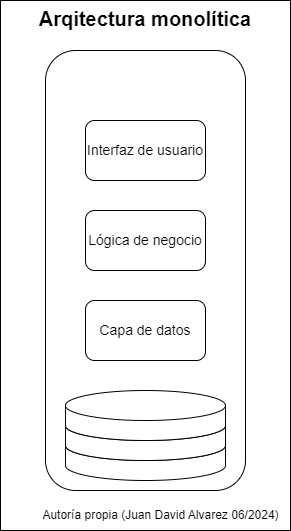
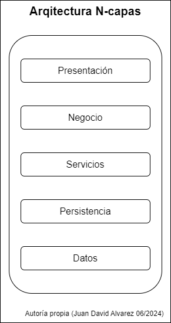
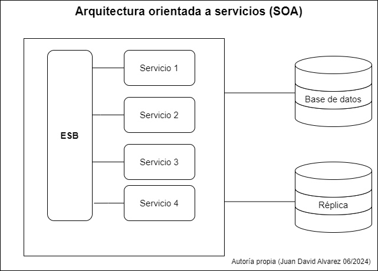
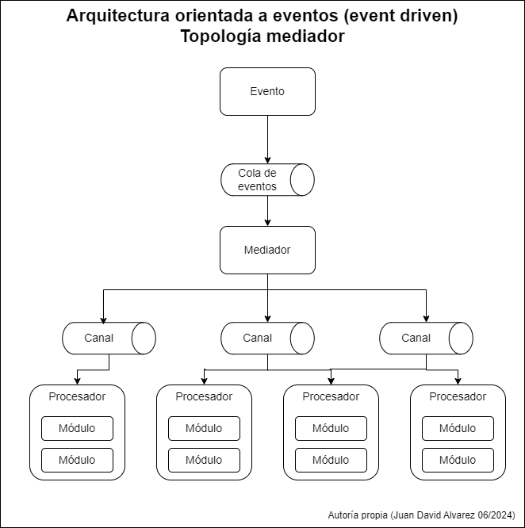
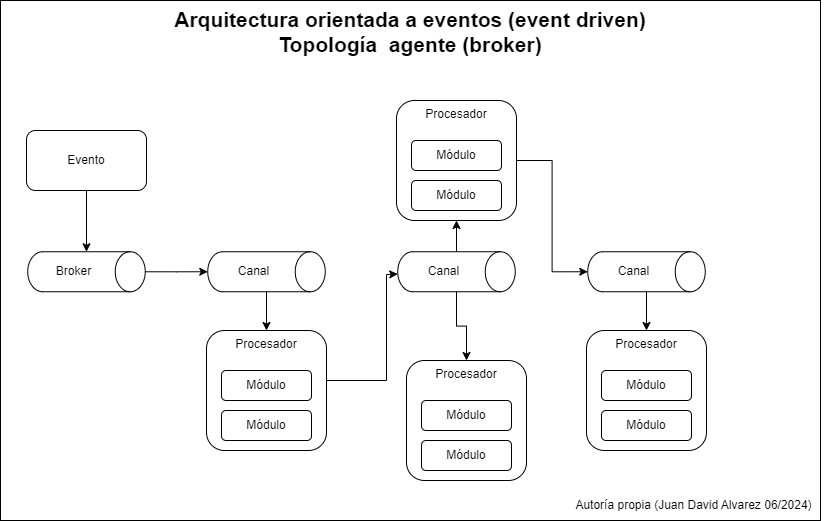
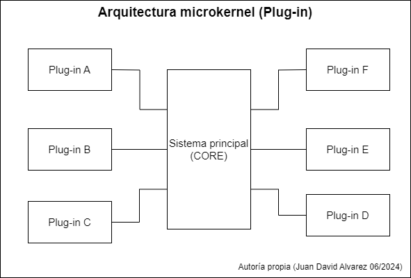
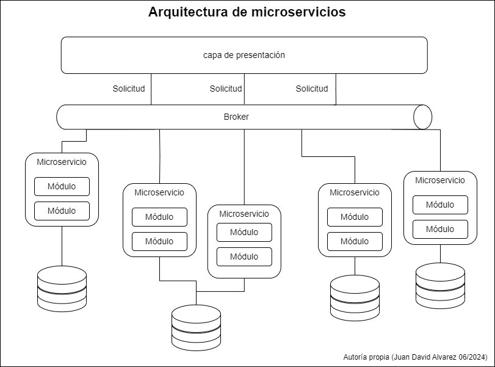
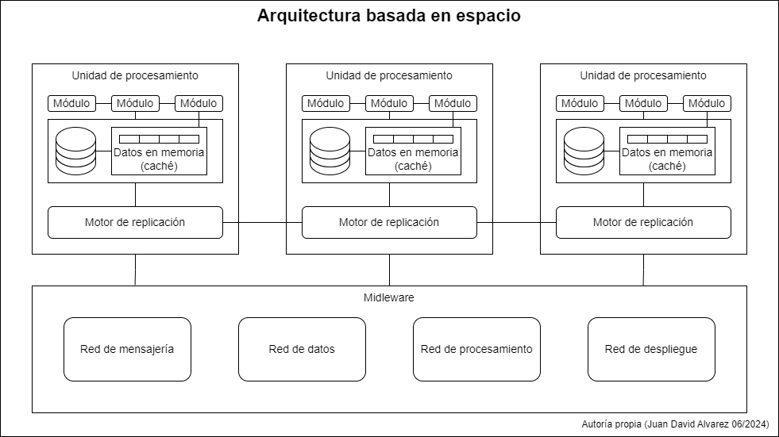

# patrones de diseño

Una vez que se identifican los requerimientos en el mantenimiento, será el momento de identificar y definir los patrones de diseño que apliquen en el desarrollo; en este sentido, es importante tener en cuenta si bien en las etapas anteriores del ciclo de vida del software se realizó un proceso detallado de analisis y definición de patrones de diseño; en las labores de mantenimiento también puede ser necesario aplicar nuevos patrones, adicionales a los que el softwre ya presenta.

Los patrones de diseño son de suma importancia en el software ya que un alto porcentaje de los incidentes de mantenimiento correctivo, pueden ser rastreados hacia una causa raiz que tiene que ver con un diseño ineficiente o degradado; así mismo, un software con antipatrones tiende a sufrir mas fallos y a una mayor entropía, consecuentemente  a ser menos mantenible en el tiempo.
los patrones de diseño, varian según su complejidad nivel de detalle y aplicabilidad. Todos los patrones pueden clasificarse según su proposito, así:

- **Los patrones creacionales**
  : proporcionan mecanismos de creación de objetos que incrementan la flexibilidad y la reutilización de código existente.

- **Los patrones estructurales**
  : explican cómo ensamblar objetos y clases en estructuras más grandes a la vez que se mantiene la flexibilidad y eficiencia de la estructura.

- **Los patrones de comportamiento**
  : se encargan de una comunicación efectiva y la asignación de responsabilidades entre objetos.

|nombre del patrón| descripción  | tipo de patrón |
| --- | --- | --- |
| Factory method (fabrica) | proporcionar una interfaz para crear objetos en una superclase, mientras permite a las subclases alterar el tipo de objetos que se crearán. | Creacional |
| Abstract factory (fabrica abstracta) | producir familias de objetos relacionados sin especificar sus clases concretas. | Creacional |
| Builder (constructor) |  construir objetos complejos paso a paso. El patrón permite producir distintos tipos y representaciones de un objeto empleando el mismo código de construcción. | Creacional |
| Prototype/clone (prototipo, clon) |  copiar objetos existentes sin que el código dependa de sus clases. | Creacional |
| Singleton (unica instancia)| asegurar que una clase tenga una única instancia, a la vez que proporciona un punto de acceso global a dicha instancia. | Creacional |
| Adapter/Wrapper (adaptador, envoltorio) | permitir la colaboración entre objetos con interfaces incompatibles. |Estructural |
| Bridge (puente) | dividir una clase grande, o un grupo de clases estrechamente relacionadas, en dos jerarquías separadas (abstracción e implementación) que pueden desarrollarse independientemente la una de la otra. |Estructural |
| Composite/ object tree (objeto compuesto, arbol de objetos) | componer objetos en estructuras de árbol y trabajar con esas estructuras como si fueran objetos individuales. |Estructural |
| Decorator (decorador) | añadir funcionalidades a objetos colocando estos objetos dentro de objetos encapsuladores especiales que contienen estas funcionalidades. |Estructural |
| Facade (fachada) | proporcionar una interfaz simplificada a una biblioteca, un framework o cualquier otro grupo complejo de clases. |Estructural |
| Flyweight (peso mosca, cache) | mantener más objetos dentro de la cantidad disponible de RAM compartiendo las partes comunes del estado entre varios objetos en lugar de mantener toda la información en cada objeto. |Estructural |
| Proxy | proporcionar un sustituto o marcador de posición para otro objeto. Un proxy controla el acceso al objeto original, permitiéndote hacer algo antes o después de que la solicitud llegue al objeto original.|Estructural |
| Chain of responsability (cadena de responsabilidad) | pasar solicitudes a lo largo de una cadena de manejadores. Al recibir una solicitud, cada manejador decide si la procesa o si la pasa al siguiente manejador de la cadena. |Comportamental |
| Command/ transaction (comando/ transacción) | convertir una solicitud en un objeto independiente que contiene toda la información sobre la solicitud. Esta transformación permite parametrizar los métodos con diferentes solicitudes, retrasar o poner en cola la ejecución de una solicitud y soportar operaciones que no se pueden realizar. |Comportamental |
|Iterator (iterador) | recorrer elementos de una colección sin exponer su representación subyacente (lista, pila, árbol, etc.). |Comportamental |
|Mediator/ controller ( mediador, controlador) | reducir las dependencias caóticas entre objetos. El patrón restringe las comunicaciones directas entre los objetos, forzándolos a colaborar únicamente a través de un objeto mediador. |Comportamental |
| Memento (recuerdo) | guardar y restaurar el estado previo de un objeto sin revelar los detalles de su implementación. |Comportamental |
| Observer (observador) |  definir un mecanismo de suscripción para notificar a varios objetos sobre cualquier evento que le suceda al objeto que están observando. |Comportamental |
| State (estado) |  permitir a un objeto alterar su comportamiento cuando su estado interno cambia. Parece como si el objeto cambiara su clase |Comportamental |
| Strategy (estrategia) | definir una familia de algoritmos, colocar cada uno de ellos en una clase separada y hacer sus objetos intercambiables. |Comportamental |
| Template method (plantilla de metodos) | definir el esqueleto de un algoritmo en la superclase pero permite que las subclases sobrescriban pasos del algoritmo sin cambiar su estructura. |Comportamental |
| Visitor(visitante) | separar algoritmos de los objetos sobre los que operan. |Comportamental |

<Mark> nota: los patrones de diseño mas básicos suelen llamarse *idioms* y suelen aplicar solamente a un lenguaje de programación; por otra parte cuando un patrón aplica a mas alto nivel y se hace mas universal, se considera un patrón de arquitectura </Mark>

## Antipatrones de diseño

Analogamente a los patrones de diseño, existen prácticas en el desarrollo de software, que deben evitarse, en general son patrones de diseño que en lugar de mejorar la calidad del software y ayudar a resolver algun problema, terminan teniendo el efecto opuesto. por ejemplo:

- **paralisis por analisis**: este antipatrón ocurre cuando las tareas de un proyecto se retrazan por demasiada planeación, analisis o discusiones.
- **arquitectura implicada**: se presenta comunmente cuando las decisiones de diseño son ejecutadas de manera implicita en lugar de explicita, lo cual puede causar entropia en el sistema
- **programación basada en asumsion**: de manera simplificada este antipatrón consiste en asumir que los usuarios piensan como el programador.
- **bola de lodo**: se refiere a una arquitectura que no tiene un diseño modular, convirtiendose en una especie de masa de codigo desorganizado sin estructura.
- **grandes diseños primero**: consiste en crear un diseño sumamente detallado del sistema antes de de iniciar su implementación, haciendo que el desarrollo sea inflexible y dificil de adaptar al cambio.
- **ventanas rotas**: se refiere a problemas pequeños que no son corregidos, lo cual indica poco mantenimiento en el software y tiende a reducir la mantenibilidad y estabilidad del software.
- **versionamiento por copias de carpetas**: cuando en un proyecto se realizan las actualizaciones de codigo mediante copias de la carpeta que contiene el archivo implicado
- **programación tipo copiar pegar**: cuando un bloque de codigo cumple puede ser utilizado en otro modulo del sistema, pero en lugar de modularizarse este es copiado al siguiente componente
- **muerte por planeación**: este patrón surge cuando un proyecto no tiene un balance entre la planeación y la ejecución del mismo, generalmente se realizan planes a muy largos plazos en el futuro.
- **marcha de la muerte** : se refiere a un proyecto que tiene una posibilidad de exito tan minima que en terminos practicos no valdría la pena invertir recursos en el.
- **programación de cinta adhesiva**: se refiere a un estilo de programación donde los ingenieros son capaces de hacer que cualquier funcionalidad, libreria o herramienta, se integre y haga parte del software pero sin prestar atención al diseño, la calidad o mantenibilidad del software
- **exposición de propiedades de colección**: esta practica se considera un antipatrón pues rompe la encapsulación y puede desembocar en un modelo de dominio anemico
- **rapido mejor que correcto**: cuando se prefiere la velocidad sobre la calidad en un proyecto
- **creep de la funcionalidad**: se refiere a agregar pequeñas funcionalidades extra de manera constatne, causando retrazos en los entregables y perdida del enfoque en el proyecto
- **banderas sobre objetos**: ocurre cuando los comportamientos son escritos por fuera de los objetos mediante banderas( ej: codigos de estado), resultando en una responsabilidad poco clara y una distribución de comportamientos problematica
- **codigo frankenstein**: consiste en que bloques de codigo o modulos completos,  que no fueron diseñados para trabajar juntos, son forzados dentro de una funcionalidad o aplicación y unidos con una especie de "cinta adhesiva" como algun patron de adaptador o una interfaz.
- **cavernicola**: este antipatrón de desarrollo, se caracteriza por la inabilidad o negación por parte del equipo o la organización para adoptar nuevas tecnologías, metodologías o prácticas.
- **martillo doraro**: se refiere a un lenguaje, herramienta, marco de trabajo o plataforma con la cual un ingeniero o equipo se siente comodo y productivo, por lo que intenta usarla para resolver todos los problemas que se puedan presentar.
- **clases iceberg**: ocurre cuando una gran una clase tiene una gran cantidad de metodos privados, lo cual puede indicar que hay comportamientos más allá del alcance de responsabilidad de dicha clase.
- **la trampa del 10%** : ocurre cuando las fases finales del proyecto son subestimadas, en complejidad y esfuerzo.
- **Strings magicos** : se refiere a datos de tipo string que son especificados dentro de la aplicación e impacta el funcionamiento de la aplicación
- **reinventar la rueda**: ocurre cuando los ingenieros, equipos o organizaciones prefieren construir herramientas para un proyecto dado por su propia cuenta, en lugar de buscar una herramienta que se encuentre disponible y permita suplir el requerimiento.
- **juguete brillante**: es la practica de creer que los problemas modernos pueden ser resueltos mediante las herramientas, tecnicas o librerias mas modernas.
- **codigo spaguetti**: se refiere a codigo que está enredado, especialmente respecto al orden en el que el programa fluye
- **adhesion estatica**: describe un acoplamiento indeseado, causado por el acceso a una funcionalidad de manera global, bien sea en forma de variables o metodos.
- **campo minado**: ocurre cuando se despliega una funcionalidad o una versión que no es lo suficientemente estable y los usuarios pueden incurrir en una gran cantidad de errores.
- **caldero de bruja**: este antipatrón se caracteriza por una base de codigo caotica y poco estructurada, donde se combinan multiples tecnologías, patrones de diseño, principios de programación entre otros, de forma inconsistente y aleatoria.

## Patrones de arquitectura

Si bien en las labores de mantenimiento del software, muchas decisiones de arquitectura y patrones ya se tomaron, a medida que el software evoluciona, también lo debe hacer su arquitectura; en este orden de ideas, podemos destacar la importancia de tomar decisiones respecto a los patrones de arquitectura del software.

Los patrones de arquitectura aplicables a un producto de software, dependen de los requerimientos funcionales y no funcionales; así mismo, los requerimientos, pueden ser satisfechos con diferentes arquitecturas y un producto de software puede estar construido usando más de un patrón de arquitectura; por lo que es imperativo, conocer los patrones arquitectonicos, sus ventajas y desventajas.Algunos patrones son:

 *"la arquitectura son las cosas importantes, independiente de lo que sean"* - Ralph Jonhson.

- **arquitectura monolítica**:este es considerado el punto de entrada del diseño del sistema; en muchos casos las primeras versiones de productos de software siguen este patrón, el cual consiste en construir toda la aplicación en un contenedor unico y unificado, es decir, todos los componentes, modulos y funcionalidades están integradas en un solo ejecutable. El patrón no especifica como se deben organizar estos componentes, por lo general se complementa con un patrón de capas, para separar los componentes funcionales; aunque también se utilizan otros métodos como la separación por módulos o subdominios. En cualquier caso siempre se debe apuntar a tener alta cohesión y bajo acoplamiento en este patrón, con el fin de hacerlo más durable y eficiente.
Adicionalmente, en la arquitectura monolítica son cuciales los [patrones de diseño](#patrones-de-diseño) de software, ya que en este patrón mientras aumenta la complejidad del sistema se hace cada vez mas dificil de mantener lo que lleva a un desgaste mas acelerado.

  

  las aplicaciones monolíticas pueden tener un buen rendimiento y suelen ser faciles de gestionar en las fases inciales de los proyectos de software; a medida que el software evoluciona suelen ser escalables hasta alguna medida dependiendo de la naturaleza del software, pero eventualmente pueden hacerse casi implosibles de escalar, patrón tiene una desventaja notable frente a otros, los despliegues e integraciones suelen hacerse más lentos y complejos, también Las aplicaciones monoliticas suelen ser dificiles de probar y mantener a medida que se hacen mas complejas, el acoplamiento entre los componentes, la deuda tecnica y la dificultad para separar las responsabilidades pueden ser factores de riesgo para este patrón.

- **arquitectura de capas( N layers)**: este patrón, suele ser complementario a aplicaciones monolíticas; consiste en organizar los componentes de la aplicación en capas horizontales, cada capa tiene una responsabilidad especifica ( ej. lógica de negocio, lógica de presentación ). El patrón no especifica la cantidad ni el tipo de capas, esta decision depende del equipo de desarrolladores; aún así, la mayoria de las arquitecturas de capas, cuenta con 4 capas principales: presentación, negocio, persistencia y datos. En algunos casos, las capas de persistencia y negocio se combinan en una sola capa.
  
  En la arquitectura de capas, las capas deben estar separadas e independientes. es decir que por ejemplo la capa de negocio, no debería tener información de como se muestra la información al usuario en la capa de presentación, tampoco debería necesitarla; lo mismo aplica para las demás capas, ya que cada capa debe proveer una abstración de sus funcionalidades, que permita la interación con el resto de los componentes de la aplicación.

  

  

  En general este patrón permite un prototipado y desarrollo rapidos, además de adaptarse a una gran variedad de necesidades de negocio, sin embargo tiene una desventaja de escalabilidad; ya que a medida que el software se hace más complejo, puede ser dificil organizar las capas y separar sus responsabilidades. Además, es facil caer en el antipatrón de sumidero, es decir una solicitud a un servicio de arquitectura en capas debe pasar por todas las capas sin aplicar ninguna lógica empresarial.

- **arquitectura orientada a servicios ( service-oriented )**: este patrón consiste en separar los componentes del software en servicios desacoplados e independientes que se encargan de una fracción de la logica de negocio y se comunican entre ellos mediante peticiones de red( tradicionalmente http ). esta arquitectura le permite a los desarrolladores aprovechar codigo heredado, así como reutilizar componentes ya construidos e integrar nuevos facilmente.
  Este patrón consta de cuatro componentes principales:
  
  - Servicios: este es el componente basico de la arquitecura, pueden ser privados dentro de equipos y organizaciones o ser expuestos para el uso del publico en general. Internamente los servicios se componen de tres partes principales:
    - implementación: contiene toda la lógica necesaria para que el servicio realice sus funciones
    - contrato: define la naturaleza del servicio y sus condiciones, por ejemplo requisitos para su funcionamiento, tipo de datos, entre otros.
    - interfas: esta es la cara visible del servicio para los demás servicios, en ella se define que como se accede a los metodos del servicio.
  - proveedor de servicios: este crea mantiene y provee los servicios para ser usados
  - consumidor de servicios: es quien sea que utilice los servicios, puede ser una aplicación o otro servicio. entre el proveedor y consumidor debe haber un contrato, que indique como interactuan ambas partes.
  - registry (registro/ repositorio): en este componente se almacenan los servicios, consiste en un directorio que puede ser accedido por los consumidores para acceder a los servicios que necesiten.

   en este patrón se requiere implementar un contrato de comunicación,como puede ser: protocolo de acceso simpe a objetos (SOAP), RESTfull HTTP, colas de mensajes, entre otros; en general se suele usar una combinación de varios patrones y  es común el uso de un patrón complementario: *bus de servicios empresariales ESB por sus siglas en ingles*.
  un ESB, es en escencia un componente encargado de la comunicación entre otros componentes del software, en el caso de la arquitectura orientada a servicios, se encarga de gestionar: modelos, conecciones, mensajería, patrones de comunicación, entre otras. haciendo que los servicios puedan integrarse entre ellos y a otras aplicaciones de forma rapida y sencilla.
  si no se implementa un ESB o cualquier otro patrón de integración y comunicación, este patrón pierde su proposito, pues los servicios estarian aislados.
  
  <Mark>Nota: los servicios en este patrón deben ser desacoplados e independientes, sin embargo, cuando se implementa un ESB, este suele ser centralizado.</Mark>

  

  en terminos generales, este patrón provee una adaptabilidad rendimiento y mantenibilidad altos, gracias a que sus componentes son independientes y están desacoplados; por otra parte, el ESB puede ser un factor de riesgo en esta arquitectura, siendo un componente centralizado en la arquitectura, si este falla, la aplicación no funcionará.
   Mientras el software evoluciona y se hace mas complejo, también se hacen mas complejas las comunicaciones entre los servicios, así mismo, un diseño ineficiente del ESB afecta el rendimiento y la escalabilidad del producto en su conjunto.
  La escalabilidad es limitada en este patrón de arquitectura, ya que varios servicios pueden necesitar uno o varios recursos simultaneamente y necesitan ser orquestados; sumado a esto, el acoplamiento en los servicios y el antipatrón de sumidero puede generar inconvenientes, a medida que la red de servicios crece, pueden darse casos de servicios repetidos y relaciones circulares

- **arquitectura de eventos ( event-driven )**: Esta arquitectura se compone de diversos servicios altamente desacoplados y con responsabilidad unica, los cuales reciven y procesan eventos de manera asincrona. En este patrón hay dos formas principales de organizar los componentes dependiendo de las necesidades: mediador( mediator ) y agente o corredor ( broker )
  - Mediador: esta topología consiste en delegar la orquestación de diversos pasos a un servicio; por ejemplo: al realizar una orden de compra en una aplicación de e-comerce, podria ser necesario verificar si el producto solicitado está en el inventario, luego verificar la información bancaria del usuario, la cobertura del envio y la confirmación de pago, para posteriormente generar un recibo de pago, enviar un correo electrónico de confirmación de orden y mostrar información sobre el envio del producto.
  
  todos estos pasos necesitan ser orquestados, para determinar el orden de los pasos y cuales se pueden ejecutar en paralelo o son dependientes de otros.

  

  el patrón de mediador consta de cuatro partes principales:

- la cola de eventos: este componente actua como punto de entrada, recibe los eventos y los transporta al mediador. El patrón no especifica que tipo de cola implementar, esta puede ser una cola de mensajes, el endpoint de un servicio web o una combinación de ambos.

- el mediador: es el responsable de recibir el evento inicial y orquestar los pasos que este contenga, al ejecutar cada uno de estos pasos, el mediador emite un mensaje de procesamiento al canal de eventos que será luego procesado. Es importante anotar que el mediador no ejecuta ni tiene conocimiento de ninguna lógica de negocio, sino mas bien conoce los pasos y el flujo entre los mismos.
  
- el canal de eventos: este componente es usado por el mediador para enviar mensajes a los procesadores, los canales pueden ser implementados en forma de colas de mensajes o temas de mensajes; generalmente se implementan temas, ya que permiten un procesamiento paralelo por parte de varios ejecutores
  
- el ejecutor o procesador: contiene toda la logica de negocio necesaria para procesar un evento; este componente debería ser autocontenido, indepentiente y altamente desacoplado. según los requerimientos, los procesadores pueden ser más o menos granulares, sin embargo el objetivo es que tengan responsabilidades unicas y no dependan de otros procesadores para realizar su trabajo.

- Agente: esta topología retira la orquestación de los eventos, en este caso, los eventos fluyen a traves de los ejecutores en forma de cadena. en este caso hay solamente dos componentes:
  - el corredor: es equivalente al canal de eventos, y contiene todos los canales pertinentes al flujo de eventos de la aplicación. este puede ser centralizado o distribuido; al igual que en la topología de mediador, se pueden implementar en forma de temas o colas de mensajes.
  - el ejecutor o procesador: cumple la misma función que en la topología de mediador.

    

      
    

    en este patrón, la escalabilidad y el rendimiento de la aplicación son destacables así como la mantenibilidad de los componentes de lógica de negocio sin embargo, el desarrollo puede ser mas compleja, en especial considerando que debido a su naturaleza asincrona y distribuida, se deben abordar requerimientos de disponibilidad y tolerancia a fallas, además de que la mantenibilidad y gobierno de los componentes de mensajería puede hacerse dificil a medida que el software se hace mas complejo.
- **Microkernel ( plug-in )**: esta arquitectura se compone tradicionalmente de 2 componentes basicos: un sistema principal o core y una serie de modulos intercambiables.
  - core: tradicionalmente, este componente debería contener la lógica minima para que el sistema funcione. Adicionalmente debe tener conocimiento de los modulos adicionales conectados y como acceder a estos; existen diversas formas de implementar este requerimiento, una de las más comunes es almacenar el registro de los modulos adicionales junto con datos o meta datos(nombre, protocolo de comunicación, protocolo de datos, datos de entrada y salida, etc.), segun sea el caso en algún formato conveniente.
  - los modulos: este componente debe ser independiente y autocontenido; permitiendo funcionalidades adicionales al sistema principal o apalancando las funcionalidades existentes del mismo. Si bien los modulos deben ser independientes entre sí, es posible diseñar modulos que se apoyen en uno o varios modulos más; siempre teniendo en cuenta que la interacción entre los modulos debe ser minima, para evitar problemas de dependencias y alto acoplamiento.
  
      

      
    

  en este patrón es importante considerar que puede aplicarse facilmente junto con otros patrones, destacando su versatilidad y rendimiento. La mantenibilidad del software con esta arquitectura es alta, ya que es relativamente simple agregar nuevas funcionalidades así como mejorar las existentes, gracias a la separación marcada de responsabilidades. sin embargo, a medida que el sistema se hace más complejo puede tener menos escalabilidad adicionalmente es necesario determinar protocolos y contratos para la conexion de los modulos, junto con protocolos marcadados de gobierno de aplicación y esto puede hacer el desarrollo más complejo.
- **Microservicios**: la idea basica detras de este patrón es tener un conjunto de unidades desplegadas independientemente, estas unidades contienen servicios o componentes del software, y pueden variar en granularidad y complejidad ( similar a las clases en los lenguajes orientados a objetos ).
  
  la arquitectura de microservicios es distribuida, por ende es importante tener en cuenta los protocolos de comunicación entre los servicios que la componen( JMS, AMQP, REST, SOAP, RMI, etc.).
  
  Existen muchas topologías en una arquitectura de microservicios y estas varian segun los requerimientos del software; algunas de las mas populares son:
  
  - API-Rest: en esta topología se organizan varios componentes que tienen responsabilidades simples y especificas de forma independiente entre sí. estos servicios son accedidos a traves de una API desplegada de forma separada
  - aplicaciones Rest: en estos casos los componentes son accedidos a traves de un cliente(una aplicación web o mobil, un servicio en nube, etc) que de forma remota se comunica con servicios desplegados independientemente a traves de protocolos tipo rest. en esta topología los componentes tienden a ser mas complejos.
  - mensajes centralizados/ cola de mensajes: en esta topología un agente de mensajeria se encarga de gestionar la interacción entre los servicios; esta topología ayuda a gestionar aplicaciones con requerimientos mas complejos y es más escalable que las aproximaciones mas simbles basadas en rest.
    En este caso es importante destacar que se requiere implementar un agente de mensajería, así como gestores de errores, monitoreo, operaciones asincronas, balanceo de cargas, entre otros.
  
  La arquitectura de microservicios se creó originalmente para abordar problemas tipicos de la arquitectura monolitica y de la arquitectura basada en servicios(SOA), gracias a esto presenta grandes ventajas con respecto a estas ultimas arquitecturas, entre las principales se destaca la integración y despliegue continuos, brindando un mejor control sobre la interacción de los componentes distribuidos, permitiendo hacer más y mejores pruebas al software, ademas de evitar eventos de tipo "big bang" como puede ocurrir en las arquitecturas monolíticas.

  

  

  en este patrón, la mantenibilidad, escalabilidad y versatilidad son altas, además de permitir un proceso de desarrollo y pruebas muy optimo, gracias a la separación marcada de responsabilidades; asún así, estas separaciones pueden ser un arma de doble filo, ya que en un diseño ineficiente, las responsabilidades pueden estar demasiado separadas, o no estarlo lo suficiente; sumado a esto, mantener el rendimiento de la aplicación puede hacerse complicado en el tiempo, ya que cuanto mas complejo es el software, más microservicios podrían ser agregados, esto representa carga sobre el agente de mensajería, integración de más componentes entre sí y en general más partes mobiles en el software, lo que se traduce en más entropía en el sistema.

- **Arquitectura basada en espacio** :  la idea de este patrón es abordar los problemas de escalabilidad que podria tener una aplicacion, apuntando a que tengan el menor impacto posible. esto se logra a traves de un espacio en tuplas o memoria distribuida, en otras palabras, usar una red de datos replicados, en lugar de una base de datos centralizada; los datos de la aplicación son replicados en las unidades de procesamiento activas, estas mismas pueden encenderse o apagarse dinamicamente, segun las necesidades de la aplicación.

  en esta arquitectura hay dos componentes basicos:
  - unidades de procesamiento: en este se despliegan los componentes del software ( en algunos casos parcialmente) que hagan falta, según el caso pueden ser componentes web,lógica de negocio o una combinación de ambos. Todo dependerá del tipo de software. así mismo, dependiendo de la complejidad del sistema, puede haber una o varias unidades de procesamiento.
    adicionalmente en las unidades de procesamiento se despliega una red de almacenamiento de datos y según el caso, un mecanismo para replicar los cambios en el resto de las unidades de procesamiento

  - intermediario o midleware: este componente es el encargado de gestionar las unidades de procesamiento y las comunicaciones. esta conformado por cuatro componentes:
    - red de mensajes: es el encargado de gestionar los datos de entrada y la información de sesión. En este componente se determina que unidades de procesamiento se encuentran disponibles para atender las peticiones y las redirige a la unidad corresponidente.
    - red de datos: este componente es el uno de los ejes centrales de la arquitectura, es el responsable de interactuar con el gestor de replicación de datos y cada una de las unidades de procesamiento para gestionar la replicación de datos cuando hay una actualización en alguna unidad de procesamiento. dado que la red de mensajes puede asignar una tarea a cualquier unidad de procesamiento, es crucial que todas las tengan exactamente los mismos datos.
    - red de procesamiento: este componente es opcional, y se encarga de gestionar peticiones distribuidas cuando las unidades de procesamiento tienen la logica de negocio distribuida en varias unidades de procesamiento( ej: Unidad1: inventario Unidad2: información de pago)
    - gestor de despliegue: está a cargo de gestionar dinamicamente ( encender o apagar ) unidades de procesamiento, según sea el caso, basandose en la carga que esté soportando el sistema. Este componente es muy importante para lograr una escalabilidad variable y optima en el sistema.

  

  

    Existen variaciones de este patrón, que incluyen una base de datos centralizada, donde se almacenan datos poco volatiles o para inicializar los datos de las bases de datos distribuidas. esta practica puede ayudar a reducir el estrés en las unidades de procesamiento causado por la red de datos en memoria.
    <mark>este patrón tambien es conocido como arquitecura basada en la nube, sin embargo, no necesariamente debe tener sus componentes alojados en un servicio basado en la nube o en PaaS(plataform as a service).</mark>
    este patrón destaca por la escalabilidad y el rendimiento, ademas de ser muy versatil y poderse aplicar a diversos requerimientos, sin embargo en cuanto a la mantenibilidad, desarrollo y aplicación de puede hacerse complicado, si bien la separacion de responsabilidades puede ser relativamente facil de ejecutar, estos factores deben ser atendidos con especial cuidado, de lo contrario puede verse afectado el rendimiento del software o su escalabilidad.  

|Patrón |mantenibilidad | testeabilidad | rendimiento| escalabilidad| complejidad en desarrollo|
|---|:---:|:---:|:---:|:---:|:---:|
|Monolítica | media | baja | alto | bajo | media |
|N-capas| baja | media | bajo | baja | media |
|orientada a servicios| alta | alta | bajo |media | media |
|orientada a eventos | alto | baja | alto | alto | alta|
|Microkernel| alta | alta | alta| baja| alta|
|Microservicios | alta |alta|  bajo | alta | baja |
|Basado en espacio| baja| baja| alta| alta | alta |  
